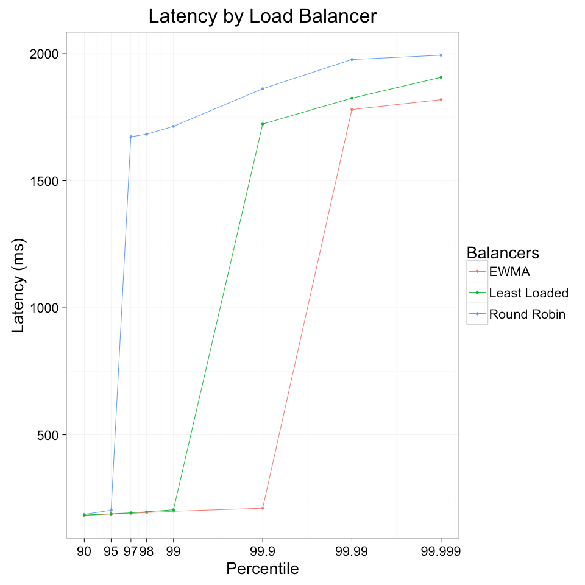

This post was co-written with Ruben Oanta (@rubeydoo).

Load balancing is a critical component of any large-scale software deployment. But there are many ways to do load balancing. Which way is best? And how can we evaluate the different options?

In the modern software ecosystem, load balancing plays several roles. First, it is fundamental to the notion of *scalability*. Software is deployed in multiple, identical replicas. We “scale” software by deploying additional replicas. Traffic must be distributed across replicas, and this distribution is the act of load balancing.

Load balancing provides another necessary feature: that of *resilience*. Intuitively speaking, a resilient system is one in which the failure of individual components does not cause the system itself to fail. Software, or the hardware on which it runs, will fail. By distributing traffic only to instances which are capable of serving it, load balancing allows us to join multiple fallible components into a single resilient system.

We can extend this model of resilience one step further, to address another unwelcome visitor in distributed systems: *latency*. Just as the components of a system may fail, so too may they become slow. A good load balancer must protect against latency, just as it protects against failure. Even in the presence of slow replicas, the system as a whole must remain fast.

This third criterion is more subtle than the first two. Algorithmically speaking, addressing scalability and resilience is straightforward: given a set of replicas, distribute traffic across all live replicas, and don’t distribute traffic to replicas that have failed. (We will ignore, for the moment, the not insignificant challenge of assessing the health of a replica.) For latency, the story is less clear: given a set of replicas performing at a variety of speeds, what is the best strategy for distributing load among them?

In this article, we run a simple experiment with three algorithms: round robin, least loaded, and peak exponentially-weighted moving average (“peak EWMA”). The three algorithms serve as a test bed for demonstrating the effect that the right—or wrong—choice of load balancing algorithm can have. In particular, we test the effectiveness of these algorithms at handling component latency.

Loosely speaking, the three algorithms behave as follows:

- **Round robin**: distribute requests to each replica in turn.
- **Least loaded**: maintain a count of outstanding requests to each replica, and distribute traffic to replicas with the smallest number of outstanding requests.
- **Peak EWMA**: maintain a moving average of each replica’s round-trip time, weighted by the number of outstanding requests, and distribute traffic to replicas where that cost function is smallest.

Of these three algorithms, round robin is commonly seen in practice, and is available in most software load balancers, including Nginx and HAProxy. The other two algorithms are less common in the wild, but production-tested implementations of both are available in [Finagle](https://finagle.github.io/), Twitter’s client-side RPC library.

## Experiment setup

We ran a simple simulation to measure the effect of component latency on overall system latency, using the following scenario:

- 11 backend servers, each replaying latency captured from a production system. This latency distribution has a median of 167ms, a standard deviation of 5ms, and no significant peaks.
- One client, running at 1000 qps, balancing across all 11 backends.
- One minute total run.
- After 15 seconds, a single server’s latency was fixed to 2 seconds for 30 seconds, then returned to normal. (This simulates a backend service suffering from a bad garbage collection pause, or other transient issue.)

We used a basic RPC client written with Finagle for these experiments.

(Note that Finagle does not include a round robin implementation by default. In order to reduce variance across experimental conditions, we added an implementation for this experiment. You can download the code used in this experiment [here](https://github.com/BuoyantIO/finagle/blob/stevej/simulate_rr/finagle-benchmark/src/main/scala/com/twitter/finagle/loadbalancer/Simulation.scala).)

## Results

The results of the experiment are shown in the graph above. The y axis denotes latency, and the x axis (log scale) denotes the percentile in the latency distribution at which that latency was exceeded.

The difference in performance between the three algorithms in the face of a slow server is clear. Round robin suffers the most, exhibiting slow performance above the 95th percentile. Least loaded fared better, maintaining fast performance until the 99th percentile, and peak EWMA fares even better, maintaining speed until the 99.9th percentile.

Since latency and failure are often tied together in distributed systems via timeouts, we can also express the results in terms of failure. If the caller of our system used a timeout of 1 second, its success rate would be approximately 95% with round robin, 99% with least loaded, and 99.9% with peak EWMA—a significant difference.

## Discussion

Round robin is clearly the worst performer of the three algorithms examined. In some respects, this is unsurprising: it is also the most naive.

However, round robin is not just a worse algorithm—it does not take advantage of the information available to least loaded and peak EWMA. Because Finagle operates at Layer 5 in the OSI model (the “session” layer), it has access to information such as queue depth and RPC latencies. Least loaded takes advantage of queue depth and shows significantly improved performance above round robin; peak EWMA takes into account both RPC latency and queue depth and shows even better performance. The difference between the three options is not so much an algorithmic one as a difference in the information used to make balancing decisions.

Of course, in practice, there are many factors that affect load balancing performance beyond choice of algorithm. The implementation may have poor performance under high concurrency. The algorithm may be unsuitable for certain classes of requests, such as long polling requests (in which case high latency is expected, and not a symptom of failure). The algorithm may be unsuitable for particular client/server relationships, such as highly asymmetric replica counts. In this article, we have not attempted to present a comprehensive analysis, and have expended only a minimum amount of effort to control for these variables. Our intention is simply to provide an example of the difference that algorithmic choice can make.

That said, large-scale production experiments at Twitter have verified the effectiveness of least loaded and peak EWMA (as well as other load balancing algorithms), and these algorithms are used at scale to power much of Twitter’s infrastructure today.

## Conclusion

For systems that load balance higher-level connections such as RPC or HTTP calls, where Layer 5 information such as endpoint latencies and request depths are available, round robin load balancing can perform significantly worse than other algorithms in the presence of slow endpoints. These systems may show significantly improved performance in the face of slow endpoints by using algorithms that can take advantage of Layer 5 information.

If the results above are applicable to your situation, you may want to take advantage of algorithms like least loaded and peak EWMA. Production-tested implementations of these algorithms are available today in [Finagle](https://finagle.github.io/), and in [Linkerd](https://linkerd.io/), the open-source service mesh for cloud-native applications. (See [here](https://api.linkerd.io/latest/linkerd/) for how to configure the load balancing algorithms in Linkerd.)

## Acknowledgments

Thanks to [Marius Eriksen](https://twitter.com/marius), [Alex Leong](https://twitter.com/adlleong), [Kevin Lingerfelt](https://twitter.com/klingerf), and [William Morgan](https://twitter.com/wm) for feedback on early drafts of this document.

## Further reading

- The Tail at Scale. [http://cacm.acm.org/magazines/2013/2/160173-the-tail-at-scale/abstract](http://cacm.acm.org/magazines/2013/2/160173-the-tail-at-scale/abstract)
- Michael Mitzenmacher. 2001. *The Power of Two Choices in Randomized Load Balancing*. IEEE Trans. Parallel Distrib. Syst. 12, 10 (October 2001), 1094-1104.
