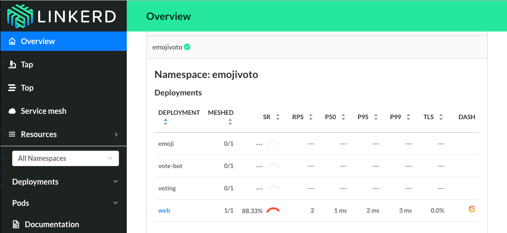

On behalf of the Linkerd maintainers, I’m happy to announce that Linkerd 2.0 is now in general availability (GA). This means that we’ve cut an official 2.0 stable release, and we think it’s ready for you to try in production. It’s already seeing the light of day at companies like [WePay](https://go.wepay.com/), Hush, [Studyo](https://studyo.co/), and [JustFootball](https://justfootball.io/).

You can try Linkerd 2.0 on a Kubernetes 1.9+ cluster in 60 seconds by running:

```bash
curl --proto '=https' --tlsv1.2 -sSfL https://run.linkerd.io/install | sh
```

(Or check out the full [Getting Started Guide](https://linkerd.io/2/getting-started/).)

The 2.0 release of Linkerd brings some very significant changes. First, we’ve completely rewritten Linkerd to be orders of magnitude faster and smaller than Linkerd 1.x. Linkerd 2.0’s data plane is comprised of ultralight Rust proxies which consume around 10mb of RSS and have a p99 latency of <1ms. Linkerd’s minimalist control plane (written in Go) is similarly designed for speed and low resource footprint.

Second, with the 2.0 release, Linkerd adds the ability to run on a single service without requiring cluster-wide installation. This means that if you’re a developer or service owner who doesn’t have access to the whole Kubernetes cluster, you can run Linkerd on your service and get:

- Instant Grafana dashboards of your service’s success rates, latencies, and throughput
- A topology graph of incoming and outgoing dependencies
- A live view of requests being made to your service
- Improved, latency-aware load balancing
- … and much more.

Even better, installing Linkerd 2.0 on your service requires no configuration or code changes.



The 2.0 release is something we’re really excited about because it addresses two major problems with the traditional (!) service mesh model:

1. Traditional service meshes are an all-or-nothing proposition that add a significant layer of complexity to your stack. That’s not great.
2. Traditional service meshes are designed to meet the needs of platform owners, and they dramatically underserve a more important audience: the _service owners_.

Linkerd 2.0 addresses both of these problems. Rather than being an all-or-nothing proposition, 2.0 allows platform owners to build out a service mesh _incrementally,_ one service at a time, as a low-risk path to get the uniform, platform-wide layer of telemetry, security, and reliability that a full service mesh provides.

More importantly, Linkerd 2.0 addresses the needs of service owners directly. This goal came from asking ourselves a fundamental question: _why are we building this technology in the first place?_ What’s the point of Docker, Kubernetes, or Linkerd? The answer is that we build infrastructure, not for its own sake, but to serve a purpose—to allow someone else (in this case, developers and service owners) to get their jobs done with a minimum of fuss. Everything about Linkerd 2.0’s design, from the service sidecar model to its focus on diagnostics and debugging, is there to help developers and service owners be productive by day and sleep soundly at night.

Linkerd 2.0 has a ton of other great design goals: a focus on minimal configuration, a modular control plane design, and UNIX-style CLI tools, and we’ll be expanding on those in the future.

We’re tremendously excited about the future of Linkerd. This is still just the beginning. We’d love to have you join our rapidly-growing community! Linkerd 2.0 is hosted on [GitHub](https://github.com/linkerd/linkerd2), and you can find us on [Slack](http://slack.linkerd.io), [Twitter](https://twitter.com/linkerd), and the [mailing lists](https://lists.cncf.io/g/cncf-linkerd-users/topics).
