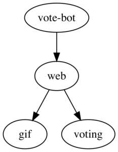
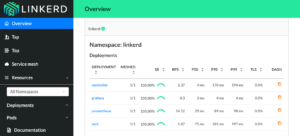
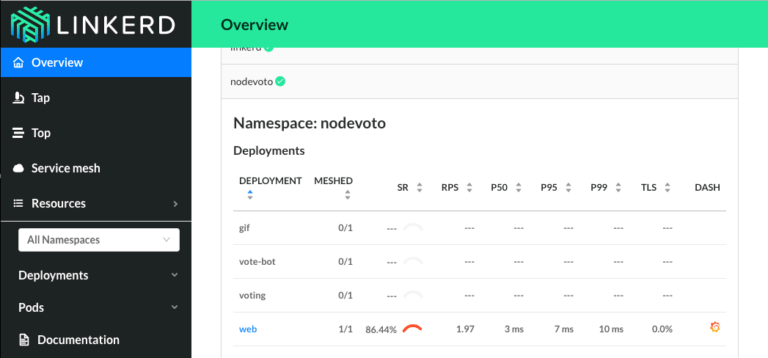
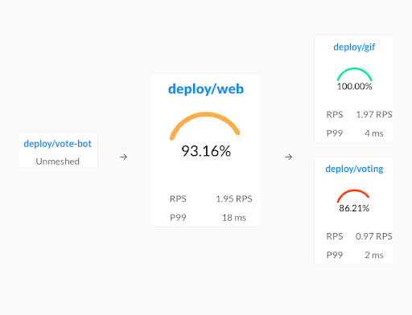
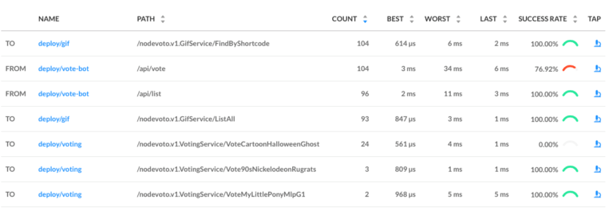
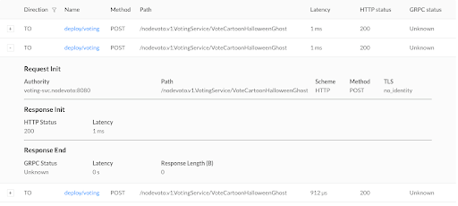
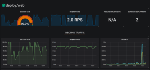

Node is one of the most popular languages for microservices. With the rise of
Kubernetes, increasingly, Node developers are being asked to deploy their
services to a Kubernetes cluster. But what’s required to safely deploy and run
Node services on Kubernetes? In this post, we focus on one specific, but vital,
component: how do I understand what’s happening with my Node service on
Kubernetes, and how do I debug it when things go wrong?

At this point, you may be thinking, can’t I just use the Kubernetes dashboard?
Unfortunately, while Kubernetes can automatically keep your service up in the
event of node failure or a software crash, it doesn’t actually know whether your
service is behaving _correctly._ In fact, a service may be returning 500’s or
taking too long to respond and the Kubernetes dashboard will show all green
lights.

This is why Kubernetes is often used in conjunction with something like Linkerd.
Linkerd is a _service sidecar_ that augments any Kubernetes service, providing
zero-config “golden metrics” dashboards and UNIX-style CLI tools for runtime
debugging, diagnostics, and reliability. (Linkerd can also act as  a _service
mesh_ by running on multiple services, providing a uniform layer of telemetry,
security, and control across them.)

Linkerd works by inserting an ultralight proxy (<10mb) into each pod of a
service, and automatically sending traffic to and from that pod through its
proxy. These proxies provide telemetry data to, and receive signals from, a
control plane. Because the proxy runs alongside your application and is
transparent, there are zero code changes required. And, of course, Linkerd is
completely open source, Apache v2 licensed, and is hosted by the Cloud Native
Computing Foundation--just like Kubernetes itself.

In this tutorial, we’ll walk you through deploying Linkerd 2.0 to a Kubernetes
cluster and using it to debug failures in an example application.

(If you don’t have a Kubernetes cluster, don’t worry! Take a look at
[minikube](https://github.com/kubernetes/minikube).)

The demo application we’ll deploy is composed of multiple services that allow
voting for favorite gifs. These services communicate via gRPC and have all been
written in Javascript. You can check out the source on
[GitHub](https://github.com/sourishkrout/nodevoto). The application is composed
of the following 4 services:

- [nodevoto-web](https://github.com/sourishkrout/nodevoto/blob/master/services/nodevoto-web):
  Web frontend and REST API
- [nodevoto-gif](https://github.com/sourishkrout/nodevoto/blob/master/services/nodevoto-gif):
  gRPC API for finding and listing gif
- [nodevoto-voting](https://github.com/sourishkrout/nodevoto/blob/master/services/nodevoto-voting):
  gRPC API for voting and leaderboard
- [vote-bot](https://github.com/sourishkrout/nodevoto/blob/master/services/nodevoto-web/voteBot.js):
  a traffic generator



This application has a major bug in it, which we’ll debug by using Linkerd’s web
dashboard and UNIX-like CLI tools.

## Step 1: Install the demo app 🚀

Before we install Linkerd, let’s install the Nodevoto demo app. In your laptop’s
terminal window, run:

```bash
curl --proto '=https' --tlsv1.2 -sSfL https://run.linkerd.io/emojivoto.yml | kubectl apply -f -
```

This command downloads the Kubernetes manifest for Nodevoto, and uses _kubectl_
to apply it to your Kubernetes cluster. Nodevoto is comprised of several
services that run in the “nodevoto” namespace. You can see the services by
running:

```bash
kubectl get -n nodevoto deployments
```

You can also see the app live by running

```bash
kubectl -n nodevoto port-forward \
  $(kubectl -n nodevoto get po -l app=web-svc -oname | cut -d/ -f 2) \
  8080:80
```

(If you see something like `kubectl: command not found`, you don’t have
Kubernetes set up properly.)

Click around the app a bit. You should see that some parts of the application
are broken! (hint - click the upper left vote button a few times and see what
happens). If you look at the Kubernetes dashboard, of course, you’ll see that
everything appears green -- all pods are running.

This is a very common type of failure scenario: Kubernetes thinks everything’s
fine, but you know the application is returning errors, because you can see
them. In the next few steps, we’ll walk you through how to use Linkerd to
diagnose the problem.


## Step 2: Install Linkerd’s CLI

We’ll start by installing Linkerd’s command-line interface (CLI) onto your local
machine. Visit the
[Linkerd releases page](https://github.com/linkerd/linkerd2/releases/), or
simply run:

```bash
curl --proto '=https' --tlsv1.2 -sSfL https://run.linkerd.io/install | sh
```

Once installed, add the `linkerd` command to your path with:

```bash
export PATH=$PATH:$HOME/.linkerd2/bin
```

Let’s validate that your cluster is prepared for Linkerd by running:

```bash
linkerd check --pre
```

As there are many different types of Kubernetes clusters, and an infinite set of
ways to configure them. This handy command will report any problems that would
interfere with your ability to install Linkerd. Hopefully everything looks OK
and you’re ready to move on to the next step.

(Note: if your Kubernetes cluster is on GKE with RBAC enabled, you’ll need an
extra step: you must grant a ClusterRole of cluster-admin to your Google Cloud
account first, in order to install certain telemetry features in the control
plane. To do that, run:
`kubectl create clusterrolebinding cluster-admin-binding-$USER --clusterrole=cluster-admin --user=$(gcloud config get-value account)`.)

## Step 3: Install Linkerd’s control plane onto the cluster

In this step, we’ll install Linkerd’s lightweight control plane into its own
namespace (“linkerd”) on your cluster. To do this, run:

```bash
linkerd install | kubectl apply -f
```

This command generates a Kubernetes manifest and uses `kubectl` command to apply
it to your Kubernetes cluster. (Feel free to read the full manifest before you
apply it.)

Depending on the speed of your connection, it might take a minute for your
Kubernetes cluster to pull down the Linkerd container images and get them
started. While that’s happening, you can validate that everything’s installing
correctly by running:

```bash
linkerd check
```

This command will wait until Linkerd has been installed and is running. Now,
let’s check out Linkerd’s dashboard! Just run:

```bash
linkerd dashboard
```

If you see something similar to the screenshot below, Linkerd is now running on
your cluster. 🎉



## Step 4: Add Linkerd to the Nodevoto web service

At this point we have the Linkerd control plane installed in the “linkerd”
namespace, and we have our nodevoto demo app installed in the “nodevoto”
namespace. But we haven’t actually added Linkerd to our service yet. So let’s do
that.

In this example, let’s pretend we are the owners of the “web” service. Let’s
just say that other services, like “gif” and “voting”, are owned by other teams
-- we don’t want to touch them. While these are local services in this example,
it is entirely possible that they could be remote APIs owned by a completely
separate entity.

There are a couple ways to add Linkerd to our service. For demo purposes, the
easiest is to do something like this:

```bash
kubectl get -n nodevoto deploy/web -o yaml | linkerd inject - | kubectl apply -f -
```

This command retrieves the manifest of the “web” service from Kubernetes, runs
this manifest through \`linkerd inject\`, and then reapplies it to the
Kubernetes cluster. The \`linkerd inject\` command adds to the manifest to
include Linkerd’s data plane proxies. As with \`linkerd install\`, \`linkerd
inject\` is a pure text operation. This means that you can inspect the input and
output before you use it. Since “web” is a Deployment, Kubernetes is kind enough
to slowly roll the service one pod at a time--meaning that “web” can be serving
traffic live while we add Linkerd to it!

We now have a service sidecar running on the “web” service!

## Step 5: Debugging for Fun and for Profit

Congratulations! You now have a full gRPC application running on your Kubernetes
cluster with Linkerd installed on the “web” service. Unfortunately, that
application is failing when you use it--so now let’s use Linkerd to track down
those errors.


If you glance at the Linkerd dashboard (the `linkerd dashboard` command), you
should see all services in the `nodevoto` namespace show up. Since “web” has the
Linkerd service sidecar installed on it, you’ll also see success rate, requests
per second, and latency percentiles show up.



That’s cool, but notice is that success rate is well below 100%! Click on “web”
and let’s debug.

You should now be looking at the Deployment page for the web service. The first
thing you’ll see here is that web is taking traffic from vote-bot (a service
included in the Nodevoto manifest to continually generate a low level of live
traffic), and has two outgoing dependencies, gif and voting.



The gif service is operating at 100%, but the voting service is failing! A
failure in a dependent service may be exactly what’s causing the errors that web
is returning.

Let’s scroll a little further down the page, we’ll see a live list of all
traffic endpoints that “web” is receiving. This is interesting:



There are two calls that are not at 100%: the first is vote-bot’s call the
“/api/vote” endpoint. The second is the \`VoteCartoonHalloweenGhost\` call from
the web service to the voting service. Very interesting! Since /api/vote is an
incoming call, and `VoteCartoonHalloweenGhost` is an outgoing call, this is a
good clue that  that the failure of the vote service’s
`VoteCartoonHalloweenGhost` endpoint is what’s causing the problem!

Finally, if we click on the “microscope” icon for that row in the far right
column, we’ll be taken to live list of requests that match this endpoint. This
allows us to confirm that the requests are failing (they all have
[gRPC status code 2](https://godoc.org/google.golang.org/grpc/codes#Code),
indicating an error).



At this point we have the ammunition we need to talk to the owners of the
“voting” service. We’ve identified an endpoint on their service that
consistently returns an error, and have found no other obvious sources of
failures in the system.

We hope you’ve enjoyed this journey through Linkerd 2.0. There is much more for
you to explore. For example, everything we did above using the web UI can also
be accomplished via pure CLI commands, e.g. `linkerd top`, `linkerd stat`, and
`linkerd tap`.

Also, did you notice the little Grafana icon on the very first page we looked
at? Linkerd ships with automatic Grafana dashboards for all those metrics,
allowing you to view everything you’re seeing in the Linkerd dashboard in a time
series format. Check it out!



## Want more?

In this tutorial, we’ve shown you how to install Linkerd on a cluster, add it as
a service sidecar to just one service--while the service is receiving live
traffic!---and use it to debug a runtime issue. But this is just the tip of the
iceberg. We haven’t even touched any of Linkerd’s reliability or security
features!

Linkerd has a thriving community of adopters and contributors, and we’d love for
YOU to be a part of it. For more, check out the [docs](/docs/) and
[GitHub](https://github.com/linkerd/linkerd) repo, join the
[Linkerd Slack](https://slack.linkerd.io/) and mailing lists
([users](https://lists.cncf.io/g/cncf-linkerd-users),
[developers](https://lists.cncf.io/g/cncf-linkerd-dev),
[announce](https://lists.cncf.io/g/cncf-linkerd-announce)), and, of course,
follow [@linkerd](https://twitter.com/linkerd) on Twitter! We can’t wait to have
you aboard!
