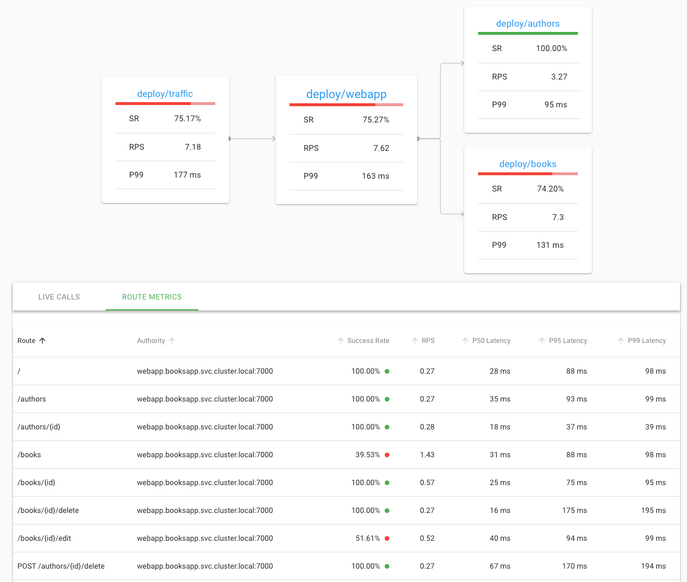

Today we're very happy to announce the release of [Linkerd 2.1](https://github.com/linkerd/linkerd2/releases/tag/stable-2.1.0). This is our first stable update to 2.0, and introduces a host of goodies, including per-route metrics, _service profiles_, and a vastly improved dashboard UI. We've also added a couple exciting experimental features: proxy auto-injection, single namespace installs, and a high-availability mode for the control plane.

Those of you who have been tracking the 2.x branch via our [weekly edge releases](/releases/) will already have seen these these features in action. For the rest of you, you can download the stable 2.1 release by running:

```bash
curl --proto '=https' --tlsv1.2 -sSfL https://run.linkerd.io/install
```

## Per-route metrics

In 2.1, Linkerd can now provide metrics not just at the service level but at the _route_ level. This means that Linkerd can reveal failures, slowdowns, or changes in traffic levels to a particular API call in a service.

For example, here's what per-route metrics look like for a service called "webapp" that has several API endpoints:



The top part of the UI shows the topology of incoming and outgoing dependencies. The bottom portion shows the route metrics. From this, it's clear that the `/books` and `/books/<id>/edit` routes are failing with a success rate of well under 50%, while all other routes on the service are fine. This is hugely better than simply knowing that the "webapp" service has an 80% success rate!

Per-route metrics are built on another significant addition to Linkerd 2.1: _service profiles_.

## Service Profiles

Linkerd 2.1 introduces the concept of the _service profile_, a lightweight way of providing information about a service to Linkerd. This information includes the service's routes, i.e. the API calls that it is expected to respond to, and the way that Linkerd should treat these routes. (As a side note, service profiles are implemented as a Kubernetes CRD, bringing the grand total of Linkerd-created Kubernetes CRDs to 1.)

Service profiles are a very exciting addition because they provide a fundamental building block for the project: the ability to configure Linkerd's behavior on a per-service basis. In upcoming releases, we'll be adding many features built on service profiles, including retries, circuit breaking, rate limiting, and timeouts.

Service profiles are also a great demonstration of the design philosophy behind Linkerd 2.x. By attaching configuration at the service level, rather than globally, we ensure that Linkerd continues to be incrementally adoptable—one service at a time. And, of course, Linkerd continues to just work out of the box even if no service profiles are specified.

## Fancy new UI

In Linkerd 2.1 we've improved the web dashboard in many ways, including by switching over to [Material UI](https://material-ui.com/). This new look should feel like home to anyone familiar with the Kubernetes dashboard:


## What's next for Linkerd?

Linkerd 2.1 is the culmination of months of work from contributors from around the globe, and we're very happy to unveil it. We're especially excited about Linkerd 2.1's service profiles, which unlock a whole host of features we've been very eager to implement.

In this release, we've just scratched the surface of what Linkerd can do. In upcoming releases, you should expect Linkerd 2.x to start filling out the roadmap around reliability and security features. In the medium term, we'll also be moving to reduce the dependency on Kubernetes. Finally, Linkerd 1.x continues to be under active development, and we remain committed to supporting our 1.x users.

Linkerd is a community project and is hosted by the [Cloud Native Computing Foundation](https://cncf.io). If you have feature requests, questions, or comments, we'd love to have you join our rapidly-growing community! Linkerd is [hosted on GitHub](https://github.com/linkerd/linkerd2), and we have a thriving community on [Slack](https://slack.linkerd.io), [Twitter](https://twitter.com/linkerd), and the [mailing lists](https://lists.cncf.io/g/cncf-linkerd-users). Come and join the fun!
