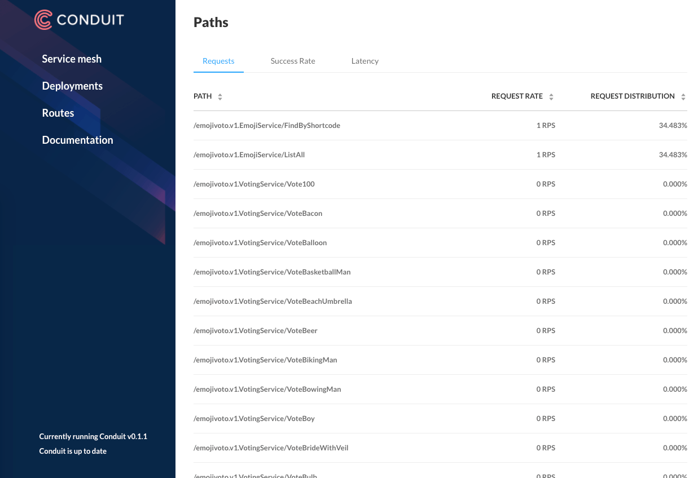
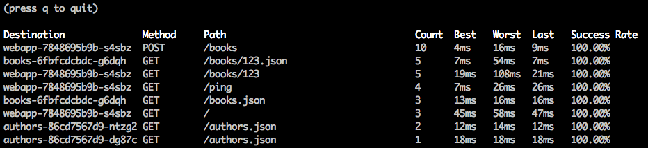
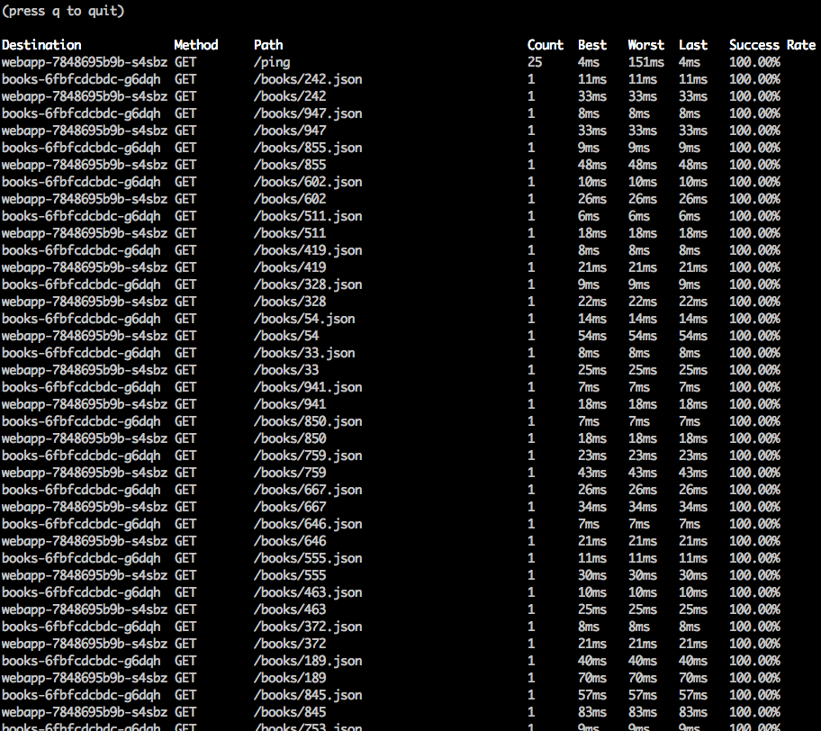

One of the primary goals of Linkerd is to enable service and platform owners alike to understand their services not just in terms of packets and bytes, but in terms of requests and responses. For protocols like HTTP, this requires understanding the semantics of the protocol, so that Linkerd can measure things like success rate and response latency. We also need to be able to break these metrics down across different dimensions such as source service, destination service, and HTTP path.

However, aggregating metrics by path in particular poses some significant challenges. In this post, we'll explore these challenges, and show how Linkerd handles them using a new concept called the _service profile_. If you're keen to simply add path-level metrics to your service, feel free to skip ahead to the end of the post.

## A First Attempt

The earliest versions of what would become Linkerd 2.0 (back when it was called Conduit!) actually had per-path metrics right out of the box:



This feature was incredibly useful, but there was a big problem. Conduit [stored all of its metrics in Prometheus](https://buoyant.io/2018/05/17/prometheus-the-right-way-lessons-learned-evolving-conduits-prometheus-integration/), using Prometheus _labels_ to store all of the different dimensions of the data such as service, deployment, and path. A Prometheus label for path means that every unique path creates a new timeseries in Prometheus. Since Conduit had no control over the requests that it receives, it was very easy for Prometheus to become overwhelmed with an unbounded number of unique paths and thus an unbounded number of timeseries. In fact, the Prometheus docs include a warning about [this very issue](https://prometheus.io/docs/practices/naming/#labels)! While this early version showed us just how awesome this feature could be, we ultimately [decided to remove the path label](https://github.com/linkerd/linkerd2/pull/317) to ensure that, in Linkerd, Prometheus could continue to perform well.

## Linkerd Top to the Rescue?

"But wait!" you might say, "What about the `linkerd top` command? Doesn't that display per-path metrics?" And you'd be right, it does!



The `linkerd top` command sidesteps the timeseries cardinality issue by avoiding Prometheus altogether. It consumes a stream of live traffic directly (using the same mechanism as `linkerd tap`) and does per-path aggregation in memory. This has some very powerful advantages:

- Since the results are computed directly from live traffic, the data is truly real-time. There is no delay from waiting for metrics to be scraped and aggregated.
- No concerns about blowing up Prometheus.

Of course, this approach has some drawbacks as well:

- No timeseries means no historical data. Live data only.
- At high traffic rates, the live traffic stream may be sampled. This means that the data in `linkerd top` is not guaranteed to represent 100% of requests and should not be assumed to be 100% accurate.

Nonetheless, `linkerd top` remains an incredibly useful tool for quickly getting a picture of how live traffic is performing.

## The Pesky Path Parameter Problem

There's one more major problem that plagues both the Prometheus based and live traffic based approaches for per-path metrics. See if you can spot it in this screenshot:



When paths have parameters in them such as user names or ids, it usually doesn't make sense to calculate metrics separately for each path. What you usually want is metrics aggregated together for a whole group of similar paths. In the above screenshot, we'd really like to see metrics for `/books/*`. In Linkerd, we call a group of paths a **route**. But I'm getting ahead of myself — let's talk about service profiles first.

## Service Profiles

[Linkerd 2.1](https://buoyant.io/2018/12/06/announcing-linkerd-2-1/) introduces the concept of a _service profile_. A service profile is a custom Kubernetes resource which is deployed in the Linkerd control plane namespace, and allows operators to give Linkerd additional information about a service. In particular, it allows you to define a list of routes for the service. Each route uses a regular expression to define which paths should match that route. Let's take a look at an example of a service profile which defines 2 routes.

```yaml
### ServiceProfile for webapp.default ###
apiVersion: linkerd.io/v1alpha2
kind: ServiceProfile
metadata:
  name: webapp.default.svc.cluster.local
  namespace: linkerd
spec:
  routes:
    - name: '/books' # This is used as the value for the rt_route label
      condition:
        method: POST
        pathRegex: '/books'
    - name: '/books/{id}' # This is used as the value for the rt_route label
      condition:
        method: GET
        pathRegex: '/books/\d+'
```

Every route in the service profile consists of a name and a condition. The condition matches on method and uses a regular expression to match the path. Requests that match a route will have the `rt_route` Prometheus label set to the route name. By requiring that routes be defined manually in the service profile, Linkerd is able to resolve many of the issues with the previous approaches:

- Paths are aggregated in a user-defined way that can match the semantics of the application.
- Routes must be explicitly configured and therefore the number of routes (and the number of timeseries) is bounded.
- Route metrics do not need to be sampled and every request is counted in the calculation of the metrics.
- Route metrics are stored as timeseries data in Prometheus and therefore historical data can be queried after the fact.

Let's walk through an example end-to-end.

## Per-route Metrics Example

Here's a quick example you can try at home to see just how easy it is to get per-route metrics with Linkerd. Start by installing Linkerd and our sample Books app into your Kubernetes cluster.

```bash
linkerd install | kubectl apply -f -
linkerd check
curl --proto '=https' --tlsv1.2 -sSfL https://run.linkerd.io/booksapp.yaml | linkerd inject - | kubectl apply -f -
```

At this point, the Books app is installed and receiving traffic from a built-in traffic generator. We would like to see per-route metrics for the `webapp` service—but we can't, because we haven't defined any routes for that service yet!

```bash
$ linkerd routes svc/webapp
ROUTE       SERVICE   SUCCESS      RPS   LATENCY_P50   LATENCY_P95   LATENCY_P99
[UNKNOWN]    webapp    70.00%   5.7rps          34ms         100ms         269ms
```

We can see there is traffic to the webapp service but can't see much beyond that. Let's remedy that by creating a service profile using the `linkerd profile` command.

```bash
linkerd profile --template webapp > webapp-profile.yaml
```

The `linkerd profile --template` command generates a basic service profile spec which you can edit to define the routes you want. Let's edit `webapp-profile.yaml` to the following:

```yaml
### ServiceProfile for webapp.default ###
apiVersion: linkerd.io/v1alpha2
kind: ServiceProfile
metadata:
  name: webapp.default.svc.cluster.local
  namespace: linkerd
spec:
  routes:
    - name: '/books' # This is used as the value for the rt_route label
      condition:
        method: POST
        pathRegex: '/books'
    - name: '/books/{id}' # This is used as the value for the rt_route label
      condition:
        method: GET
        pathRegex: '/books/\d+'
```

This service describes two routes that the webapp service responds to, `/books` and `/books/<id>`. We add the service profile with `kubectl apply`: `$ kubectl apply -f webapp-profile.yaml`

Within about a minute (Prometheus scrapes metrics from the proxies at regular intervals) per-route metrics will be available for the `webapp` service.

```bash
$ linkerd routes svc/webapp
ROUTE         SERVICE   SUCCESS      RPS   LATENCY_P50   LATENCY_P95   LATENCY_P99
/books/{id}    webapp   100.00%   0.3rps          26ms          75ms          95ms
/books         webapp    56.25%   0.5rps          25ms         320ms         384ms
[UNKNOWN]      webapp    79.14%   4.6rps          29ms         165ms         193ms
```

Now we can easily see success rate, requests per second, and latency for each route, and we've avoided any problems about timeseries cardinality. Success! We can also see that there are requests which don't match any of our defined routes, suggesting that we may need to add more route definitions.

## Conclusion

In this post, we've shown how to enable per-route (aka per-path) metrics for a service by using a new feature in Linkerd 2.1 called _service profiles_. By giving Linkerd a little information about the routes that your service expects, you can move beyond "my service is failing" to "my service is mostly fine except this one this particular call, which is is failing"—a huge step forward in runtime debugging.

Service profiles aren't just for route-based metrics. They will also serve as the foundation for many of the features on Linkerd's roadmap. In the future, you will be able to specify other properties on service profiles and routes such as retryability, rate limits, timeouts, etc. Look for these features and more in upcoming Linkerd releases!

Like this post? Linkerd is a community project and is hosted by the [Cloud Native Computing Foundation](https://cncf.io). If you have feature requests, questions, or comments, we’d love to have you join our rapidly-growing community! Linkerd is [hosted on GitHub](https://github.com/linkerd/linkerd2), and we have a thriving community on [Slack](https://slack.linkerd.io), [Twitter](https://twitter.com/linkerd), and the [mailing lists](https://lists.cncf.io/g/cncf-linkerd-users). Come and join the fun!
