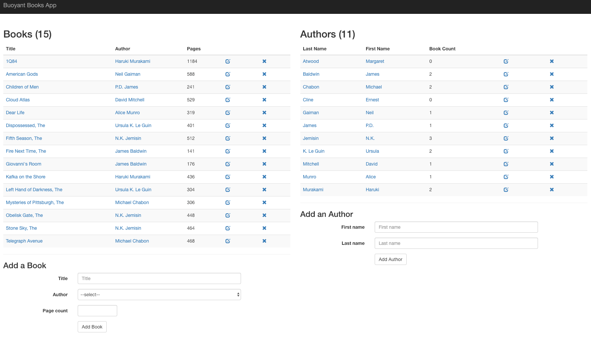
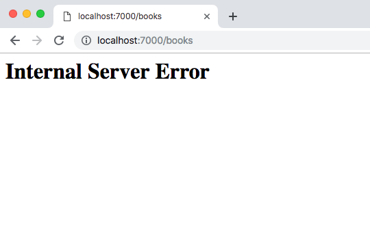
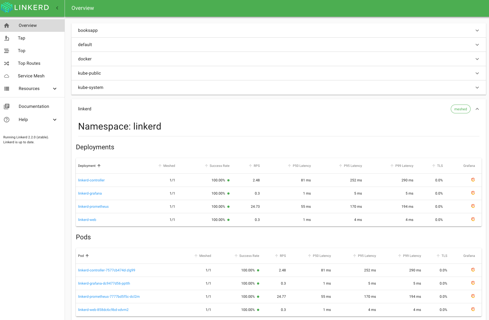
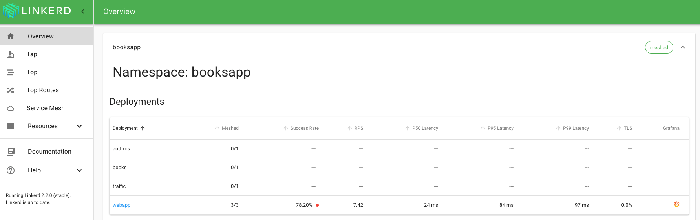
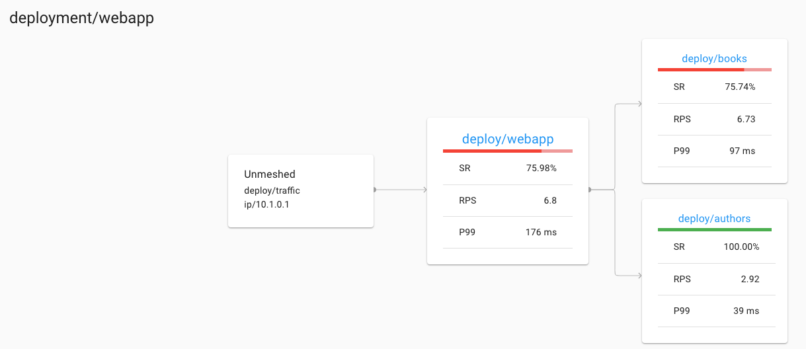
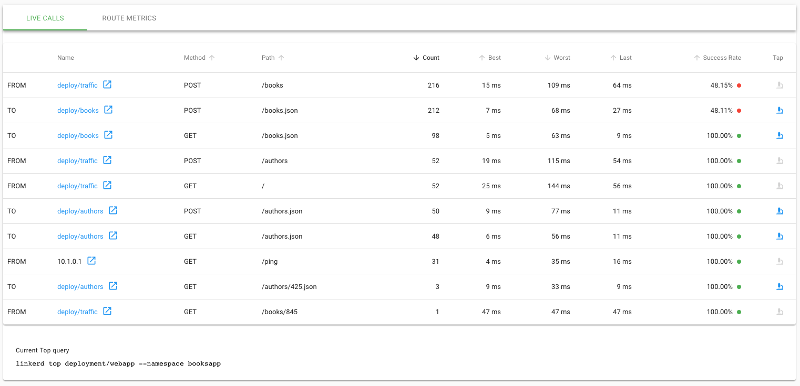
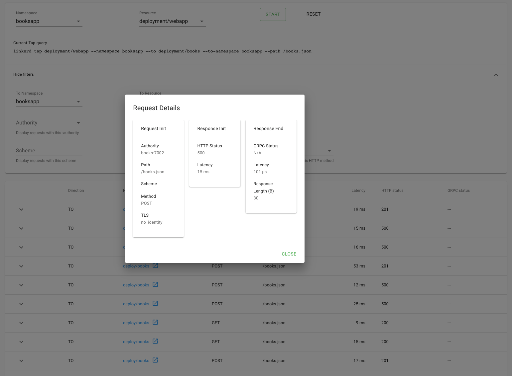
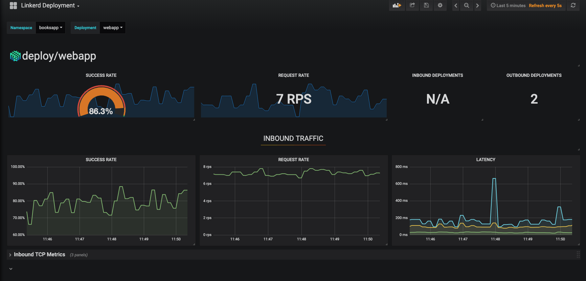

Ruby continues to be one of the most popular and influential programming languages in the world. With the rise of Kubernetes, Ruby developers are increasingly being asked to deploy their services to a Kubernetes cluster. But what’s required to safely deploy and run Ruby services on Kubernetes?

In this post, we focus on one specific, but vital, component: how do I understand what’s happening with my Ruby service on Kubernetes, and how do I debug it when things go wrong?

One of the advantages of Kubernetes is that it is able to handle certain types of failures automatically. Kubernetes can automatically keep your service up in the event of node failure or a software crash. However, Kubernetes doesn’t actually know whether your service is behaving _correctly._ A service that’s returning 500’s or taking too long to respond will still be considered healthy by Kubernetes.

This is why Kubernetes is often used in conjunction with something like Linkerd. Linkerd is a _service mesh_ that augments any Kubernetes service, providing zero-config “golden metrics” dashboards and UNIX-style CLI tools for runtime debugging, diagnostics, and reliability. Linkerd works by inserting an ultralight proxy (<10mb) into each pod of service, and automatically sending traffic to and from that pod through its proxy. These proxies provide telemetry data to, and receive signals from, a control plane. Because the proxy runs alongside your application and is transparent, there are zero code changes required. And, of course, Linkerd is completely open source, Apache v2 licensed and is hosted by the Cloud Native Computing Foundation–just like Kubernetes itself.

In this tutorial, we’ll walk you through deploying Linkerd on a Kubernetes cluster and using it to debug failures in an example Ruby application.

## The Books App

The Books app, as you might imagine, is a Ruby application that helps you manage your bookshelf. It’s written as microservices and uses JSON over HTTP to communicate with the other services in the app. It’s composed of the following three services:

- [webapp](https://github.com/BuoyantIO/booksapp/blob/master/webapp.rb): the frontend
- [authors](https://github.com/BuoyantIO/booksapp/blob/master/authors.rb): an API to manage the authors in the system
- [books](https://github.com/BuoyantIO/booksapp/blob/master/books.rb): an API to manage the books in the system

For demo purposes, the app comes with a simple traffic generator. The overall topology looks like this: The overall topology looks like this:


## Prerequisites

Before you begin this guide, you'll need the following:

- Kubernetes cluster - If you don’t have a Kubernetes cluster, don’t worry! Take a look at [minikube](https://github.com/kubernetes/minikube), or at the [Kubernetes documentation](https://kubernetes.io/docs/setup/).

## Step 1 — Install the demo app 🚀

Before we install Linkerd, let’s add the books app onto your cluster. In your local terminal, just run:

```bash
kubectl create ns booksapp && \
  curl --proto '=https' --tlsv1.2 -sSfL https://run.linkerd.io/booksapp.yml | \
  kubectl -n booksapp apply -f -
```

This command creates a namespace for the demo, downloads its Kubernetes manifest and uses _kubectl_ to apply it to your Kubernetes cluster. The app is comprised of several services that run in the booksapp namespace.

Downloading a bunch of containers and starting mysql up for the first time takes a little while. Kubernetes can tell you when all the services are running and ready for traffic. Wait for that to happen by running:

```bash
kubectl -n booksapp rollout status deploy webapp
```

You can also take a quick look at all the components that were added to your cluster by running:

```bash
kubectl -n booksapp get all
```

Once the rollout has completed successfully, you can forward the [frontend](http://localhost:7000/) (webapp) locally for viewing [http://localhost:7000](http://localhost:7000) by running:

```bash
kubectl -n booksapp port-forward \
  $(kubectl -n booksapp get po -l app=webapp \
    -o jsonpath='{.items[0].metadata.name}') \
  7000:7000 &
```



As you can imagine, there is an error in the app. If you click Add Book, it will fail 50% of the time. This is a classic case of non-obvious, intermittent failure - the type that drives service owners mad because it is so difficult to debug. Because Kubernetes is interested in keeping processes running, it will show you that everything is running. It looks like everything’s fine, but you know the application is returning errors.



In the next few steps, we’ll walk you through how to use Linkerd to diagnose the problem.

## Step 2 — Install Linkerd’s CLI

We’ll start by installing Linkerd’s command-line interface (CLI) onto your local machine. Visit the Linkerd releases page, or simply run:

```bash
curl --proto '=https' --tlsv1.2 -sSfL https://run.linkerd.io/install | sh
```

Once installed, add the linkerd command to your path with:

```bash
export PATH=$PATH:$HOME/.linkerd2/bin
```

Let’s validate that your cluster is prepared for Linkerd by running:

```bash
linkerd check --pre
```

As there are many different types of Kubernetes clusters, and an infinite set of ways to configure them, this handy command will report any problems that would interfere with your ability to install Linkerd. Hopefully, everything looks OK and you’re ready to move on to the next step.

As there are many different types of Kubernetes clusters, and an infinite set of ways to configure them, this handy command will report any problems that would interfere with your ability to install Linkerd. Hopefully, everything looks OK and you’re ready to move on to the next step.

Note: if your Kubernetes cluster is on GKE with RBAC enabled, you’ll need an extra step: you must grant a ClusterRole of cluster-admin to your Google Cloud account first, in order to install the control plane. To do that, run:

```bash
kubectl create clusterrolebinding cluster-admin-binding-$USER \
  --clusterrole cluster-admin \
  --user=$(gcloud config get-value account)
```

### Step 3 — Install Linkerd’s control plane onto the cluster

In this step, we’ll install Linkerd’s lightweight control plane into its own namespace (`linkerd`) on your cluster. To do this, run:

```bash
linkerd install | kubectl apply -f –
```

This command generates a Kubernetes manifest and uses kubectl to apply it to your Kubernetes cluster. (Feel free to read the full manifest before you apply it.)

Depending on the speed of your connection, it might take a minute for your Kubernetes cluster to pull down the Linkerd container images and get them started. While that’s happening, you can validate that everything’s installing correctly by running:

```bash
linkerd check
```

This command will wait until Linkerd has been installed and is running. Now, let’s check out Linkerd’s dashboard! Just run:

```bash
linkerd dashboard
```

If you see something similar to the screenshot below, Linkerd is now running on your cluster. 🎉



## Step 4 — Add Linkerd to the webapp service

At this point, we have the Linkerd control plane installed in the linkerd namespace, and we have our demo app installed in the booksapp namespace. We now need to add Linkerd to our service. In this example, let’s pretend we are the owners of the webapp service. Let’s just say that other services, like authors and books, are owned by other teams -- we don’t want to touch them. While these are local services in this example, it is entirely possible that they could be remote APIs owned by a completely separate entity. There are a couple of ways to add Linkerd to our service. For demo purposes, the easiest is to do something like this:

```bash
kubectl get -n booksapp deploy/webapp -o yaml \
  | linkerd inject - \
  | kubectl apply -f -
```

This command retrieves the manifest of the webapp service from Kubernetes, runs this manifest through linkerd inject, and then re-applies it to the Kubernetes cluster. The linkerd inject command adds to the manifest to include the data plane’s proxies. As with install, inject is a pure text operation. This means that you can inspect the input and output before you use it. Since webapp is a Deployment, Kubernetes is kind enough to slowly roll the service one pod at a time–meaning that webapp can be serving traffic live while we add Linkerd to it!

We now have a service mesh running on the webapp service!

## Step 5 — Debugging Your Ruby Service

Cool! You have a full Ruby application running on your Kubernetes cluster with Linkerd installed on the webapp service. Let’s use Linkerd to discover the root cause in minutes without any code changes. Check out the Linkerd dashboard (the linkerd dashboard command). You should see all the services in the booksapp namespace show up. Since webapp has the Linkerd sidecar installed on it, you’ll also see success rate, requests per second, and latency percentiles.



That’s cool, but you’ll notice that the success rate for webapp is not 100%. This is because the traffic generator is submitting new books. You can do the same thing yourself and push that success rate even lower. Click on webapp in the Linkerd dashboard for a live debugging session.

You should now be looking at the detail view for the webapp service. You’ll see that webapp is taking traffic from traffic, and has two outgoing dependencies: authors and book. One is the service for pulling in author information and the other is the service for pulling in book information.



A failure in a dependent service may be exactly what’s causing the errors that webapp is returning (and the errors you as a user can see when you click). We can see that books service is also failing. Let’s scroll a little further down the page, we’ll see a live list of all traffic endpoints that webapp is receiving. This is interesting:



Aha! We can see that inbound traffic coming from the webapp service going to the books service is failing a significant percentage of the time. That could explain why webapp was throwing intermittent failures. Let’s click on the 🔬 icon to look at the actual request and response stream.



Indeed, many of these requests are returning 500's.

It was surprisingly easy to diagnose an intermittent issue that affected only a single route. Assuming that someone else operates the books service, you now have everything you need to open a detailed bug report explaining exactly what the root cause is. If the books service was your own, you know exactly where to look in the code.

## Conclusion

In this tutorial, we’ve shown you how to install Linkerd on a cluster, add it as a service mesh to just one service–while the service is receiving live traffic! — and use it to debug a runtime issue. But this is just the tip of the iceberg.

For example, everything we did above using the web UI can also be accomplished via pure CLI commands, e.g. linkerd top, linkerd stat, and linkerd tap.

Also, did you notice the little Grafana icon on the very first page we looked at? Linkerd ships with automatic Grafana dashboards for all those metrics, allowing you to view everything you’re seeing in the Linkerd dashboard in a time series format. Check it out!



Linkerd has a thriving community of adopters and contributors, and we’d love for YOU to be a part of it. For more, check out the [docs](https://linkerd.io/docs) and [GitHub](https://github.com/linkerd/linkerd) repo, join the [Linkerd Slack,](https://slack.linkerd.io/) mailing lists ([users](https://lists.cncf.io/g/cncf-linkerd-users), [developers](https://lists.cncf.io/g/cncf-linkerd-dev), [announce](https://lists.cncf.io/g/cncf-linkerd-announce)), and San Francisco [Linkerd Meetup](https://www.meetup.com/San-Francisco-Linkerd-Meetup/), and, of course, follow [@linkerd](https://twitter.com/linkerd) on Twitter! We can’t wait to have you aboard!
