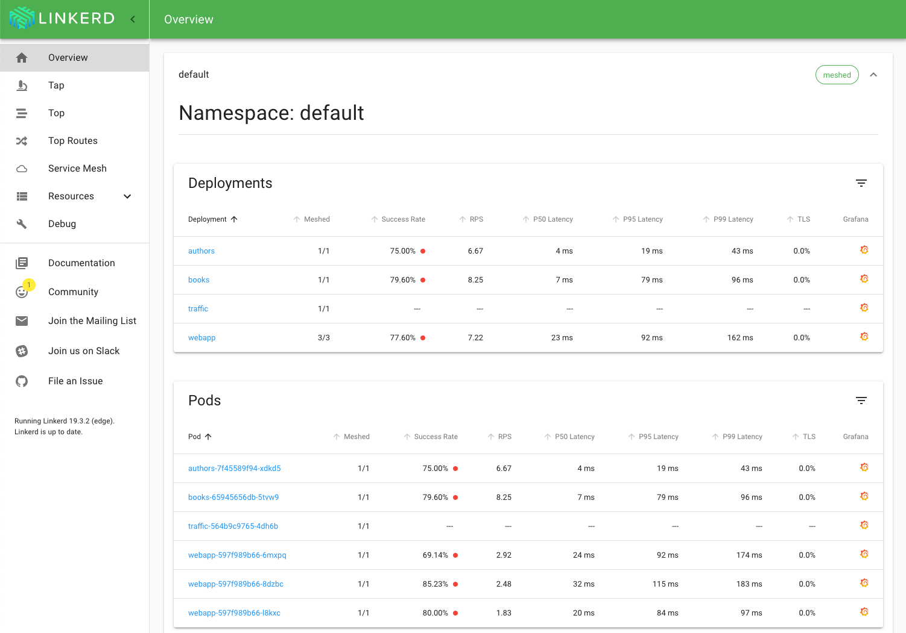
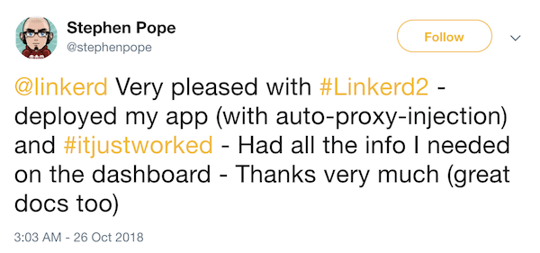
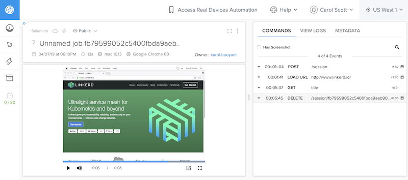

_This post was written for engineers who are building front-end integration test suites from scratch, particularly if your project is open-source. If you want to skip the background information and go right to the tutorial, scroll down to_ **"Building Your Testing Architecture."**

One of the coolest things about working on [Linkerd](http://www.linkerd.io) is how excited our users are about our clean, deceptively simple dashboard, built with [React](https://reactjs.org/) and [Material-UI](https://material-ui.com/). (Wanna try it? Get our super-light, open-source service mesh [up and running in just a few minutes](https://linkerd.io/2/getting-started/)!)



And when I say excited, I mean unsolicited-praise excited: we constantly get messages from users like this:



We want to keep our users happy with a clean, consistent dashboard as we constantly roll out new features and improvements, so recently we built a suite of integration tests simulating a user's traversal through the application.

## Why Front-End Integration Tests?

If you're reading this, you're probably already sold on the idea of testing, but as an [open source project](https://www.cncf.io/projects/), there are a few additional advantages of front-end integration tests you may not have considered:

### Integration tests are a great way to onboard open source contributors

We are lucky to have a ton of contributors to Linkerd, both power users and open source enthusiasts. Forking our repo and running the tests are a great way for a new contributor to ensure their development environment is properly set up.

### ...And to encourage them to submit their first PR

Writing, or updating, a test is a fabulous way to contribute to a project without much prior knowledge required.

### Most importantly, you can sanity-check UI changes in a fast-moving dev environment

If you're reviewing multiple PRs a day from many different contributors, it becomes important to have a set of actions to run through in the browser to ensure you haven't inadvertently broken or changed any functionality.

Yes, clicking through yourself is always the first step when making a front-end change! But, I mean, we're not _robots_. That's where WebdriverIO comes in:


WebdriverIO is a test automation framework for Node.js that allows you to get a test suite up and running in minutes. You don't need any Selenium knowledge to get started, although there is an entire universe of libraries built by the WebdriverIO community that can add layers of complexity.

In the spirit of open source, we're sharing what we've learned. This post should take you from 0 to a full test architecture. You'll be able to run your tests locally and, if you have a Sauce Labs account, in the cloud! SauceLabs is free for open source projects. Let's get started!

## Building Your Testing Architecture

Before we start, you need to have the following installed:

- [Yarn](https://yarnpkg.com/en/docs/getting-started)
- [Node.js](https://nodejs.org/en/download/)

**Recommended**: If you install Yarn through the [Homebrew package manager](https://brew.sh/) it will download Node.js as well.

First, navigate to the directory in your project that holds your web application. Ours is named `app`:

```bash
cd app
```

Now it's time to add some packages! First, we'll add WebdriverIO:

```bash
yarn add webdriverio --dev
```

We added the `--dev` flag because we want this package to be part of the `devDependencies` portion of our `package.json`, since we'll be running our tests in a development environment. If you didn't already have a `package.json` file, this command will create one for you.

Now, we'll add WebdriverIO's testrunner command line interface, which is what will allow you to run the tests from your terminal:

```bash
yarn add @wdio/cli --dev
```

 When WebdriverIO 5 was released, the project switched to a `@wdio` naming structure. In general, if a library is prefixed with `@wdio` it is officially part of the WebdriverIO project, and if it is prefixed with `wdio` it is a community project. 

The `@wdio/cli` testrunner comes with a config file generator, which we won't use for this project. If you want to learn more about it, visit WebdriverIO's [Getting Started](https://webdriver.io/docs/gettingstarted.html) page. Instead, we'll download the packages we need directly:

```bash
yarn add chromedriver @wdio/local-runner @wdio/mocha-framework @wdio/sync wdio-chromedriver-service --dev
```

These packages are, respectively:

- `chromedriver` Automated testing for Chrome
- `@wdio/local-runner` A WebdriverIO runner to run tests locally
- `@wdio/mocha-framework` Adapter for Mocha testing framework
- `@wdio/sync` Helper module to run WebdriverIO commands synchronously
- `wdio-chromedriver-service` (community package: WebdriverIO service to start & stop ChromeDriver)

Now, from `app`, let's create a subdirectory for our tests:

```bash
mkdir integration && cd integration
touch wdio.conf.js
```

In the `integration` directory, we'll create a config file to tell WebdriverIO what to do. In your text editor, open `wdio.conf.js` and paste:

```javascript
exports.config = {
  port: 9515, // default for ChromeDriver
  path: '/',
  services: ['chromedriver'],
  runner: 'local',
  specs: ['./integration/specs/*.js'],
  exclude: [
    // 'path/to/excluded/files'
  ],
  maxInstances: 10,
  capabilities: [
    { browserName: 'chrome', platform: 'OS X 10.13', version: '69.0' }
  ],
  bail: 0,
  baseUrl: 'http://localhost',
  waitforTimeout: 10000,
  connectionRetryTimeout: 90000,
  connectionRetryCount: 3,
  framework: 'mocha',
  mochaOpts: {
    ui: 'bdd',
    timeout: 60000
  }
}
```

As you can see, we're specifying that our tests will live in `/integration/specs/`, that we are using Chromedriver and specifying a specific platform and version to run the tests.

Create a `specs/` directory with a sample test file:

```bash
mkdir specs && cd specs && touch first-test.js
```

At this point your directory structure should look like this:

```bash
app/
  node_modules/
  package.json
  integration/
    wdio.conf.js
    specs/
      first-test.js
```

Let's run a simple test where we go over to [Linkerd.io](http://linkerd.io) and check that the title of the page is what we expect. Open `first-test.js` and paste the following:

```javascript
const assert = require('assert')
describe('logo link test', function() {
  it('should redirect to the home view if logo is clicked', () => {
    browser.url('http://www.linkerd.io')
    const title = browser.getTitle()
    assert.equal(title, 'Linkerd - Linkerd')
  })
})
```

Right now, you're still in your `specs` directory. Go back up to your `app` directory to run the tests:

```bash
cd ../..
./node_modules/.bin/wdio ./integration/wdio.conf.js
```

You should see a message in your terminal saying "Starting ChromeDriver on port 9515". An instance of Chrome window should then open up, go to [Linkerd.io](http://linkerd.io) and close. You should see "1 Passing" in your terminal!

")

Awesome, you just successfully ran an integration test with WebdriverIO! 🥳 You can start building these tests out to test your application. I've found the WebdriverIO [Selector Docs](https://webdriver.io/docs/selectors.html) very helpful.

## Testing in the Cloud

You're currently just running the tests on one browser. This will help find bugs in functionality, but a big part of front-end development is making sure your application looks consistent — and works — on multiple browsers and devices.

You could instruct WebdriverIO to run the tests on multiple different browsers locally (and maybe you want to), but if you add in all of the different versions and device sizes that your application should support, that quickly grows out of hand.

Enter SauceLabs, whose cross-browser testing tools are [free for open source projects](https://saucelabs.com/open-source) and allow you to run tests in a host of browser types, versions and sizes.


If you have an open source project and want to use SauceLabs, you first need to [apply for an account](https://saucelabs.com/open-source). You can also sign up for a free trial on their site. (If you're a Linkerd contributor, the best way to get a contributor credential is to [ask on our Slack channel](https://slack.linkerd.io/).)

SauceLabs will give you a username and key. Once you have those credentials, set them as permanent environment variables. This keeps your credentials private, and means that everyone on the team can run the tests via their unique login without modifying the test files.

To do that, open your `~/.bash_profile` file and add:

```bash
export SAUCE_USERNAME="your Sauce username"
export SAUCE_ACCESS_KEY="your Sauce access key"
```

Great! Now, in your `integration` directory, we'll need to create a separate config file for running WebdriverIO with SauceLabs.

```bash
cd integration # from app directory
touch wdio-sauce.conf.js
```

Open that file and paste in the following:

```javascript
exports.config = {
  runner: 'local',
  user: process.env.SAUCE_USERNAME,
  key: process.env.SAUCE_ACCESS_KEY,
  sauceConnect: true,
  specs: ['./integration/specs/*.js'],
  // Patterns to exclude.
  exclude: [
    // 'path/to/excluded/files'
  ],
  maxInstances: 10,
  capabilities: [
    { browserName: 'firefox', platform: 'Windows 10', version: '60.0' },
    { browserName: 'chrome', platform: 'OS X 10.13', version: '69.0' }
  ],
  bail: 0,
  baseUrl: 'http://localhost',
  waitforTimeout: 10000,
  connectionRetryTimeout: 90000,
  connectionRetryCount: 3,
  framework: 'mocha',
  mochaOpts: {
    ui: 'bdd',
    timeout: 60000
  }
}
```

As you can see, we've removed the `port` , `path` and `services` variables and added our Sauce `user` and `key`. We've switched on something called `sauceConnect` and added two specific browsers to try, Firefox and Chrome.

## Tunneling to Localhost in 3, 2, 1

[SauceConnect](https://wiki.saucelabs.com/display/DOCS/Sauce+Connect+Proxy) is a proxy server that will open a tunnel between a SauceLabs Virtual Machine (VM) and whatever you are running on `localhost.`You'll want to save it in a separate directory from the rest of your development files.

 SauceConnect only [supports specific port numbers to tunnel to localhost](https://wiki.saucelabs.com/display/DOCS/Sauce+Connect+Proxy+FAQS#SauceConnectProxyFAQS-CanIAccessApplicationsonlocalhost), so you may need to change the port where you serve the dashboard. We had to change from `:8084` to `:7777` in order for the tunnel to work. 

After [downloading SauceConnect](https://wiki.saucelabs.com/display/DOCS/Sauce+Connect+Proxy), navigate to that directory and start it up:

```bash
SC=sc-4.5.3-osx # OSX example
wget -O - https://saucelabs.com/downloads/$SC.zip | tar -xzf - -C ~/
cd ~/$SC
bin/sc -u $SAUCE_USERNAME -k $SAUCE_ACCESS_KEY
```

Wait until you see "Sauce Connect is up, you may start your tests" in your terminal. Open a separate terminal window, navigate to `app` and run:

```bash
./node_modules/.bin/wdio ./integration/wdio-sauce.conf.js
```

SauceLabs will start running the tests in the cloud. You can watch them run in real-time from the [SauceLabs dashboard](https://app.saucelabs.com/dashboard/tests) (and even take over if you want to manually control where the test goes).



If any tests fail, you'll immediately get the URL in your terminal window with a video of the test and information about what happened. (Break the test and try that now!)

When you're finished testing, **close the tunnel** by pressing `CTRL-C` in the Sauce Connect window. If you forget to do this, it will close on its own after a few minutes.

## Finishing Up

Congratulations! You've now set up testing architecture for your project, with a test you can run locally on Chrome and in the cloud on multiple browsers.

If you want to make it REALLY easy for your team to run, you can create shortcuts in a `bin` file (check out the `integration` function [in our repo's bin/web file](https://github.com/linkerd/linkerd2/blob/main/bin/web)).

## Go Forth and Test! 🚀

Your next challenge is to replace our simple `first-test.js` with a set of practical tests for your own application. Good luck! If you have any questions, feel free to shoot me [a note on Twitter](https://twitter.com/CarolScottSF) or [file an issue or feature request for Linkerd](https://github.com/linkerd/linkerd2).

Want to learn more? We’d love to have you join our rapidly-growing community! Linkerd is [hosted on GitHub](https://github.com/linkerd/linkerd2), and we have a thriving community on [Slack](https://slack.linkerd.io), [Twitter](https://twitter.com/linkerd), and our [mailing lists](https://lists.cncf.io/g/cncf-linkerd-users). Come and join the fun!
