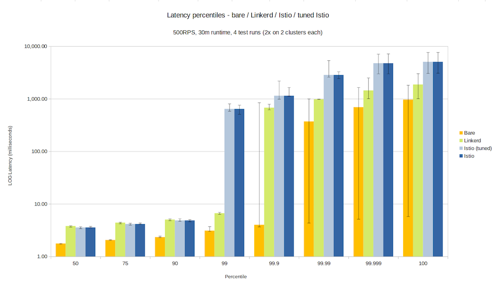
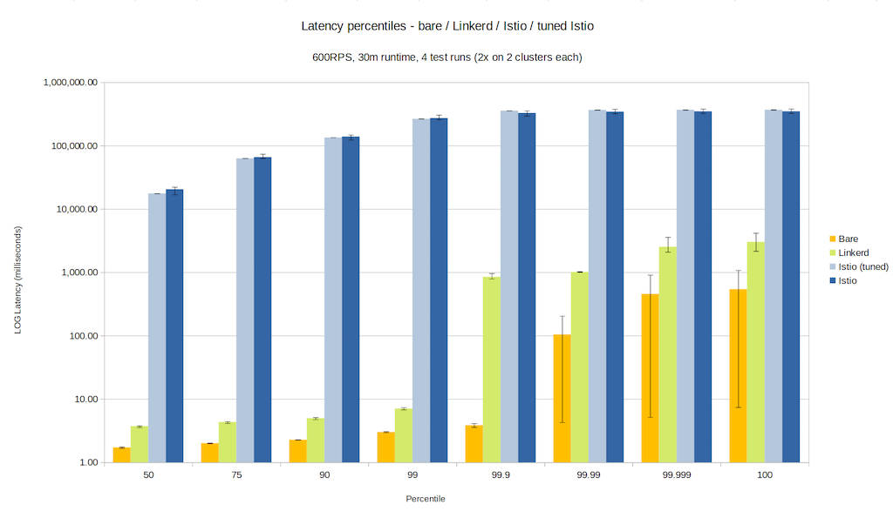
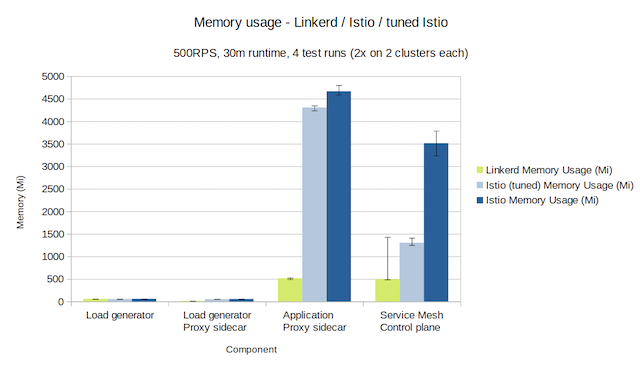
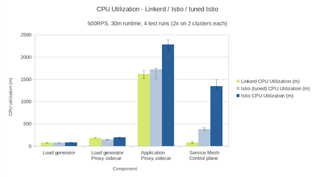
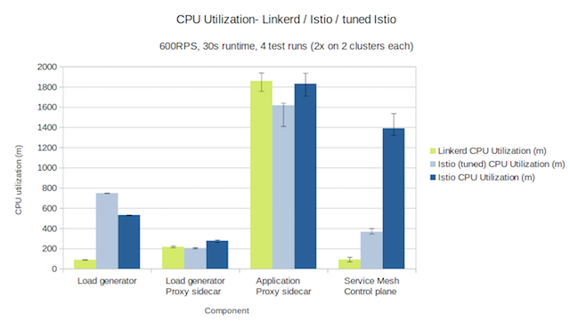

**Update 2021-11-29: we've repeated these experiments with the [latest versions
of Linkerd and Istio](/2021/11/29/linkerd-vs-istio-benchmarks-2021/).**

(**Update 5/30/2019:** Based on feedback from the Istio team, Kinvolk has
[re-run some of the Istio
benchmarks](https://github.com/kinvolk/service-mesh-benchmark/issues/5#issuecomment-496482381).
The results are largely similar to before, with Linkerd maintaining a
*significant* advantage over Istio in latency, memory footprint, and possibly
CPU. Below, we've noted the newer numbers for Istio when applicable.)

Linkerd's goal is to be the fastest, lightest, simplest service mesh in the
world. To that end, several weeks ago we asked the kind folks at
[Kinvolk](https://kinvolk.io/) to perform an independent benchmark. We wanted
an unbiased evaluation by a third party with strong systems expertise and a
history of benchmarking. Kinvolk fit this description to a T, and they agreed
to take on the challenge.

We asked Kinvolk for several things:

* A benchmark measuring tail latency, CPU usage, and memory consumption—the
  three metrics we believe are most indicative of the cost of operating a
  service mesh.
* A comparison to the baseline of _not_ using a service mesh at all.
* A comparison to Istio, another service mesh. (We're frequently asked how
  the two compare.)
* A realistic test setup for an application "at load" and "at scale",
  including an apples-to-apples comparison between features, and controls for
  variance and measurement error.
* A downloadable framework for reproducing these tests, so that anyone can
  validate their work.

Today, Kinvolk published their results. You can see the full report here:
[Kubernetes Service Mesh
Benchmarking](https://kinvolk.io/blog/2019/05/kubernetes-service-mesh-benchmarking/).
Kinvolk measured Linkerd 2.3-edge-19.5.2 and Istio 1.1.6, the latest releases
that were available at the time of testing. They measured performance under two
conditions: "500rps" and "600rps", representing effectively "high" and "very
high" load for the test harness.

Here's a summary of their results. (Note that for Istio, Kinvolk tested two
configurations, "stock" and "tuned". We're looking purely at the "tuned"
configuration below.)

## Latency

Latency is arguably the most important number for a service mesh, since it
measures the _user_-facing (as opposed to operator-facing) impact of a service
mesh. Latency is also the most difficult to reason about, since it is best
measured as a distribution.

Kinvolk measured latency from the perspective of load generator, which means
that these latency numbers are a function of the application they tested—if the
call graph was deeper, we'd see additional latency, and if it were shallower,
these numbers would be less. Thus, raw numbers are not as important as the
comparisons—how did Linkerd do versus the baseline, and versus Istio?

In the 500rps condition, Linkerd's p99 latency was 6.7ms, 3.6ms over the
baseline p99 of no service mesh of 3.1ms. (In other words, 99% of the time, a
request without a service mesh took less than 3.1 ms, and 99% of the time, a
request with Linkerd took less than 6.7ms.) At the p999 level (the 99.9th
percentile), Linkerd's latency was significantly worse, at 675ms above the
baseline's p999 of 4ms. The worst response time seen over the whole test with
Linkerd was a full 1.8s of latency, compared to the baseline's worst case of
972ms.

By comparison, Istio's p99 latency in the 500rps case was 643ms, almost 100x
worse than Linkerd's p99. Its p999 was well over a second, compared to
Linkerd's 679ms, and its worst case was a full 5s of latency, 2.5x what was
measured with Linkerd.

(**Update**: Kinvolk's re-tuned Istio benchmarks dropped Istio's p99 from 100x
that of Linkerd's to 26x and 59x that of Linkerd's across two runs. It also
dropped Istio's p999 to just under a second, though still *double* Linkerd's
p999.)

In the 600rps condition, the difference between the two service meshes is
exaggerated. While Linkerd's p99 elevates from 6.7ms to 7ms, 4ms over the "no
service mesh" baseline, Istio's p99 was a full 4.4 minutes (!). While Linkerd's
p999 climbed to 850ms, compared to the baseline of 3.8ms, Istio's p999 is
almost 6 minutes. Even Istio's p50 (median) latency was an unacceptable 17.6
seconds. In short, Istio was not able to perform effectively in Kinvolk's
600rps condition.

(**Update**: Kinvolk's re-tuned Istio benchmark showed similar performance in
the 600rps condition, with p99 latency for Istio remaining in the minutes and
median latency between 10 and 20 seconds.)

**_Summary: Linkerd had a latency advantage over Istio. In the 500rps
condition, Istio's p99 was 100x of Linkerd's. in the 600rps condition, Istio's
latency was unacceptable throughout. However, both meshes introduced
significant latency at the 99.9th percentile compared to the baseline in the
500rps condition._**

## Memory consumption

At 500rps, Linkerd's memory usage was 517mb across all data plane proxies
(averaging 5.7mb per proxy), and a little under 500mb for the control plane
itself, for a total of ~1gb of memory. By comparison, Istio's memory usage was
4307mb across all data plane proxies (averaging 47mb per proxy), and 1305mb for
the control plane, for a total of almost 5.5gb.

The situation was almost identical in the 600rps condition. Of course, both
meshes suffer greatly when compared to the baseline usage of 0mb!

(As a side note, 25% of Linkerd's control plane memory usage in these runs was
its Prometheus instance, which temporarily stores aggregated metrics results to
power Linkerd's dashboard and CLI. Arguably, this should have been excluded,
since Prometheus was disabled in Istio.)

**_Summary: Linkerd had a clear memory advantage. Istio consumed 5.5x as much
memory as Linkerd. Linkerd's data plane, in particular, consumed less than an
1/8th of the RAM that Istio's did._**

## CPU consumption

When measuring CPU consumption, the two meshes product comparable results. In
the 500rps run, Linkerd's data plane proxies took 1618mc (millicores)
cumulatively, and its control plane consumed 82mc, for a total of 1700mc.
Istio's data plane proxies consumed 1723mc and its control plane consumed
379mc, for a total of 2100mc, a 23% increase over Linkerd. However, in the
600rps run, the results were flipped, with Linkerd taking 1951mc vs Istio's
1985mc. In this run, Linkerd's data plane at 600RPS condition consumed 15%
_more_ CPU than Istio's. (Though it should be noted that, since Istio was not
able to actually return 600rps, it's not entirely a fair comparison to
Linkerd.)

**_Summary: CPU usage was similar Linkerd and Istio. Linkerd's data plane CPU
utilization was higher than Istio's in the 600rps condition, though it's hard
to know how real this result was because Istio was not able to fully perform in
this condition._**

(**Update**: Kinvolk's re-tuned Istio benchmarks showed a "massive increase in
CPU usage of Istio's proxy sidecar". While no numbers were reported, from this
description it is clear that Linkerd's CPU usage was less than Istio's in this
configuration.)

## Conclusion

Overall we are happy with Linkerd's performance in this test, and we're very
happy to have a thorough quantification of the relative cost of introducing a
service mesh, and a [publicly available, reproducible
harness](https://github.com/kinvolk/service-mesh-benchmark) for running these
benchmarks.

We're pleased to see that Linkerd has a very significant advantage in latency
and memory consumption over Istio. While CPU usage was comparable, we feel that
Linkerd can do better. We suspect there is low-hanging fruit in linkerd-proxy,
and we're eager to see if a little profiling and tuning can reduce CPU
consumption over the next few releases. (And we'd love your help -- hop into the
[Linkerd Slack](https://slack.linkerd.io) or [come talk to us next week at
Kubecon
EU](https://buoyant.io/2019/04/23/linkerd-community-guide-to-kubecon-eu-2019/)!)

In the future, we hope that projects like [Meshery](https://layer5.io/meshery)
can provide an industry standard approach for these sorts of benchmarks in the
future. They're good for users and good for projects too.

We're impressed by the thoroughness of Kinvolk's tests, and we'd like to thank
them for taking on this sizeable effort. The [full
report](https://kinvolk.io/blog/2019/05/kubernetes-service-mesh-benchmarking/)
details the incredible amount of effort they put into building accurate test
conditions, reducing variability, and generating statistically meaningful
results. It's definitely worth a read!

Finally, we'd also like to extend a huge THANK YOU to the kind folks at
[Packet](https://www.packet.com/), who allowed Kinvolk to use the [CNCF
community cluster](https://github.com/cncf/cluster) to perform these
experiments. The Linkerd community owes you a debt of gratitude.

---

Linkerd is a community project and is hosted by the [Cloud Native Computing
Foundation](https://cncf.io). If you have feature requests, questions, or
comments, we'd love to have you join our rapidly-growing community! Linkerd is
hosted on [GitHub](https://github.com/linkerd/), and we have a thriving
community on [Slack](https://slack.linkerd.io),
[Twitter](https://twitter.com/linkerd), and the [mailing
lists](https://linkerd.io/2/get-involved/). Come and join the fun!

Image credit: [Bernard Spragg. NZ](https://www.flickr.com/photos/volvob12b/)
