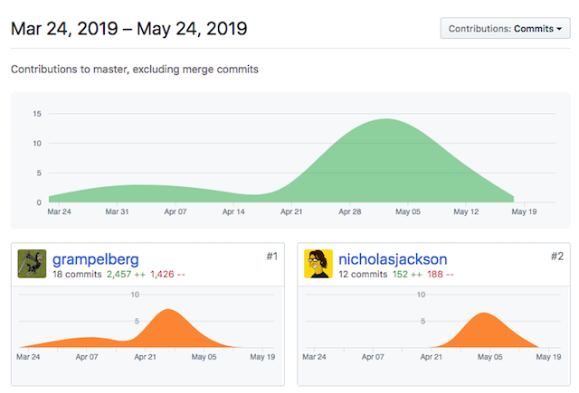

Earlier this week at [Kubecon
EU](https://events.linuxfoundation.org/events/kubecon-cloudnativecon-europe-2019/),
Microsoft announced the [Service Mesh Interface](https://smi-spec.io) (SMI).
SMI is a specification that exposes core service mesh features like telemetry,
traffic shifting, and policy, purely via Kubernetes primitives.

The Linkerd community has been working heavily with our friends from Microsoft
and Hashicorp on SMI for the past few months. In fact, the [top two
contributors to SMI](https://github.com/deislabs/smi-spec/graphs/contributors)
are Linkerd's [Thomas Rampelberg](https://github.com/grampelberg) and
Hashicorp's [Nick Jackson](https://github.com/nicholasjackson)---a healthy sign
of serious community involvement.

The reason we've invested so much time and energy in SMI is that we believe it
will significantly opens up the ecosystem of tools and products built _top_ of
the service mesh. With SMI, awesome tools like
[Flagger](https://github.com/weaveworks/flagger),
[Kubecost](https://kubecost.com/), and [Kiali](https://www.kiali.io/) can build
on SMI rather than tying their implementation to a specific mesh. This is great
for Linkerd users and great for the community as a whole.

Linkerd 2.3 [already implements SMI's _Traffic Metrics_
spec](https://github.com/deislabs/smi-metrics). In next month's 2.4, we'll add
support for _Traffic Split_ (which means that, yes, next month Linkerd will
support traffic shifting for canaries and blue-green deploys!), and in later
releases we'll flesh out Linkerd's support for the remaining SMI interfaces.

Linkerd is the [fastest, lightest, simplest service mesh in the
world](/2019/05/18/linkerd-benchmarks/), and we're excited
about SMI's ability to bring Linkerd to even more users around the globe.

---

Linkerd is a community project and is hosted by the [Cloud Native Computing
Foundation](https://cncf.io). If you have feature requests, questions, or
comments, we'd love to have you join our rapidly-growing community! Linkerd is
hosted on [GitHub](https://github.com/linkerd/), and we have a thriving
community on [Slack](https://slack.linkerd.io),
[Twitter](https://twitter.com/linkerd), and the [mailing
lists](/community/get-involved/). Come and join the fun!

Image credit: [I G](https://www.flickr.com/photos/qubodup/)
