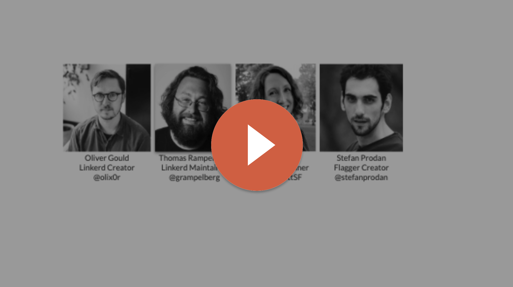

In this month's community meeting, Oliver, Thomas, and special guests Stefan
Prodan, creator of the [Flagger](https://github.com/weaveworks/flagger)
project, and Carol Scott, Linkerd maintainer extraordinaire, discussed:

💥 Linkerd 2.4: what’s new in this month's stable release?

💥 Linkerd security audit: what’s the scoop?

💥 Flagger + Linkerd: what awesome stuff does this unlock?

💥 Linkerd 2.5 and beyond: what does the future hold for Linkerd?

Got a Linkerd demo to show off? Have a topic suggestion? We’d love to have you
involved. Reach out to @KierstenGaffney in the [Linkerd Community
Slack](https://slack.linkerd.io/).
