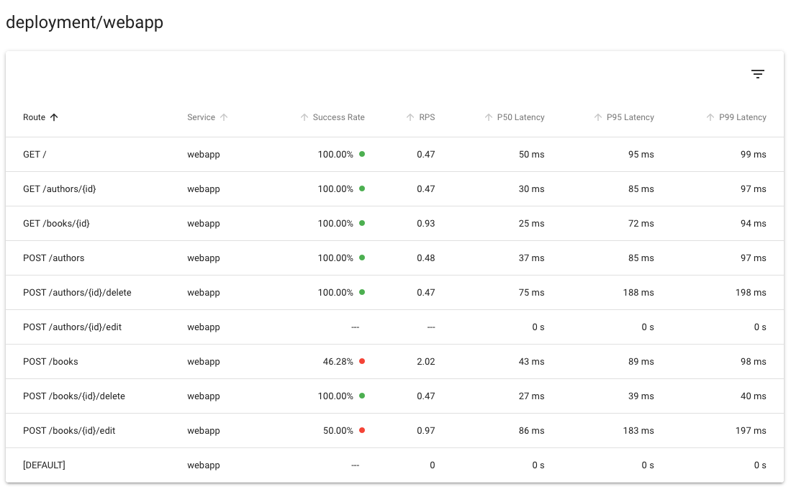
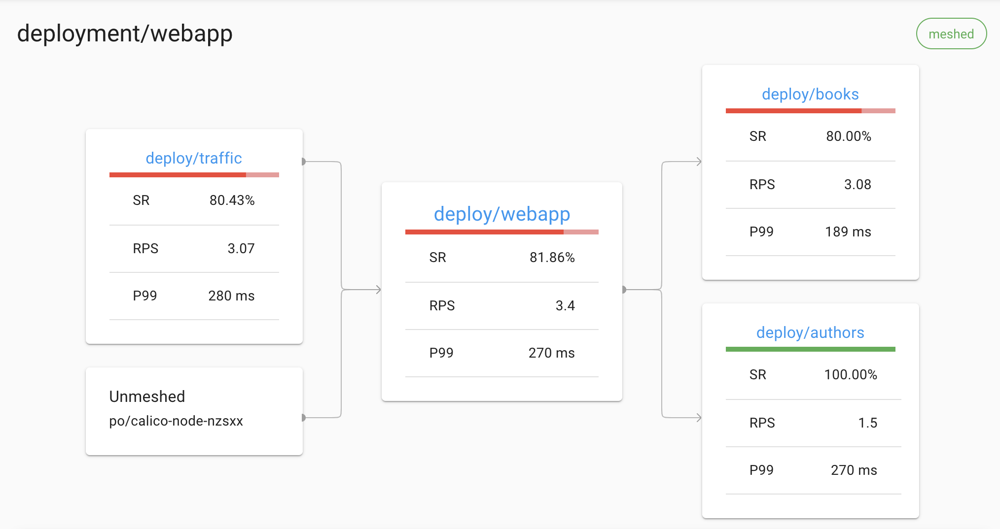

One of the most common feature requests for Linkerd 2.x is *distributed
tracing*. We're happy to report that this feature is on the [near-term Linkerd
roadmap](https://github.com/linkerd/linkerd2/issues/3188). Unfortunately,
we've found that many of the people asking for this feature don't quite
understand what they're asking for.

A few weeks ago we [conducted a Twitter
survey](https://twitter.com/linkerd/status/1152326635959439360) to understand
why people were asking for distributed tracing. This was highly
unscientific--64 respondents, advertised purely on Twitter, not peer reviewed,
etc--but the results suggested some common misunderstandings of what
distributed tracing support in a service mesh would actually provide, and what
it would require from them to be useful.

These misunderstandings can be characterized as a set of myths, which I'll
dispel below.

## Myth 1: I need distributed tracing to measure the health / latency / throughput of my services

**False**. Many respondents suggested that measuring service success rate,
latency, etc was a desired use case for distributed tracing in the service
mesh. While this is a possible use of distributed tracing data when a service
mesh is not in place, the service mesh itself already provides these metrics,
and arguably does so in a way that's better than what can be achieved with
distributed tracing. (No sampling, no code changes required.)

For example, Linkerd provides success rate, throughput, and latency
distributions per service (as well as per route, per client per service, per
client per route, etc) from metrics data, and the Linkerd dashboard and CLI
report this data today:

## Myth 2: I need distributed tracing to see which services talk to which other services

**False**. Many respondents suggested that drawing a *service topology* was a
desired use of distributed tracing in a service mesh. Again, while this is a
role that distributed tracing can provide outside of a service mesh, the
service mesh can detect and display these relationships purely from metrics
data, again without requiring any application-level changes.

For example, the Linkerd dashboard displays the set of upstream and downstream
Kubernetes deployments on the deployment detail page:

## Myth 3: I can "get distributed tracing" from the service mesh without having to make any changes to my application

**False**. Many respondents answered that they would not expect to need any
application changes once Linkerd added distributed tracing support.
Unfortunately, while a service mesh can emit trace spans from the proxies, the
application will need to *propagate headers* in order for these spans to be
pulled together into traces--i.e. copy any distributed tracing header that is
attached to an incoming request to each resulting outgoing request.

In other words, in contrast to nearly every other service mesh feature,
distributed tracing mesh can only work if developers make changes to their
code. Note that this isn't a flaw with Linkerd; this is a function of the
sidecar proxy model and is true of any sidecar-based service mesh.

## Myth 4: I can "get distributed tracing" from a service mesh by instrumenting my application with a distributed tracing library

*Sort of true*. Some respondents answered that they would make use of
distributed tracing in Linkerd by instrumenting their applications with a
distributed tracing library. It's true that these libraries will make it easy
to propagate the headers, thus accomplishing the development work you need to
do to make use of distributed tracing. But once you're at this point, you have
distributed tracing, regardless of whether the service mesh "supports
distributed tracing" or not! (Of course, Linkerd support will add some
important data--see below.)

## What does distributed tracing support in a service mesh actually get you?

If you've decided you want distributed tracing, *and* you are willing and able
to modify your application to support it, then what distributed tracing support
at the service mesh level actually gets you is:

1. Proxy timing and data in your traces. This can be helpful for understanding
   how much latency for particular requests is coming from the proxy. (Happily,
   [Linkerd is very, very fast](0518-linkerd-benchmarks), but
   nothing is free.)
2. Traces that extend to ingress points. This can be helpful for painting a
   more complete picture of how time is spent on particular requests.
3. Distributed tracing functionality without needing to couple application code
   to a particular library. This is helpful if you don't want to commit to a
   particular library, or don't have library support in the languages you need.

Those are all valuable features, certainly, but they're a far cry from some of
the expectations we saw in the survey.

All that said, [distributed tracing support *is* on the near-term roadmap for
Linkerd 2.x](https://github.com/linkerd/linkerd2/issues/3188). If this is a
valuable feature for you in Linkerd 2.x, please leave a comment on that ticket
saying as much--we'd love to hear from you.

_Linkerd is a community project and is hosted by the [Cloud Native Computing
Foundation](https://cncf.io/). If you have feature requests, questions, or
comments, we'd love to have you join our rapidly-growing community! Linkerd is
hosted on [GitHub](https://github.com/linkerd/), and we have a thriving
community on [Slack](https://slack.linkerd.io/),
[Twitter](https://twitter.com/linkerd), and the [mailing
lists](/community/get-involved/). Come and join the fun!_

*Special thanks to Alex Ellis, Matt Turner, and Alex Klemmer for reviewing
drafts of this post. All errors are mine, not theirs.*

(*Image credit: [Digital Vincent](https://www.flickr.com/photos/7699384@N07/)*)
