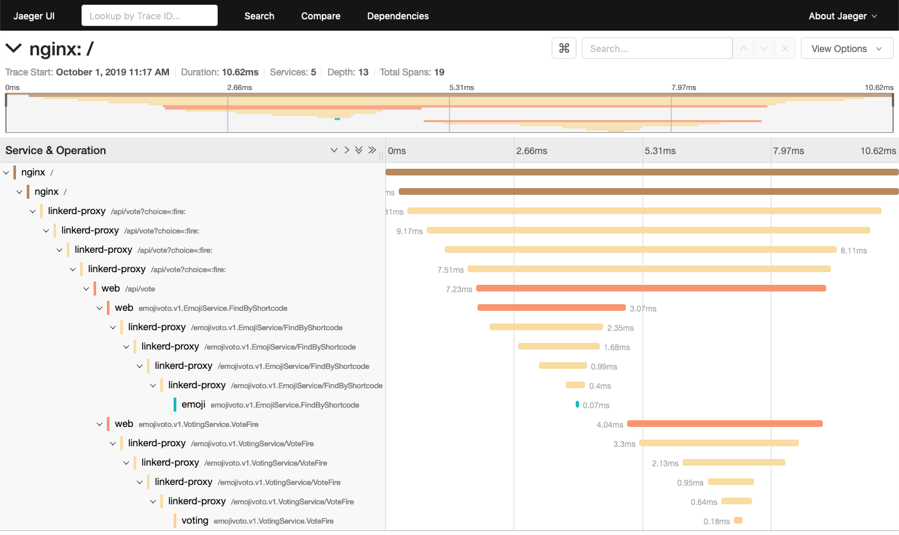

We're happy to announce that Linkerd 2.6 adds support for distributed tracing!
This means that Linkerd data plane proxies can now emit trace spans, allowing
you to see the exact amount of time that requests spend in the Linkerd proxy for
traced requests. Since using distributed tracing in practice can be quite
difficult, in this post, we've assembled a reference architecture with our
recommendation on the best way to make use of distributed tracing with Linkerd.

## Overview

Tracing can be an invaluable tool in debugging distributed systems performance,
especially for identifying bottlenecks and understanding the latency cost of
each component in your system.  If you're not already familiar with the idea
behind distributed tracing, the [OpenTelemetry Observability
Primer](https://opentelemetry.io/docs/concepts/observability-primer/#what-is-observability)
gives a good overview of the concepts. The promises of distributed tracing are
exciting, but in our experience, there are significant barriers to achieving
those promises in practice.

First, the distributed tracing ecosystem is very complex. It includes a dizzying
array of projects such as [Zipkin](https://zipkin.io/),
[Jaeger](https://www.jaegertracing.io/), [OpenTracing](https://opentracing.io/),
[OpenCensus](https://opencensus.io/),
[OpenTelemetry](https://opentelemetry.io/), and many many others, each with
partially overlapping sets of functionality. There are [complex
matrices](https://opencensus.io/feature_matrix/) of which projects can
interoperate with which other projects and in which ways.

To make matters worse, the addition of a service mesh adds another layer of
decision-making complexity. Using a service mesh and using distributed tracing
have feature overlap in what they provide, e.g. in the ability to draw
application topologies. Also, while most of the features of a service mesh
require no code changes, this is not true for distributed tracing. My fellow
Linkerd maintainer William Morgan wrote an earlier blog post about this,
entitled [Distributed tracing in the service mesh: four
myths](/2019/08/09/service-mesh-distributed-tracing-myths/).

Given the amount of confusion we saw in the Linkerd community, it was important
to us to not just "add distributed tracing" to Linkerd 2.6 and call it a day,
but also to provide concrete recommendations for how a Linkerd-enabled
application could actually make use of this feature. Hence, the reference
architecture below.

## Distributed tracing in Linkerd 2.6

First, let's understand what exactly "distributed tracing support" looks like in
Linkerd. It's actually quite simple: when a Linkerd data plane proxy sees a
tracing header in b3 format in a proxied HTTP request (see below for why this
particular format), Linkerd will emit a trace span for that request. This span
will include information about the exact amount of time spent in the Linkerd
proxy, and, in the future, potentially other information as well.

And that's it. As you can see, Linkerd's role in distributed tracing is actually
quite simple. The complexity lies in everything else that must be in place in
order to make this feature of Linkerd useful.

What else is required? To use Linkerd's new distributed tracing feature, you'll
need several additional components in your system:

1. An ingress layer that kicks off the trace on particular requests.
1. A client library for your application. (Your application code must propagate
   trace headers, and ideally emit its own spans as well.)
1. A trace collector to collect span data and turn them into traces.
1. A trace backend to store the trace data and allow the user to view/query it.

## Demo!

Let's take a look at how distributed tracing works in our reference
architecture. Then we'll describe each of the components in more detail and
explain how to use those components in your own application.

Make sure you have the Linkerd 2.6 CLI available and have Linkerd 2.6 installed
on your cluster. If you don't, you can follow the
[installation](/2.10/tasks/install/) or [upgrade](/2.10/tasks/upgrade/) instructions.

```bash
$ linkerd version
Client version: stable-2.6
Server version: stable-2.6
```

Start by cloning the reference architecture repository:

```bash
git clone git@github.com:adleong/emojivoto.git && \
    cd emojivoto
```

Next we install Jaeger and the OpenCensus collector. It's important to inject
these components with Linkerd so that they can receive spans from the Linkerd
proxy over a secure connection.

```bash
linkerd inject tracing.yml | kubectl apply -f -
```

Finally, we install the Nginx ingress controller and the Emojivoto application
itself.  Since we inject these components with Linkerd, we will be able to see
the Linkerd proxy itself in the resulting traces.

```bash
linkerd inject emojivoto.yml | kubectl apply -f - && \
    linkerd inject ingress.yml | kubectl apply -f -
```

With all of that in place, we can use the Jaeger dashboard to explore traces
flowing through the system.

```bash
kubectl -n tracing port-forward deploy/jaeger 16686 &; \
    open http://localhost:16686
```



## Linkerd Distributed Tracing Reference Architecture

This reference architecture definitely isn't the only way to get distributed
tracing for your application, and it may not even be the best way, depending on
your application and its requirements, but it's a good starting point and will
work well with or without a service mesh.

The reference architecture has 4 components: Nginx for ingress, OpenCensus for
the client library, OpenCensus for the trace collector, and Jaeger for the
backend. We'll describe each of these components in more detail. Of course, each
of these components is swappable--we've detailed the requirements for
substituting a different option for each component below.

## Ingress: Nginx

The ingress is an especially important component for distributed tracing because
it creates the root span of each trace and is responsible for deciding if that
trace should be sampled or not.  Having the ingress make all sampling decisions
ensures that either an entire trace is sampled or none of it is, and avoids
creating "partial traces".

Distributed tracing systems all rely on services to propagate metadata about the
current trace from requests that they receive to requests that they send. This
metadata, called the trace context, is usually encoded in one or more request
headers. There are many different trace context header formats and while we hope
that the ecosystem will eventually converge on open standards like [W3C
tracecontext](https://www.w3.org/TR/trace-context/), we only use the [b3
format](https://github.com/openzipkin/b3-propagation) today. Being one of the
earliest widely used formats, it has the widest support, especially among
ingresses like Nginx.

This reference architecture includes a simple Nginx config that samples 50% of
traces and emits trace data to the collector (using the Zipkin protocol).  Any
ingress controller can be used here in place of Nginx as long as it:

- Supports probabilistic sampling
- Encodes trace context in the b3 format
- Emits spans in a protocol supported by the OpenCensus collector

## Client library: OpenCensus

While it is possible for services to manually propagate trace propagation headers, it's usually much easier to use a library which does three things:

- Propagates the trace context from incoming request headers to outgoing request headers
- Modifies the trace context (i.e. starts a new span)
- Transmits this data to a trace collector

We recommend using OpenCensus in your service and configuring it with:

- [b3 propagation](https://github.com/openzipkin/b3-propagation) (this is the default)
- [the OpenCensus agent exporter](https://opencensus.io/exporters/supported-exporters/go/ocagent/)

The OpenCensus agent exporter will export trace data to the OpenCensus collector
over a gRPC API. The details of how to configure OpenCensus will vary language
by language, but there are [guides for many popular
languages](https://opencensus.io/quickstart/). You can also see an end-to-end
example of this in Go with our example application,
[Emojivoto](https://github.com/adleong/emojivoto).

You may notice that the OpenCensus project is in maintenance mode and will
become part of [OpenTelemetry](https://opentelemetry.io/). Unfortunately,
OpenTelemetry is not yet production ready and so OpenCensus remains our
recommendation for the moment.

## Collector: OpenCensus

The OpenCensus collector receives trace data from the OpenCensus agent exporter
and potentially does translation and filtering before sending that data to
Jaeger. Having the OpenCensus exporter send to the OpenCensus collector gives us
a lot of flexibility: we can switch to any backend that OpenCensus supports
without needing to interrupt the application.

## Backend: Jaeger

Jaeger is one of the most widely used tracing backends and for good reason: it
is easy to use and does a great job of visualizing traces. However, [any backend
supported by OpenCensus](https://opencensus.io/service/exporters/) can be used
instead.

## Linkerd

If your application is injected with Linkerd, the Linkerd proxy will participate in the traces and will also emit trace data to the OpenCensus collector. This enriches the trace data and allows you to see exactly how much time requests are spending in the proxy and on the wire.  To enable Linkerd's participation:

- Set the `config.linkerd.io/trace-collector` annotation on the namespace or pod
  specs that you want to participate in traces.  This should be set to the
  address of the OpenCensus collector service.  In our reference architecture
  this is `oc-collector.tracing:55678`.
- Set the `config.alpha.linkerd.io/trace-collector-service-account` annotation
  on the namespace or pod specs that you want to participate in traces. This
  should be set to the name of the service account of the collector and is used
  to ensure secure communication between the proxy and the collector. This can
  be omitted if the collector is running as the default service account. This is
  the case for the reference architecture so we omit it.
- Ensure the pods that you want to emit spans are injected with the Linkerd
  proxy.
- Ensure the OpenCensus collector is injected with the Linkerd proxy.

While Linkerd can only actively participate in traces that use the b3
propagation format (as in the reference architecture above), Linkerd will always
forward unknown request headers transparently, which means it will never
interfere with traces that use other propagation formats.  We would also love to
expand Linkerd's support for more propagation formats.  Please open an
[issue](https://github.com/linkerd/linkerd2/issues) (or [pull
request](https://github.com/linkerd/linkerd2/pulls)!) if this interests you.

## Conclusion

Hopefully this reference architecture makes it easier for you to understand the
different moving parts of distributed tracing and to get started instrumenting
your application.  While the reference architecture above isn't the only way to
get distributed tracing for your application, we'd hope it represents a good
starting point for your exploration. And if it doesn't, please let us know!
