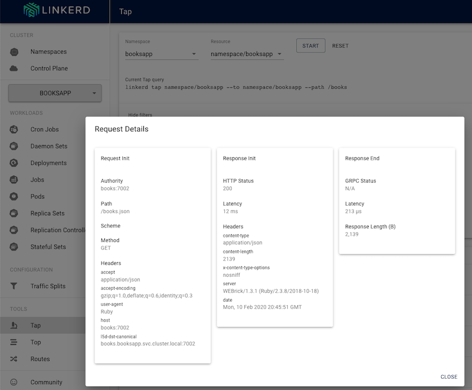

We're happy to announce the release of Linkerd 2.7! This security-themed
release adds support for integrating Linkerd's mutual TLS infrastructure with
external certificate issuers such as [Vault](https://www.vaultproject.io/) and
[cert-manager](https://github.com/jetstack/cert-manager), improves
[gitops](https://www.weave.works/blog/what-is-gitops-really) workflows by
allowing Linkerd manifests to be generated without secrets, and makes it easy
to automatically rotate TLS credentials. It also improves dashboard
performance, improves usability of Helm charts, and much, much more.

This release includes changes from a massive list of contributors, including
[@alenkacz](https://github.com/alenkacz),
[@bmcustodio](https://github.com/bmcustodio),
[@daxmc99](https://github.com/daxmc99),
[@droidnoob](https://github.com/droidnoob),
[@ereslibre](https://github.com/ereslibre),
[@javaducky](https://github.com/javaducky),
[@joakimr-axis](https://github.com/joakimr-axis),
[@JohannesEH](https://github.com/JohannesEH),
[@KIVagant](https://github.com/KIVagant),
[@mayankshah1607](https://github.com/mayankshah1607),
[@Pothulapati](https://github.com/Pothulapati), and
[@StupidScience](https://github.com/StupidScience)!

## External PKI support, including Vault

Linkerd's new support for external PKI providers unlocks a ton of new
capabilities for Linkerd. First, it means that it's possible to use projects
such as [Vault](https://www.vaultproject.io/) and
[cert-manager](https://github.com/jetstack/cert-manager) to provide the
credentials that Linkerd uses to sign its TLS certificates. For gitops
practitioners, it means that Linkerd manifests can now be generated without
secrets and thus can be safely checked in to version control&mdash;a popular
request!

Finally, it means that, regardless of where they originate, it's now easy to
automatically rotate Linkerd's mTLS credentials, a process that was until now
was manual. (Note that data plane proxy TLS certificates have always been
automatically rotated.)

This new set of capabilities is already generating excitement in the community:



## Improved dashboard

Linkerd 2.7 continues our theme of improving Linkerd's dashboard. First, the
dashboard now displays CronJob and ReplicaSet resources, and ships with
pre-configured Grafana dashboards for them. We've added `tap` headers (a
feature introduced in 2.6) to the dashboard, protected against DNS rebinding
attacks, and fixed many other smaller issues.



## And lots more

Linkerd 2.7 brings some big improvements to Linkerd's Helm charts (though with
[some breaking
changes](https://linkerd.io/2/tasks/upgrade/#upgrade-notice-stable-270)): we've
split the CNI template into a separate chart, fixed several issues, and
generally updated the chart to follow community best practices. Linkerd 2.7
also has a tremendous list of other improvements, performance enhancements, and
bug fixes, including:

* Support for headless services.
* A new `--wait-before-exit-seconds` flag to delay proxy shutdown.
* Improved error classification for gRPC services.
* Many additions to `linkerd check`, including CNI plugin status, and TLS cert validation.
* Lots more!

See the [full release notes](https://github.com/linkerd/linkerd2/releases/tag/stable-2.7.0) for details.

## Find us at KubeCon EU

We want to meet you! Next month many of the Linkerd maintainers and
contributors will be converging on [Kubecon EU in
Amsterdam](https://events.linuxfoundation.org/kubecon-cloudnativecon-europe/).
William, Oliver, and Tarun will be delivering Linkerd introductory and
deep-dive talks, and we'll have Linkerd talks by engineers at
[Finleap](https://www.finleap.com/) [Universidad San Carlos de
Guatemala](https://www.usac.edu.gt/), [Buoyant](https://buoyant.io), and more.
If you're attending, please swing by the **#kccnceu20** channel in the [Linkerd
Slack](https://slack.linkerd.io) and find us at the Linkerd booth in the expo
hall.

## Try it today!

Ready to try Linkerd? Those of you who have been tracking the 2.x branch via
our [weekly edge releases](https://linkerd.io/2/edge) will already have seen
these features in action. Either way, you can download the stable 2.7 release
by running:

```bash
curl --proto '=https' --tlsv1.2 -sSfL https://run.linkerd.io/install | sh
```

Using Helm? See our [guide to installing Linkerd with
Helm](https://linkerd.io/2/tasks/install-helm/). Upgrading from a previous
release? We've got you covered: see our [Linkerd upgrade
guide](https://linkerd.io/2/tasks/upgrade/) for how to use the `linkerd
upgrade` command.

## Linkerd is for everyone

Linkerd is a community project and is hosted by the [Cloud Native Computing
Foundation](https://cncf.io/). Linkerd is [committed to open
governance.](https://linkerd.io/2019/10/03/linkerds-commitment-to-open-governance/)
If you have feature requests, questions, or comments, we'd love to have you
join our rapidly-growing community! Linkerd is hosted on
[GitHub](https://github.com/linkerd/), and we have a thriving community on
[Slack](https://slack.linkerd.io/), [Twitter](https://twitter.com/linkerd), and
the [mailing lists](https://linkerd.io/2/get-involved/). Come and join the fun!

*Image credit:
[Georgia de Lotz](https://unsplash.com/@georgiadelotz?utm_medium=referral&amp;utm_campaign=photographer-credit)*
