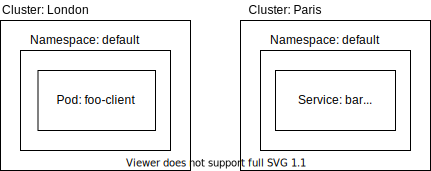

 Linkerd 2.8 has been released and implements the architecture
described here. Check out the
[release blog post](/2020/06/09/announcing-linkerd-2.8/) and get started on your
own clusters! 

In our earlier post,
[Architecting for Multicluster Kubernetes](https://linkerd.io/2020/02/17/architecting-for-multicluster-kubernetes/),
we outlined three requirements for building a simple yet resilient multicluster
approach to Kubernetes: supporting hierarchical networks, preserving
independence of cluster state, and not introducing a shared control plane.

In this post, we'll propose a solution that we believe satisfies these
constraints, called service mirroring. In keeping with
[Linkerd's design principle](https://linkerd.io/2019/04/29/linkerd-design-principles/)
of "keep it simple", we've done our best to build this solution in terms of pure
Kubernetes primitives and to remove any dependencies on Linkerd itself. This
allows us to keep the operational surface area of any solution as close as
possible to that of Kubernetes itself. In other words, the mesh should do less,
not more.

We're currently actively prototyping this approach and we'd love your feedback.
Read on for details and how you can get involved.

## Introduction

There are many challenges to building an effective multicluster Kubernetes
architecture, including configuration, monitoring, deployment, and traffic
management. Of these challenges, we see a service mesh as able to directly
address three specific areas:

- Observability: a service mesh can provide a unified view of application
  behavior that spans clusters.
- Security: a service mesh can provide guarantees around authentication,
  authorization, and confidentiality to cross-cluster traffic.
- Routing: a service mesh can make it possible and "easy" for applications in
  one cluster to communicate with applications in another cluster.

Today, it is possible to build a multicluster setup that accomplishes many of
these goals by running Linkerd independently across multiple clusters,
aggregating metrics to an external Prometheus or Thanos, sharing service
information in DNS, and using cert-manager to rotate certs on cluster Ingress
controllers. (See our
[Multicluster the Kubernetes Way with Linkerd](https://docs.google.com/document/d/1yDdd5nC348oNibvFAbxOwHL1dpFAEucpNuox1zcsOFg/edit#)
writeup, from which this framing is copied, for more on how to accomplish this.)

While functional, this approach has several downsides around cross-cluster
calls. In contrast to in-cluster calls, cross-cluster calls in this approach
don't have full metrics, do not preserve source identity across the cluster
boundary, and cannot be the target of traffic splitting. Most crucially, for
even these partial guarantees to be made, the application itself must
distinguish between on-cluster and cross-cluster calls. This runs counter to
Linkerd's goal of not requiring application changes.

Enter service mirroring.

## Service Mirroring

The goal of the service mirroring is to allow the same guarantees that a service
mesh like Linkerd provides for in-cluster calls—identity, traffic shifting,
etc—to also be applied to cross-cluster calls. Service mirroring works, as the
name suggests, by "mirroring" service information between clusters. With service
mirroring in place, the full observability, security, and routing features of
Linkerd apply uniformly to both in-cluster and cross-cluster calls, and the
application does not need to distinguish between those situations.

The service mirror is a Kubernetes Operator. Once installed, it mirrors a remote
cluster’s services locally to provide service discovery and allow pods to refer
to the remote services. It also manages configuring endpoints so that traffic
goes to the correct IP address. (Many more details below.)

The astute reader may note that nothing in service mirroring actually requires a
service mesh. Instead, the service mirror is a standalone component that can
compose well with other projects. This applies not just to the potential users
of service mirroring, but also to the service mirror itself. For example, the
service mirror's gateway component is pluggable by design, and can be implemented
by projects such as [Ambassador](https://www.getambassador.io/),
[Gloo](https://github.com/solo-io/gloo) and
[Traefik](https://containo.us/traefik/).

To understand how service mirroring works, let's take a quick trip to the
origins of Kubernetes in the heart of the French Revolution.

## A Tale of Two Clusters

It was the best of times, it was the worst of times. We have two Kubernetes
clusters that need to send traffic between themselves. Let’s set the scene by
describing these clusters and picking a specific task.

On the left, London has a pod named `foo-client`. On the right, Paris has a
service named `bar`. How do we make it possible for the `foo-client` pod to make
requests to the `bar` service?

## Step 1: Service Discovery

Pods in the London cluster need to send requests to the `bar` service in Paris.
Normally, this would be done using the service name. However, `bar` is on
another cluster! Let’s copy the service definition from Paris to London.

At this point, the `bar` service has been copied to London. The remote cluster
name is appended, both to keep from having local collisions as well as allowing
pods to explicitly opt-in to sending requests off cluster. Immediately, the pods
in London will be able to start resolving the full service name -
`bar-paris.default.svc.cluster.local`. The `bar-paris` service living in London
has type `ClusterIP`. A virtual IP address will be created by London and be used
as the response to pods resolving the service name for `bar-paris`.

By copying services from Paris to London, we are
[maintaining independent state](https://linkerd.io/2020/02/17/architecting-for-multicluster-kubernetes/#requirement-ii-maintain-independent-state)
— one of our requirements. Paris has its own state, London has its own state and
they are not dependent on each other. If the connectivity between London and
Paris goes down, service updates will stop. That’s okay though! With
connectivity failing, traffic can’t flow from London to Paris anyways.

We won’t be able to send traffic to the destination pods yet, unfortunately. The
pod selector from `bar` in Paris won’t match pods in London. In fact, we should
probably remove the selector just in case. It would be unintentional to have
traffic we intend to arrive in Paris accidentally end up in London instead.
Removing the selector lets us abstract the service beyond pods and use a
different backend.

Without a selector, the endpoint object cannot be created automatically.
Kubernetes doesn’t know what to watch as we’ve not given it enough information.
Having a
[service without a selector](https://kubernetes.io/docs/concepts/services-networking/service/#services-without-selectors)
is something that Kubernetes was designed to work with though! Like all the
resources in Kubernetes, you can create and manage them yourself. So, if we can
create an endpoint ourselves and point it somewhere, where should the traffic be
forwarded?

## Step 2: Endpoint juggling

It would be possible to copy all the endpoints from Paris to London along with
the service definition. Depending on how many pods are in the service, that
could be a lot of data! Take a look at
[EndpointSlices](https://kubernetes.io/blog/2019/09/18/kubernetes-1-16-release-announcement/#introducing-endpoint-slices)
to get a feel for just how much bandwidth replicating Endpoints across clusters
could consume. Even with a solution to this problem, replicating individual pod
IP addresses wouldn’t
[support hierarchical networks](https://linkerd.io/2020/02/17/architecting-for-multicluster-kubernetes/#requirement-i-support-hierarchical-networks)
— another of our requirements. Instead of moving all this state between
clusters, let’s introduce a single endpoint that can take care of routing
traffic to the correct destination.

We have introduced a new service in Paris. With a type of `LoadBalancer`, the
gateway service will have a load balancer allocated. This load balancer will
have a public IP address that can forward traffic internally in Paris. We now
have an answer to the question of where requests from London should be sent to!

To get everything working, we can now create an Endpoints resource containing
this public IP address and send traffic there. At this point, requests issued in
London will resolve to the ClusterIP of `bar-paris` and get rewritten to the
public IP address of the gateway service in Paris. If the gateway service’s
selector targets the same pods as `bar`, everything would just work at this
point.

There are two important problems with our plan so far. Cloud load balancers are
expensive, public ip addresses are few and far between. Creating an external
load balancer for every service inside your cluster would quickly run out of ip
addresses and push costs up to unacceptable levels.

Perhaps even more critically, if the gateway service points directly to `bar`, a
potentially sensitive internal service is now available on the greater internet.
It would be possible to configure firewall rules to restrict access, but that
feels pretty fragile. What could multiplex services across a single load
balancer and limit connectivity to authorized clients?

## Step 3: The gateway

If you guessed that the solution to this problem sounds a lot like an ingress
controller, you’d be right!
[Ingress](https://kubernetes.io/docs/concepts/services-networking/ingress-controllers/)
resources allow configuration for the general case. As the ingress spec
[does not support wildcards](https://github.com/kubernetes/kubernetes/issues/41881),
it isn’t possible to directly use Ingress resources to do this. Luckily, most
ingress controllers support this use case! In fact, it is likely that your
ingress controller of choice can already do wildcards in Kubernetes with a
little configuration.

It is now possible to trace the life of a request as it originates in London and
ends up at the final destination in Paris. Starting out in London, a pod will
issue a request to `bar-paris.default.svc.cluster.local`. When the pod queries
DNS, it will receive the cluster IP for the service that resides in London. On
connect, the cluster IP will be rewritten to the public IP address of Paris’
gateway service. London’s pod will then connect to this IP address and have its
request forwarded to the ingress controller living in Paris. The ingress
controller can look at the incoming request’s host header and rewrite it to the
local `bar` service. After being rewritten, the request can finally reach the
destination pod, `bar-server` in Paris.

Passing requests through a load balancer running in Paris has the added benefit
of making decisions locally on the cluster instead of remotely. As a local load
balancer will always have a better picture of what is happening locally, the
decision can be more optimal than one that originated outside the cluster.
There’s definitely an extra hop, the introduction of an extra component which
will end up doing routing in the local cluster does come with some added
latency. The tradeoff is that multicluster communication is not a special case,
services are exposed as if they were third party services and the tooling is
identical between internal and external services.

As there is no private network in this example, data will traverse the public
internet. Encrypting all the cross-cluster traffic thus becomes critical.
Linkerd automatically does mTLS out of the box and takes care of the encryption
transparently. Sharing a
[root certificate](https://en.wikipedia.org/wiki/Root_certificate) between
clusters allows Linkerd to validate both ends of the connection and encrypt all
traffic between them. The shared root certificate allows Linkerd’s control plane
in both clusters to be
[completely independent](https://linkerd.io/2020/02/17/architecting-for-multicluster-kubernetes/#requirement-iii-have-an-independent-control-plane),
fulfilling the final requirement. While Linkerd automates mTLS, it would be
possible to configure the gateway to present a wildcard certificate such as
`*.default.svc.cluster.local` which clients could then validate. Traffic would
be encrypted and validated by clients.

Note that the gateway works for TCP as well as HTTP with a caveat. Arbitrary TCP
based protocols will not contain the information required for a gateway to
forward the request to the correct destination. The gateway load balancer could
map TCP ports, reserving one port for each internal service. As the service and
endpoints are managed, port rewriting can occur without any requirements to
clients or services. This naive solution can actually be improved significantly
by utilizing something like
[ALPN](https://en.wikipedia.org/wiki/Application-Layer_Protocol_Negotiation) or
[SNI](https://en.wikipedia.org/wiki/Server_Name_Indication) at the TLS layer.
Unfortunately, these solutions are not generally supported or configurable.

And that is service mirroring in a nutshell.

## Want to get involved?

We’d love your feedback on service mirroring. Please leave us feedback on the
[service mirroring design doc](https://docs.google.com/document/d/1uzD90l1BAX06za_yie8VroGcoCB8F2wCzN0SUeA3ucw/edit).
You can also email the
[cncf-linkerd-dev mailing list](https://lists.cncf.io/g/cncf-linkerd-dev) or
find us on the [Linkerd community Slack](https://slack.linkerd.io). We're
actively prototyping this solution today, and hope to have a functioning
implementation very soon.

---

Linkerd is a community project and is hosted by the
[Cloud Native Computing Foundation](https://cncf.io). If you have feature
requests, questions, or comments, we'd love to have you join our rapidly-growing
community! Linkerd is hosted on [GitHub](https://github.com/linkerd/), and we
have a thriving community on [Slack](https://slack.linkerd.io),
[Twitter](https://twitter.com/linkerd), and the
[mailing lists](https://linkerd.io/2/get-involved/). Come and join the fun!
