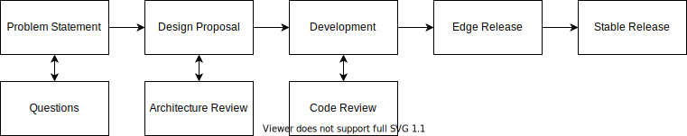

Earlier this year
[we introduced a formal RFC ("request for comment") process for Linkerd](https://github.com/linkerd/rfc).
In this post, I'll describe the motivations for adding this process and talk a
little bit about how it works. If you're interested in contributing to Linkerd,
or just curious about the mechanics of an open source, open governance project,
read on for all the details!

## Why did we introduce an RFC process?

Linkerd is an "extremely open source" project: it is licensed under the Apache
License Version 2.0; it's hosted by a neutral foundation (the
[CNCF](https://cncf.io)) which owns the trademark; and it is
[committed to open governance](/2019/10/03/linkerds-commitment-to-open-governance/)
as its operational model. As a community-focused project, bug reports, ideas,
and feedback can come from anywhere, and we consider it critical that Linkerd
_always_ be a project that anyone anywhere in the world can use and contribute
to. This belief is part and parcel of the project's continued success.

Linkerd has been very fortunate to have always had a very active community of
contributors. From early contributors like NIH's
[Borys Pierov](https://github.com/ashald) and BigCommerce's
[Zack Angelo](https://github.com/zackangelo) to more recent folks like
[Tarun Pothulapati](https://github.com/Pothulapati) (who started as a
[GSoC](https://summerofcode.withgoogle.com/) student in 2019 and has since then
[merged 40 PRs](https://github.com/linkerd/linkerd2/pulls?page=1&q=is%3Apr+is%3Aclose+author%3APothulapati)
into Linkerd, including some
[major features](https://github.com/linkerd/linkerd2/pull/3955/)!), Linkerd has
always benefited mightily from the community around it.

But despite these amazing people and their efforts, we, the maintainers, still
felt that making larger contributions to Linkerd was simply not as easy as it
should be. Earlier this year, we set out to address this with the introduction
of an RFC process. We had a couple goals going into this:

- We wanted to ensure that we had the opportunity to socialize major changes
  within not just maintainers but end-users, many of whom rely on Linkerd for
  the critical reliability of their systems.
- We wanted to ensure that any major changes fit within Linkerd's philosophy of
  maximizing out-of-the-box value and debuggability, and were in accordance with
  [Linkerd's design principles](/2019/04/29/linkerd-design-principles/).
- Most importantly, we wanted to be able to set contributors up for success and
  get contentious issues on the docket as early in the process as possible,
  rather than duking out design decisions in the confines of a PR when code had
  already been written.

With these goals in mind, we drafted our RFC process. Like any good open source
project, the process itself is
[defined in a repo](https://github.com/linkerd/rfc) and we're very open to your
feedback on it!

## A three-step plan for success

Like any good open source project, we designed our RFC process by borrowing
heavily from other projects. We took a lot of inspiration from Rust: the Rust
RFC process is clear, straightforward, and approachable, and it also happens to
be an ecosystem we depend on and care a lot about. We also took inspiration from
the Python PEP process, which was notable in its level of polish.

While the RFC process will (must!) evolve over time, the current process looks
something like this:

As you can see, while there are two "release" stages (edge and stable), the hard
work of the process is separated into three stages: a problem statement, a
design proposal, and finally, implementation. Let's walk through them one at a
time.

### Step 1: State the problem

First up is the problem statement. Problem statements live in the `problem`
directory and have a short template to fill out. We’d like to know exactly what
problem you’re solving. The more details the better! Everything helps us build
the perfect solution to the issues you’re looking to have taken care of. You’ll
notice that we explicitly don’t want any solutions at this stage. It is easy to
become fixated on a solution and totally miss out on others, especially when the
problem statement isn’t extremely clear. Please make sure to clean the template
up and remove any sections that are not applicable at this time.

With a problem statement written out, it is time for a PR to the RFC repo. The
Linkerd community will be able to ask lots of questions and get an understanding
of what kind of problem you’re experiencing. Once the community has gotten a
chance to ask all the questions they’d like, your PR will be merged into the
`problem` directory. At this point, your proposal can wait for an implementer to
come along and take care of it for you. We hope you continue in the process
though!

### Step 2: Propose your design

Next up is the design proposal. This is really the meat of the RFC process and
the part that will receive the most attention from the community. It is here
that we’ll work through exactly how the feature will be implemented. Before you
get started, please reach out in the [#contributors](https://slack.linkerd.io/)
Slack channel. We’ll pair you up with a reviewer who will be with you the whole
time. Once the two of you are feeling confident, it is time to move the proposal
in the problem directory to the design directory.

Each section of the template provides direction on what makes a successful
design proposal. Thinking through how to implement a feature isn’t all the work
after all. We find it just as important to explicitly call out functionality
that is out of scope. This allows implementation and architecture to be
simplified and stick to Linkerd’s project goals of being lightweight and easy to
understand.

A pull request to the RFC repo will start community discussion again. Don’t be
surprised if there is conversation and changes to the proposal. During this
stage you can expect to make edits, both big and small, to clarify or change the
design based on feedback. Consensus will lead to your pull request being merged
and now it is time to start development!

### Step 3: You finally get to write code

Now for the fun part, writing code! An important piece of the proposal is
outlining deliverables. We do this to ensure pull requests are small, thoughtful
and implement small pieces of the larger functionality. With an accepted
proposal, code review is primarily around style and functionality, the major
architectural decisions will already be sorted out. The assigned reviewer will
be with you every step of this phase and be your primary reviewer.

### Step 4: Profit?

As all your deliverables get merged, they’ll get shipped in the next release.
Linkerd does regular edge releases every week. These allow anyone interested to
play with new functionality and test it out. It also provides time for writing
documentation and educating the community on what is happening with the project.
Once we’re comfortable with the stability of the project, a stable release will
happen. These are about 6 weeks between each other. Don’t worry, even if a
stable release is going to happen during the middle of development, we’ll just
make sure it is marked as experimental.

## Once more unto the RFC

We've already had
[a few early proposals](https://github.com/linkerd/rfc/pulls?q=is%3Apr) start to
wend their way through the RFC process, and we're eager to see how things play
out and to do any fine tuning along the way. Of course, we'd love your feedback,
and we'd love even more to have you participate! We can't wait to see what
amazing things that you have planned for the future for Linkerd.

## Linkerd is for everyone

Linkerd is a community project and is hosted by the
[Cloud Native Computing Foundation](https://cncf.io/). Linkerd is
[committed to open governance.](/2019/10/03/linkerds-commitment-to-open-governance/)
If you have feature requests, questions, or comments, we'd love to have you join
our rapidly-growing community! Linkerd is hosted on
[GitHub](https://github.com/linkerd/), and we have a thriving community on
[Slack](https://slack.linkerd.io/), [Twitter](https://twitter.com/linkerd), and
the [mailing lists](/community/get-involved/). Come and join the fun!

## Want to get involved?

We’d love your feedback on service mirroring. Please leave us feedback on the
[service mirroring design doc](https://docs.google.com/document/d/1uzD90l1BAX06za_yie8VroGcoCB8F2wCzN0SUeA3ucw/edit).
You can also email the
[cncf-linkerd-dev mailing list](https://lists.cncf.io/g/cncf-linkerd-dev) or
find us on the [Linkerd community Slack](https://slack.linkerd.io). We're
actively prototyping this solution today, and hope to have a functioning
implementation very soon.
