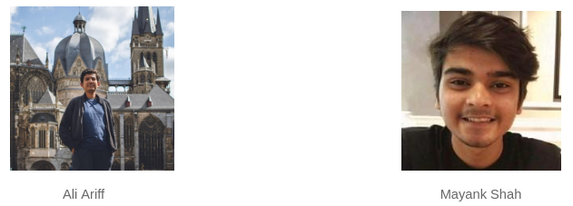

We are excited to announce that Linkerd is participating in the
[Google Summer of Code (GSoC)](https://summerofcode.withgoogle.com/) program
again this year as a mentor organization! We look forward to working with these
awesome folks and providing the students with a summer of rewarding open source
experience. We want to encourage them to be lifelong advocates and contributors
of the open source community.

GSoC is an annual program organized by Google, where college and university
students from around the world are paired with mentoring organizations to work
on participating open source projects. Students get to spend their summer
learning and writing code, while getting paid. Mentor organizations get valuable
contributions and feedback to their projects, contribution workflow and
mentorship program.

Last year, we had a very successful GSoC experience with
[Tarun Pothulapati](https://github.com/Pothulapati), who made significant
contributions to the Linkerd and Service Mesh Interface (SMI) projects. Tarun
continued his involvement in the service mesh, SMI and tracing community after
GSoC 2019 concluded. And upon completing his studies, he joined Buoyant as a
full-time contributor to the Linkerd project.

This year, we are happy to announce that we have 2 GSoC students joining us. We
will like to welcome [Ali Ariff](https://github.com/aliariff) and
[Mayank Shah](https://github.com/mayankshah1607) to the team:

Ali is a student from RWTH Aachen University, Aachen, Germany. He is currently
enrolled in the Master Programme Software Systems Engineering program. He will
be spending the summer working on extending the Linkerd build pipeline to
support ARM builds. There’s already been some awesome work in the community to
make it happen, we’re so excited that it’ll become official now! Imagine being
able to run Linkerd with k3s on your fleet of Raspberry Pi!

Mayank is from Chennai, India. He is currently enrolled in the B.Tech in
Computer Science and Engineering program in Vellore Institute of Technology.
Mayank will help the community to build out a suite of  conformance tests,
which can be used to determine if your existing Kubernetes cluster setup (pod
security policy, service accounts auto-mount configuration, API server
extensions TLS setup etc.) will work with Linkerd. Every Kubernetes cluster is
different and while `check` is awesome, it can’t check everything! The
conformance test suite will help diagnose problems in how clusters are
configured as well as hunt down bugs that crop up in Linkerd.

You can check out the RFCs for both projects here:

* [ARM Support](https://github.com/linkerd/gsoc/blob/master/rfc/2020/arm-support/aliariff.md)
* [Conformance Validation](https://github.com/linkerd/gsoc/blob/master/rfc/2020/conformance-validation/mayankshah1607/rfc.md)

We are very excited to have Ali and Mayank on the Linkerd team. They will be
joining us at this month’s Linkerd online community meetup, on May 27 at 9AM PST
. Be sure to drop by to show them your support!

## Linkerd is for everyone

Linkerd is a community project and is hosted by the
[Cloud Native Computing Foundation](https://cncf.io/). Linkerd is
[committed to open governance.](/2019/10/03/linkerds-commitment-to-open-governance/)
If you have feature requests, questions, or comments, we'd love to have you
join our rapidly-growing community! Linkerd is hosted on
[GitHub](https://github.com/linkerd/), and we have a thriving community on
[Slack](https://slack.linkerd.io/), [Twitter](https://twitter.com/linkerd),
and the [mailing lists](/community/get-involved/). Come and join the
fun!
