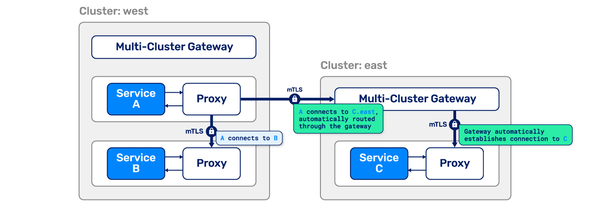

We're very happy to announce the release of Linkerd 2.8! This release introduces
a new multi-cluster extension to Linkerd, allowing it to establish connections
across Kubernetes clusters that are secure, transparent to the application, and
work with any network topology. We believe this is the simplest option for
secure Kubernetes multi-cluster connectivity available today. The 2.8 release
also makes Linkerd more modular with the beginnings of an _add-on_ system, and
introduces a variety of other features and stability improvements.

This release includes changes from a massive list of contributors. A special
_thank you_ to [Arthur Silva Sens](https://github.com/ArthurSens),
[Matei David](https://github.com/mateiidavid),
[Ali Ariff](https://github.com/aliariff),[amariampolskiy](https://github.com/amariampolskiy),[arminbuerkle](https://github.com/arminbuerkle),
[Christian Hüning](https://github.com/christianhuening),
[Christy Jacob](https://github.com/christyjacob4),
[Lutz Behnke](https://github.com/cypherfox),
[Dax McDonald](https://github.com/daxmc99),
[Saurav Tiwary](https://github.com/dr0pdb),
[drholmie](https://github.com/drholmie),
[EMEHINOLA Idowu](https://github.com/hydeenoble),
[Joakim Roubert](https://github.com/joakimr-axis),
[jpresky](https://github.com/jpresky),
[Kohsheen Tiku](https://github.com/kohsheen1234),
[Lewis Cowper](https://github.com/lewiscowper),
[Alex Lundberg](https://github.com/lundbird),
[Mayank Shah](https://github.com/mayankshah1607),
[mmiller1](https://github.com/mmiller1),
[Naseem Ullah](https://github.com/naseemkullah),
[Sanni Michael](https://github.com/sannimichaelse), and
[Supratik Das](https://github.com/supra08) for your hard work.

## Multi-cluster Kubernetes the Kubernetes way

Linkerd 2.8's new [multi-cluster feature](/2.10/features/multicluster/) means
that Linkerd can now connect Kubernetes services across cluster boundaries in a
way that's secure, fully transparent to the application, and independent of
network topology. As discussed in our
[earlier](/2020/02/17/architecting-for-multicluster-kubernetes/)
[posts](/2020/02/25/multicluster-kubernetes-with-service-mirroring/), this
multi-cluster feature is designed to meet some critical goals:

1. **Providing a unified trust domain.** The identity of source and destination
   workloads must be validated at every step, both in and across cluster
   boundaries.
2. **Separating failure domains.** A cluster outage should still allow the
   remaining clusters to function.
3. **Supporting heterogeneous networks.** Since clusters can span clouds, VPCs,
   on-premises data centers, and combinations thereof, Linkerd should not
   introduce any L3/L4 requirements other than gateway connectivity.
4. **Providing a unified model with in-cluster communication.** The same
   observability, reliability, and security features that Linkerd provides for
   in-cluster communication should extend to this new cross-cluster
   communication.

Just as with in-cluster connections, Linkerd's cross-cluster connections are
transparent to the application code. A service _A_ on cluster _west_ can talk to
a service _C_ on cluster _east_ simply by addressing it directly as `C.east`, or
by addressing it as `C` and having Linkerd automatically route (or even shift
just a portion of) traffic for that service to cluster _east_. Regardless of
whether that communication happens within a cluster, across clusters within a
datacenter or VPC, or across the public Internet, Linkerd will establish a
connection between clusters that's encrypted and authenticated on both sides
with mTLS.



This new multi-cluster functionality unlocks a whole host of use cases for
Linkerd, including failover (transitioning traffic across datacenters or cloud
in the presence of failure); "inverted multi-tenancy" (each tenant gets their
own cluster); hybrid cloud (workloads can move between on-premises and cloud
environments without affecting the rest of the application); and more.

Finally, like all Linkerd features, Linkerd's "service mirroring" approach to
multi-cluster leverages as much existing Kubernetes functionality as possible
and adds the bare minimum of additional machinery. Remote services are
represented directly as Kubernetes services; no new CRDs are introduced; and
configuration complexity is kept to a bare minimum.

## Ambassador support for Multi-cluster

We're happy to report that our friends at the Ambassador project have already
created a multi-cluster integration, allowing Ambassador users to leverage
Ambassador deployments as Linkerd's multi-cluster gateway!
[Learn more in the Ambassador blog post](https://blog.getambassador.io/multi-cluster-kubernetes-with-ambassador-and-linkerd-2caf0e978f8f).

## Add-ons

The 2.8 release also introduces a simple _add-on system_ for adding (or
removing!) bundles of functionality from Linkerd. Linkerd 2.8 ships with two
addons:

- A Jaeger add-on, which adds the Jaeger and oc-collector components for
  collecting and displaying distributed tracing to your cluster.
- A Grafana add-on (enabled by default) which adds Grafana graphs to Linkerd's
  dashboard.

In the future we'll be moving more functionality into add-ons, allowing you to,
for example, remove the default Prometheus installation and replace it with your
own--or potentially with none at all.

## And lots more

Linkerd 2.8 also has a tremendous list of other improvements, performance
enhancements, and bug fixes, including:

- The Helm chart is more flexible and modular, with new Prometheus configuration
  options.
- The proxy now labels emitted distributed tracing spans with pod metadata.
- Various performance improvements to the proxy to reduce contention, improving
  latency, and reduce spurious timeouts.
- Automatic prevention of common traffic-loop scenarios.

See the
[full release notes](https://github.com/linkerd/linkerd2/releases/tag/stable-2.8.0)
for details.

## Linkerd's upcoming roadmap

We believe that Linkerd's core value is _connectivity_--and that in a cloud
native world, connectivity doesn't just mean "A and B can exchange packets", but
rather "A and B can exchange packets in a way that validates the identity on
both sides; has clear authorization semantics; is confidential to third parties;
and is measurable and inspectable".

As we look ahead, we see Linkerd's ability to create this connectivity
transforming it into the _security plane_ for your Kubernetes infra. The 2.8
release marks a major step forward in that direction, and the next several
releases will flesh out Linkerd's featureset, including by extending mTLS to all
connections; introducing policy; and much more. Stay tuned for lots more on this
topic.

## Try it today!

Ready to try Linkerd? Those of you who have been tracking the 2.x branch via our
[weekly edge releases](/2-edge/) will already have seen these features in
action. Either way, you can download the stable 2.8 release by running:

```bash
curl --proto '=https' --tlsv1.2 -sSfL https://run.linkerd.io/install | sh
```

Using Helm? See our
[guide to installing Linkerd with Helm](/2/tasks/install-helm/). Upgrading from
a previous release? We've got you covered: see our
[Linkerd upgrade guide](/2/tasks/upgrade/) for how to use the linkerd upgrade
command.

## Linkerd is for everyone

Linkerd is a community project and is hosted by the
[Cloud Native Computing Foundation](https://cncf.io/). Linkerd is
[committed to open governance.](/2019/10/03/linkerds-commitment-to-open-governance/)
If you have feature requests, questions, or comments, we'd love to have you join
our rapidly-growing community! Linkerd is hosted on
[GitHub](https://github.com/linkerd/), and we have a thriving community on
[Slack](https://slack.linkerd.io/), [Twitter](https://twitter.com/linkerd), and
the [mailing lists](/community/get-involved/). Come and join the fun!
