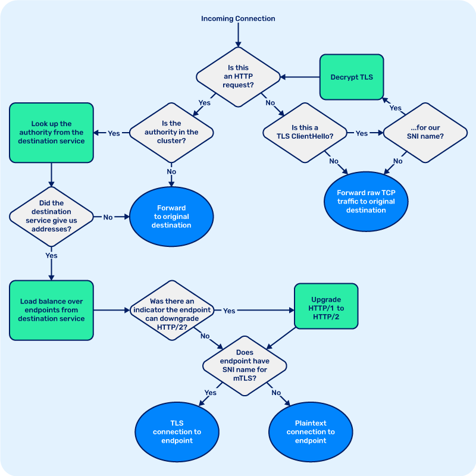

Thanks in part to Linkerd's
[performance numbers](https://kinvolk.io/blog/2019/05/performance-benchmark-analysis-of-istio-and-linkerd/)
and stellar
[security audit report](https://github.com/linkerd/linkerd2/blob/main/SECURITY_AUDIT.pdf),
there's been a recent surge of interest in Linkerd2-proxy, the underlying proxy
used by Linkerd. I've been working on Linkerd2-proxy for the majority of my time
as a Linkerd maintainer so this topic is near and dear to my heart. In this
article, I'm going to shed a little more light on what Linkerd2-proxy is and how
it works.

The proxy is arguably the most critical component of a service mesh. It scales
in deployment with the application, so low added latency and low resource
consumption are vital. It's also where all the application's sensitive data is
handled, so security is critical. If the proxy is slow, bloated, or insecure,
then so is the service mesh.

The Linkerd2-proxy of today is designed to meet those strict requirements, and
more. In fact, I believe it's the best possible proxy for the service mesh use
case and some of the most exciting technology in the world. As William Morgan
[put it recently](https://thenewstack.io/linkerds-little-secret-a-lightning-fast-service-mesh-focused-rust-network-proxy/),
Linkerd2-proxy is the _state of the art_ for modern network programming:

> Unlike general purpose proxies such as Envoy, NGINX, and haproxy, the open
> source Linkerd2-proxy is designed to do only one thing and do it better than
> anyone else: be a service mesh sidecar proxy.
>
> In fact, we believe that Linkerd2-proxy represents the state of the art for
> secure, modern network programming. It is fully asynchronous and written in a
> modern type-safe and memory-safe language. It makes full use of the modern
> Rust networking ecosystem, sharing foundations with projects such as Amazon's
> Firecracker. It has native support for modern network protocols such as gRPC,
> can load balance requests based on real-time latency, and do _protocol
> detection_ for zero-config use. It is fully open source, audited, and widely
> tested at scale.

So if you want to peek under the hood of what state-of-the-art network
programming looks like, read on!

## Why Rust?

No discussion of Linkerd2-proxy would be complete without a discussion of Rust.
When we first started working on what would become Linkerd2-proxy in 2017, we
made a conscious decision to use Rust, even though, at the time, Rust's
networking ecosystem was very, very early. Why did we take this risky path
rather than sticking to Go or Scala, or some more "traditional" proxy language
like C++ or C?

The decision to use Rust came down to several factors. First, a service mesh
proxy has some pretty stringent requirements: because it's deployed as a sidecar
on a per-pod basis, it has to have as small a memory and CPU footprint as
possible. Because most or all of the application's network traffic flows through
the proxy, it needs to have minimal latency overhead,
[especially worst-case tail latency](https://cacm.acm.org/magazines/2013/2/160173-the-tail-at-scale/fulltext).
Perhaps most importantly, because the proxy handles _application_
data—potentially including incredibly sensitive data such as financial
transactions or personal health—it has to be _secure_.

Let's take each of these in turn, starting with resource consumption. Before we
wrote Linkerd2-proxy, we built Linkerd 1.x. This first version of Linkerd had a
proxy component that was written in Scala, and leveraged the robust Scala and
Java networking ecosystem for excellent performance at scale. But, because it
ran on the Java Virtual Machine, it had a pretty significant resource footprint.
(The JVM is good at "scaling up", but not good at "scaling _down_", as William
wrote in his InfoQ article on
[the decision to reimplement Linkerd](https://www.infoq.com/articles/linkerd-v2-production-adoption/).)
Even though the Linkerd community
[got pretty good](/2016/06/17/small-memory-jvm-techniques-for-microservice-sidecars/)
at tuning the JVM's memory use to minimize footprint, it was still too much to
ask in a per-pod service mesh deployment model. So we knew we'd need a language
that compiled to native binaries, like Rust, Go, and C++.

Now, latency. Another lesson we learned from Linkerd 1.x that informed our
choice of Rust was the impact of garbage collection. In a garbage-collected
runtime, the GC must occasionally traverse the graph of objects in memory to
find the ones that are no longer in use and can be reclaimed. This process takes
time and can happen at unpredictable points. If a request comes in during a
garbage collector pass, it can have significantly heighted latency. This spiky,
unpredictable latency profile is the opposite of what we wanted for a service
mesh proxy. Thus, although
[we love Go](https://github.com/linkerd/linkerd2/search?l=go) (and the Linkerd
2.x control plane is written in it), Go, too,
[is a garbage-collected language](https://blog.discord.com/why-discord-is-switching-from-go-to-rust-a190bbca2b1f).
So that left us with languages without garbage collection, like Rust and C++.

Finally, security. Ensuring secure and private communication between services is
a major value prop for the service mesh. But inserting another hop into the data
path also exposes a new attack surface to attackers. Before we can even think
about improving the application's security, we have to make sure we aren't
making it _worse_. We've already determined that a garbage collected language is
unsuitable for Linkerd2-proxy's use case, but languages like Scala, Java, Ruby,
and Go all rely on garbage collection _for a critical reason_: ensuring memory
safety in a language with manual memory management, like C and C++, is much
harder than it looks.

Why does memory safety matter so much? It's simple: a vast
[majority](https://twitter.com/LazyFishBarrel) of all exploitable security
vulnerabilities—70% of serious security bugs in
[Chromium](https://www.chromium.org/Home/chromium-security/memory-safety) and
[Windows](https://thenewstack.io/microsoft-rust-is-the-industrys-best-chance-at-safe-systems-programming/),
and some of the worst vulnerabilities in recent memory, like
[Heartbleed](https://heartbleed.com/)—are caused by memory safety bugs like
[buffer overflows](https://cwe.mitre.org/data/definitions/119.html) and
[use-after-frees](https://cwe.mitre.org/data/definitions/416.html). Unlike C and
C++, Rust solves these problems, but it does so at compile time, without the
performance impact of garbage collection. In other words, Rust allowed us to
sidestep a huge class of potential data plane vulnerabilities that would
otherwise haunt Linkerd.

With all of this taken into consideration, Rust was the _only_ choice for
Linkerd2-proxy. It offered the lightning fast performance, predictably low
latency, and security properties that we knew a service mesh proxy would
require. It also gave us modern language features like pattern matching and an
expressive static type system, as well as tools like a built-in testing
framework and package manager, making it
[very pleasant to program in](https://stackoverflow.blog/2020/01/20/what-is-rust-and-why-is-it-so-popular/).

## The Rust ecosystem

Happily, since 2017, the Rust networking ecosystem has flourished—thanks, in no
small part, to [Buoyant](https://buoyant.io)'s investments in several of the key
projects. Today, Linkerd2-proxy is built upon some foundational Rust networking
libraries:

- [Tokio](https://tokio.rs/), Rust's asynchronous runtime,
- [Hyper](https://hyper.rs/), a fast, safe, and correct HTTP implementation,
- [Rustls](https://github.com/ctz/rustls), a secure, modern TLS implementation,
- [Tower](https://github.com/tower-rs/tower), a library of modular and
  composable components for networking software.

Let's look at each of these in turn.

Tokio is a platform for building
[fast](https://tokio.rs/blog/2019-10-scheduler/), reliable, and lightweight
networking applications. It provides an event loop that integrates with the
operating system's non-blocking I/O primitives, high-performance timers, and
task scheduling. For readers familiar with Node.js, Tokio can be thought of as
playing a role similar to that of the C library `libuv` — in fact, using Tokio
was [one of the main reasons](https://youtu.be/lcoU9jtsK24?t=651) that Node
creator Ryan Dahl chose to use Rust in Deno, his next-generation JavaScript
runtime. Since Linkerd first started using Tokio
[way back in 2016](https://github.com/linkerd/linkerd-tcp/commit/cff670f79eb1a3f5dccf1704304ebe610cd3fc5a),
it has seen rapid, widespread adoption, in open-source projects like
[TiKV](https://github.com/tikv/tikv), Microsoft Azure's
[iot-edge](https://github.com/Azure/iotedge/blob/89b738fa28c70756e2e95d0abc1793376e8d39ef/mqtt/mqtt-broker/Cargo.toml#L28-L31),
and Facebook's
[Mononoke](https://github.com/facebookexperimental/eden/blob/d374ea5098b554164a6210d8d0db89939be9eb44/eden/mononoke/Cargo.toml#L119),
and at companies like
[AWS](https://aws.amazon.com/blogs/opensource/aws-sponsorship-of-the-rust-project/)
to
[Discord](https://blog.discord.com/why-discord-is-switching-from-go-to-rust-a190bbca2b1f).

Hyper is Rust's leading asynchronous HTTP implementation, notable for its
[best-in-class performance](https://www.techempower.com/benchmarks/#section=data-r18&hw=ph&test=plaintext)
and correctness. Like Tokio, Hyper has been battle-hardened by widespread use at
scale.

To secure meshed traffic with mutual TLS, the Linkerd proxy uses
[rustls](https://github.com/ctz/rustls), an implementation of the TLS protocol,
which is built on top of [_ring_](https://github.com/briansmith/ring) and
[webpki](https://github.com/briansmith/webpki), libraries that provide
underlying cryptographic primitives. An
[independent security audit](https://github.com/ctz/rustls/blob/master/audit/TLS-01-report.pdf),
sponsored by the CNCF, found that this cryptographic stack to be exceptionally
high quality, with the auditors from Cure53 "incredibly impressed with the
presented software."

Today, these components form the core building blocks of Rust's networking
ecosystem, and it's no exaggeration to say that much of the development has been
driven by Linkerd2-proxy. In 2017 when we began work on Linkerd2-proxy, there
wasn't a production-ready HTTP/2 or gRPC implementation, so we spearheaded the
development of the [`h2`](https://github.com/hyperium/h2) library and
`tower-grpc`. Now, `h2` powers Hyper's HTTP/2 support, while `tower-grpc` (now
known as [Tonic](https://github.com/hyperium/tonic)) has become Rust's most
popular gRPC library. We also drove the development of
[Tower](https://github.com/tower-rs/tower), an abstraction layer for
implementing networking services and middleware in a modular, composable way,
inspired by [Finagle](https://twitter.github.io/finagle/), the Scala library
that powered Linkerd 1.x.

## The life of a request

With the building blocks out of the way, let's talk about what the proxy
actually _does_. One of Linkerd's biggest benefits as a service mesh can be
summed up as "zero config, just works": if you add Linkerd to a functioning
application, it should _continue_ functioning, and the user shouldn't have to do
any configuration to get there. (If you're coming to Linkerd from other service
mesh projects, this can seem magical.)

How does Linkerd manage this amazing feat? With the amazing Linkerd2-proxy, of
course. So let's break down the lifecycle of a request flowing through the
proxy. What does the proxy do in order to intelligently handle traffic, without
configuration, while remaining transparent to the meshed application?

The first step is _protocol detection._ For zero config to be a reality, when
the proxy gets a request, we need to
[determine the protocol](/2/features/protocol-detection/) that's in use. So the
first thing we do is read a couple bytes from the client side of the connection
and ask a few questions:

- "Is this an HTTP request?"
- "Is this a TLS
  [Client Hello](https://tools.ietf.org/html/rfc5246#section-7.4.1.2) message?"

If the request is a client hello, we then look at the
[server name indication](https://tools.ietf.org/html/rfc6066#section-3) (SNI)
value, which contains the hostname of the server that the client expects to
terminate. If the SNI value indicates that the TLS connection is intended for
the injected application, the proxy will simply forward the message along. An
important part of transparency is that if a proxy receives a message it can't do
anything smart with, it should just send it through—and in this case, the
message is encrypted and the proxy doesn't have the key to decrypt it, so
there's nothing else we can do. Similarly, TCP traffic in an unknown protocol
will be transparently forwarded to its original destination.

On the other hand, what if the encrypted connection _is_ for us, as part of
Linkerd's [automatic mutual TLS](/2/features/automatic-mtls/) feature? Each
proxy in the mesh has its own unique cryptographic identity, the key material
for which is generated by the proxy on startup and never leaves the pod boundary
or gets written to disk. These identities are
[signed by the control plane's Identity service](/2/features/automatic-mtls/#how-does-it-work)
to indicate that the proxy is authenticated to serve traffic for the
[Kubernetes ServiceAccount](https://kubernetes.io/docs/tasks/configure-pod-container/configure-service-account/)
of the pod that the proxy is injected into. If the SNI name matches the proxy's
service account, then we decrypt it and start processing it as part of the
service mesh.

Next, what does the proxy do if a request is meshed? Let's consider the case
where a meshed client sends an outbound request to its proxy. The proxy performs
the protocol detection we discussed above, and determines that this is a HTTP/1,
HTTP/2, or gRPC request—protocols that Linkerd understands and can route
intelligently. So, now we need to determine where the request is going. Linkerd
routes HTTP traffic based on the target
[authority](https://tools.ietf.org/html/rfc3986#section-3.2), which is either
the value of the `Host:` header or the authority part of the request URL for
HTTP/1.1 and 1.0 requests, or the value of the `:authority` header field in
HTTP/2. The proxy inspects the request, and based on which protocol version is
in use, finds the target authority, and performs a DNS query to determine the
canonical form of that name.

Once the proxy knows the request's target authority, it performs service
discovery by looking up authority from the Linkerd
[control plane's Destination service](/2/reference/architecture/#destination).
Whether or not the control plane is consulted is decided based on a set of
search suffixes: by default, the proxy is configured to query the Destination
service for authorities which are within the default
[Kubernetes cluster local domain, `.cluster.local`](https://kubernetes.io/docs/concepts/services-networking/dns-pod-service/),
but
[this can be overridden for clusters which use a custom domain](/2/tasks/using-custom-domain/).
The Destination service provides the proxy with the addresses of all the
endpoints that make up the Kubernetes Service for that authority, along with
Linkerd-specific metadata, and the
[Service Profile](/2/features/service-profiles/) that configures retries,
timeouts, and other policies. All this data is streamed to the proxy, so if
anything changes—e.g. if a service is scaled up or down, or the Service Profile
configuration is edited—the control plane will push the new state to the proxies
as it happens.

The proxy will then load balance requests over the set of endpoints provided by
the control plane. As requests are forwarded to their destination, the proxy
calculates load estimates using a load balancing algorithm called
[exponentially weighted moving averages](/2016/03/16/beyond-round-robin-load-balancing-for-latency/),
or EWMA. Essentially, this means that the proxy keeps a moving average of
latency over a limited time window, in order to react to changes in latency as
they occur, and this load estimate is weighted based on the number of requests
in flight to that endpoint. Historically, load balancing decisions used to be
made by always picking the endpoint with the _lowest_ load estimate, such by
using an ordered heap. However, keeping an ordered set of endpoints from least
to most loaded is computationally expensive, so Linkerd instead implements
_power of two choices_ (P2C) load balancing. In this approach, we instead make
each load balancing decision by picking the less loaded of two randomly-chosen
available endpoints. Although it may seem counterintuitive, this has been
[mathematically proven](https://citeseerx.ist.psu.edu/viewdoc/download?doi=10.1.1.57.4019&rep=rep1&type=pdf)
to be at least as effective at scale as always picking the least loaded, and it
[avoids the problem of multiple load balancers all sending traffic to the least
loaded replica, overloading it](https://www.nginx.com/blog/nginx-power-of-two-choices-load-balancing-algorithm/).
Also, this shortcut is significantly more efficient, making for a crucial
difference in speed.

When the destination endpoint has its own Linkerd proxy, the control plane will
indicate to the proxy that it can initiate mutual TLS, ensuring that the
connection is secure and private. Similarly, when HTTP/1.x requests are sent in
the mesh, the proxy will transparently upgrade them to HTTP/2, so that multiple
requests can be multiplexed on a single connection on the wire, and downgraded
back to HTTP/1 by the destination proxy, so that this upgrade is invisible to
the application. In conjunction with Linkerd's intelligent, protocol-aware load
balancing, this is one of the reasons that meshed traffic can often have lower
latency than unmeshed traffic, despite taking additional network hops.

Putting it all together, the basic flow of logic in the proxy looks like this:

Although it provides a lot of functionality, we've kept Linkerd2-proxy as simple
and minimalist as possible. Best of all, the proxy's modular architecture means
that most features can be implemented as small, self-contained modules and
plugged in at the appropriate point in the stack, keeping overall code
complexity low.

## It's the proxy, silly

Today, Linkerd is the only service mesh to feature a data plane proxy designed
from the ground up explicitly for the service mesh use case. By focusing on the
service mesh's unique requirements and making full use of Rust's impressive
performance, security guarantees, and cutting-edge asynchronous networking
stack, we believe Linkerd2-proxy is the secret sauce to Linkerd's success.



So, do _you_ want to get involved in a cutting edge open source Rust project
that's used in critical systems around the world? Great news, Linkerd is open
source and so you can! Join us on [GitHub](https://github.com/linkerd/) and
check out the `#contributors` channel on [the Slack](https://slack.linkerd.io/).
We'd love to have you aboard.

## Linkerd is for everyone

Linkerd is a community project and is hosted by the
[Cloud Native Computing Foundation](https://cncf.io/). Linkerd is
[committed to open governance](/2019/10/03/linkerds-commitment-to-open-governance/).
If you have feature requests, questions, or comments, we'd love to have you join
our rapidly-growing community! Linkerd is hosted on
[GitHub](https://github.com/linkerd/), and we have a thriving community on
[Slack](https://slack.linkerd.io/), [Twitter](https://twitter.com/linkerd), and
the [mailing lists](/community/get-involved/). Come and join the fun!

(Photo by
[Michael Dziedzic](https://unsplash.com/@lazycreekimages?utm_source=unsplash&utm_medium=referral&utm_content=creditCopyText)
on
[Unsplash](https://unsplash.com/s/photos/circuitboard?utm_source=unsplash&utm_medium=referral&utm_content=creditCopyText)).
