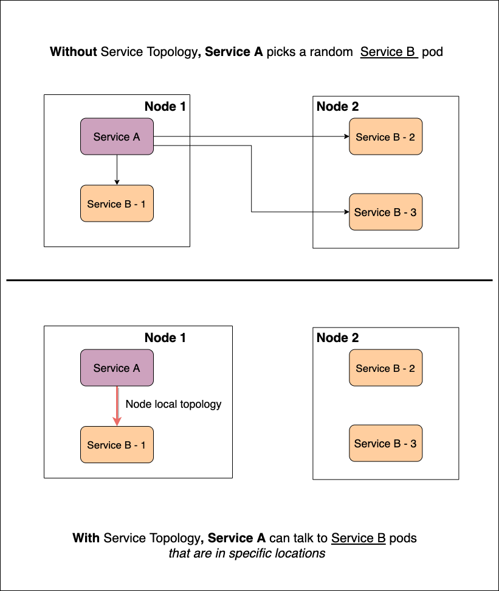
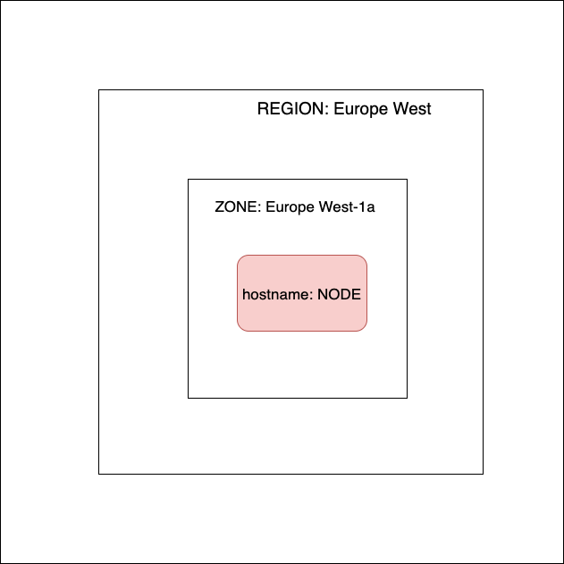
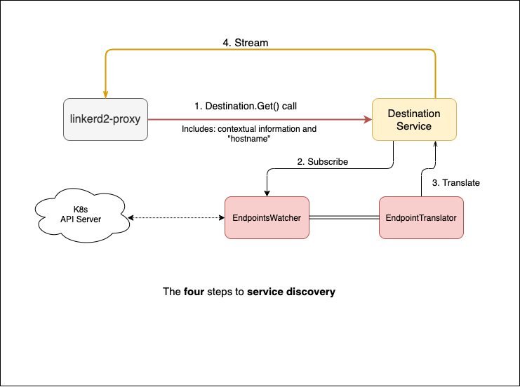

A few months ago, I was browsing through issues and feature requests in the
Linkerd2 repository in search of a cool topic to submit to the
[LFX Mentorship program](https://github.com/cncf/mentoring). To participate,
students were asked to propose an RFC for a feature that, if accepted, they'd
implement. My choice — Service Topology — which, at the time, was a newly
released Kubernetes feature.

Truth be told, I initially struggled to wrap my head around Service Topology.
Partially, due to the perceived complexity, but mostly because there weren't a
lot of resources on the topic. As a newly released feature, all I had on Service
Topology was the proposal and its implementation.

Fast forward to the present day. Thanks to the cumulative effort of maintainers,
contributors, and myself (yep, my RFC was accepted), Linkerd now supports
Service Topology out-of-the-box.

In this article, I’ll discuss what Service Topology is, how Linkerd supports it
(no config needed), and some of the challenges I encountered as a newbie open
source contributor.

## What is Service Topology?

Unlike the term "topology" may suggest, Service Topology doesn't refer to the
arrangement of services within a cluster. Instead, it refers to the ability to
route traffic for specific services based on a predetermined node topology. This
capability was introduced in Kubernetes v1.17 as an alpha feature.

The need for topology-aware service routing originated from the higher cost
associated with cross-zonal network traffic for multi-zone cluster deployments.
The standard Kubernetes proxy (kube-proxy) balances load randomly, meaning
service traffic could be routed to any pod. But some Kubernetes users would
rather target endpoints that are either co-located or at least closer to the
service. A randomly selected pod by the kube-proxy could be far away, increasing
latency and cost. This is exactly what Service Topology addresses. It allows
service owners to prioritize topology domains to be routed to.

Figure 1.1 shows what topology-aware service routing looks like. Suppose we have
a cluster with two nodes (node-1 and node-2). Let's say service A wants to talk
to service B. Without Service Topology any pod from service B’s pod pool (B-1,
B-2, or B-3) could be targeted*.* In the bottom half of the diagram, you'll see
the same scenario but this time with Service Topology enabled. Service A is only
allowed to target co-located pods. Now all traffic between service A and B will
exclusively route via B-1.

## How does Service Topology work?

While writing the Service Topology RFC, I often asked myself this very question.
Initially, the feature seemed complex but there are two Kubernetes resources
that facilitate topology-aware service routing: **topology** **labels** and
**EndpointSlices.**

Topology labels are typical Kubernetes k/v pairs used to represent topological
cluster domains. Topology labels are commonly associated with nodes. When
provisioning a cluster, every node should get a list of associated topology
labels (although not always, think of the kubeadm). Here are the labels used
with service topology:

- kubernetes.io/hostname
- topology.kubernetes.io/zone
- topology.kubernetes.io/region

In the
[official documentation](https://kubernetes.io/docs/concepts/services-networking/service-topology/#examples)
you'll see how different combinations of these three labels (four if you count
the wildcard \*) can be used to route traffic based on your topology
preferences.

EndpointSlices is an exciting yet underrated feature that was released a version
before Service Topology became available. It optimizes Endpoints, the resource
object that holds the subsets (IP address of a pod x port combination) of a
service together. As it turns out, holding all subsets of a service in the same
object means the object will endlessly grow. And the more it grows, the harder
(and more costly, performance-wise) to process.

EndpointSlices break Endpoints up into multiple objects. This is fundamental to
Service Topology because, as part of the change, these subsets aren't just
separated, they also contain more identifying information, such as the topology
domain they belong to. As a bonus, EndpointSlices also include support for
dual-stack addresses, paving the way for more advanced networking logic that can
be developed in the Kubernetes ecosystem.

## Putting it all together: Service Topology in Linkerd

So how does Linkerd fit into our Service Topology discussion? You guessed it: it
enables topology-aware service routing! Linkerd supports Service Topology rather
than extending it or doing something special to it. It enables locality-based
routing by leveraging the same resources that the kube-proxy uses. Most of the
changes we made were to support Service Topology on the Destination service
side, which I’ll cover next.

Figure 2.2 depicts a high-level overview of what I call “the four steps to
service discovery”. The destination service accepts connection requests from the
sidecar proxies. Each request contains the FQDN or IP address of the service
that the proxy wants to resolve, as well as metadata such as contextual
information, i.e on which namespace the pod is. The destination service takes
that FQDN or IP address, translates it internally, and streams it back with a
list of pods that the proxy can use — we say stream because the service is
sending updates back to the proxy, it’s not just a one-time thing. There are two
main components that help us do this:

1. **EndpointWatcher** is essentially a caching mechanism. It watches events and
   holds services and their endpoints in memory.
2. **EndpointTranslator** is a listener. It subscribes to a service in the
   EndpointsWatcher and translates any create, delete, or update operations on
   the cached resources into updates for our proxies.

This differs widely from how the kube-proxy handles routing. For one, we don’t
let the system randomly pick a pod. Instead, we send updates to the proxy which
in turn routes requests based on response latency. That's ten times cooler than
an iptable rewrite or a randomly chosen pod. Based on how the Destination
service works, we had to do two things to support Service Topology. First,
introduce support for EndpointSlices and then introduce support for the actual
Service Topology.

**EndpointSlice** support was quite straightforward. Only a few changes were
needed in the watcher. The first challenge came when dealing with feature gates.
Kubernetes' feature gates can be annoying to deal with, and, as it happens, the
EndpointSlices and Service Topology are both behind feature gates. We had to
choose when to use EndpointSlices over Endpoints, or use both and reconcile
them. Since the kube-proxy doesn't do any reconciliation between the two
resources we decided to go ahead and either use one or the other. After some
trial and error we came up with a CLI flag to enable the support of slices for a
Linkerd installation or upgrade. That, coupled with some other checks, gave us
confidence that adopters would be able to opt-in at any point provided they meet
the native Kubernetes service topology prerequisites: active feature flags and a
recent Kubernetes version. After resolving the flag, everything else was smooth
sailing. We simply added new structs and functions to process the EndpointSlices
as resources.

**Service Topology** support was easier said than done. First, to identify the
traffic source we had to add additional contextual data to requests sent from
the proxy to the service. After all, to calculate topology we must look at both
— the source and destination nodes. That was a dedicated effort in itself. It
required a solid way to grab the name of the source node without messing up the
control plane internals. We also needed to identify the best way to add
contextual data moving forward. We decided to turn the contextual information
represented as a string (denoting the namespace of the pod) into JSON. This
ensured the value would continue to be opaque to most of the API while only
requiring a code change to unmarshal the information on the destination service
side. The biggest challenge was keeping track of the different topology
preferences and the available endpoints. As I was about to learn, filtering
implies state. A lot of edge cases that I didn't account for in the RFC started
to surface: how do we do fallbacks? What happens when the service object is
modified after we picked a preference? And so on. The answer to all of it was
state**.** We decided to change the EndpointTranslator component to be stateful,
keeping track of the total amount of endpoints, as well as a snapshot of the
previously filtered set. This alleviated most of the concerns around the
substantiated edge cases, and made coming up with filtering logic a breeze.

### Conclusion

I certainly didn't expect this feature to take the turns it had. For one, as a
final year undergraduate student, the prospect of coming up with a solution with
no help whatsoever seemed far off — until it wasn’t. Knowing that my work will
make other people's lives easier is incredibly gratifying. What’s more, I get to
tell people how to deal with feature gates and contextual data!

But above all, I am excited to have implemented (what I consider to be) a pretty
cool feature that the rest of the Linkerd community can build on and use.
Service Topology allows you to route traffic based on the location of your
endpoints by default. Enable those feature gates in your cluster and slice down
on your costs.
