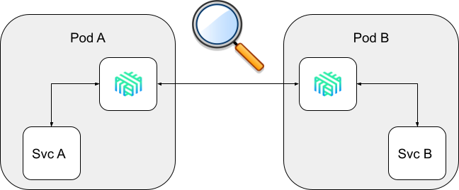
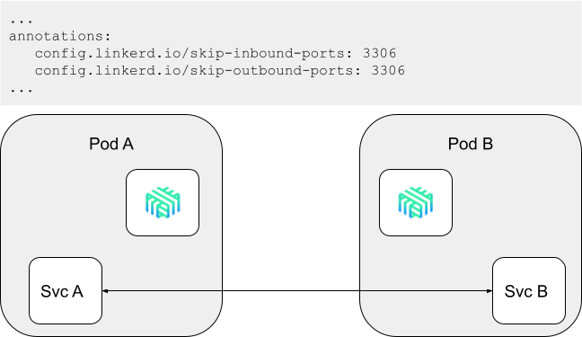
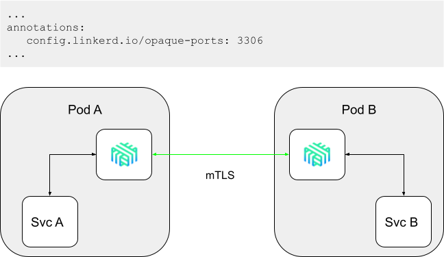

The upcoming Linkerd 2.10 release adds a new _opaque ports_ feature that further
extends Linkerd's ability to provide zero-config mutual TLS for all TCP traffic.
There have been quite a few questions from the Linkerd community in
[Slack](https://slack.linkerd.io) and
[GitHub](https://github.com/linkerd/linkerd2) about this feature, so this
article focuses on one of the most important underlying features that enables
Linkerd to perform this feat:
[Protocol Detection](/2/features/protocol-detection/).

Protocol detection, as the name suggests, allows Linkerd to automatically detect
the protocol in use in a TCP connection. One of [Linkerd's design
principles](/2/design-principles/) is to "just work," and
protocol detection is an important part of how Linkerd achieves that goal.

In this article, you'll learn what protocol detection is, how this subtle
feature gives Linkerd such power, and what the upcoming opaque ports feature
will bring to Linkerd.

## What is protocol detection?

Put simply, _protocol detection is the ability to determine the protocol in use
on a TCP connection by inspecting the traffic on the connection._

Linkerd uses protocol detection to avoid asking the user to specify the
protocol. Rather than requiring the user to configure what protocol each port
uses, Linkerd's proxy simply performs protocol detection to answer the question.

Linkerd's protocol detection works by peeking at the first few bytes of a client
connection to get information about the traffic. This implementation has some
consequences, which we'll get into below.

But first, let's answer the question of _why_ Linkerd cares about any protocol
in the first place.

## Observability, reliability, and security

We typically categorize Linkerd's broad swath of features into three buckets:
observability, reliability, and security. Understanding which protocol is in use
on a connection is fundamental to each of those categories.

### Observability

Central to Linkerd's observability features is the instrumentation of traffic.
This instrumentation requires understanding the protocol in use, because
knowledge of the protocol can provide rich metrics. For example, knowing that a
connection is using HTTP allows Linkerd to parse the requests, responses, and
response codes, and to report metrics such as response latencies, request
volumes, and error rates. These metrics are so valuable that they are part of
what is known as the "[golden signals](https://sre.google/sre-book/monitoring-distributed-systems/#xref_monitoring_golden-signals)"
in Google's SRE book. On the other hand, if all that Linkerd knows is that a
connection is TCP, it is limited to recording very basic information like the
number of bytes read and written—there is no ability to interpret the bytes
further.

### Security

Mutual TLS (mTLS) is a core feature of Linkerd. As of Linkerd 2.9, all TCP
traffic between meshed endpoints is mTLS'd by the Linkerd proxies by default.
(With some caveats—see the section on _skip-ports_ below.)

Here, again, knowing the protocol of the connection is critical. For example, if
the connection is already TLS'd (e.g. by the application), there is no reason to
re-TLS it. (Strictly speaking, TLS is a transport-layer protocol rather than an
application-layer protocol like HTTP, but for the purposes of this article the
distinction doesn't matter.)

### Reliability

Finally, knowing the protocol of the underlying connection allows Linkerd to
provide sophisticated reliability features. One example here is load balancing.
Without knowing the protocol of the connection, Linkerd is limited to balancing
_connections:_ once a TCP connection is established to a server, it has no
further ability to manipulate that connection.

However, if Linkerd knows that a connection is HTTP, it can move from connection
balancing to _request_ balancing. Linkerd will establish a connection _pool_
across endpoints, and will balance requests across this pool. Since it now has
access to requests and responses, Linkerd can be very sophisticated in how it
balances requests; in fact, it balances requests based on the recent performance
of each possible endpoint (used a metric called "exponentially weighted moving
average",  or
[EWMA](https://en.wikipedia.org/wiki/Moving_average#Exponentially_weighted_moving_variance_and_standard_deviation))
so as to avoid incurring tail latency from slow endpoints.

(Linkerd is also an easy solution to the unique considerations of [load balancing gRPC connections within Kubernetes](/2018/11/14/grpc-load-balancing-on-kubernetes-without-tears/).)

## When protocol detection fails

While protocol detection is designed to allow Linkerd "just work", there are
some cases where it cannot: the infamous _server-speaks-first_ protocols. These
protocols, which include things like MySQL and SMTP, work by having the client
establish a connection and then waiting for the server to respond. This is a
perfectly legal behavior from the TCP perspective, but means that Linkerd cannot
detect the protocol as the relevant information comes from the server, not the
client.

(Why not simply use the server's bytes to detect the protocol? Because at the
time of protocol detection Linkerd hasn't even established a connection to the
server. Choosing which server to speak to is a function of the load balancer,
and which load balancer to use is a function of the protocol. It's a delicious,
TCP-flavored chicken-and-egg problem.)

To circumvent this, Linkerd introduced the _skip-inbound-ports_ and
_skip-outbound-ports_ configuration options. These options instruct Linkerd to
bypass the proxy entirely for certain ports by modifying the iptables rules that
Linkerd uses to wire connections for a pod through its sidecar proxy. For
example, adding the annotation `config.linkerd.io/skip-outbound-ports: 3306` to
the PodSpec of a workload instructs Linkerd to create an iptables rule that
ensures that the Linkerd proxy never handles any traffic to port 3306 (the MySQL
port). Similarly, the annotation `config.linkerd.io/skip-inbound-ports: 3306`
will write an iptables rule so that the proxy never handles MySQL traffic that
is sent to it.

These options provide a workaround for the inability of protocol detection to
handle server-speaks-first protocols. However, they have one significant
drawback: because they bypass the Linkerd proxy entirely, Linkerd cannot apply
mTLS or capture any metrics for these ports.

## Opaque ports and improved protocol detection in Linkerd 2.10

To address the deficiency with skip-ports, in the upcoming 2.10 release, Linkerd
will add the concept of _opaque ports_ (and the corresponding `opaque-ports`
annotation). An opaque port is simply one that Linkerd will proxy _without_
performing protocol detection. While this approach still requires configuration,
marking a port as opaque allows Linkerd to apply mTLS and report TCP-level
metrics—a big improvement over skipping it entirely.

Linkerd 2.10 will also improve how protocol detection works by making it "fail
open": if the protocol detection code sees no client-side bytes after 10
seconds, it will treat the connection as a TCP connection and continue, rather
than failing as in 2.9. This means that worst-case behavior of not annotating a
server-speaks-first port with opaque-ports (or skip-ports) is a 10-second
connect-time latency, rather than a connect failure.

## Summary

Protocol detection is one of Linkerd's most powerful features and is fundamental
to Linkerd's "just works" principle. While protocol detection is not a panacea,
the introduction of opaque ports in Linkerd 2.10 should address most of the
downsides of the earlier skip-ports features, and will allow Linkerd adopters to
extend mTLS across their entire Kubernetes environment, regardless of protocol.

(Want to give opaque ports a try? You don't have to wait for the 2.10 release
because the feature is currently available in the
[edge](/releases/) releases!)

## Linkerd is for everyone

Linkerd is a community project and is hosted by the [Cloud Native Computing
Foundation](https://cncf.io). Linkerd is [committed to open
governance](/2019/10/03/linkerds-commitment-to-open-governance/).
If you have feature requests, questions, or comments, we'd love to have you join
our rapidly-growing community! Linkerd is hosted on
[GitHub](https://github.com/linkerd/), and we have a thriving community on
[Slack](https://slack.linkerd.io), [Twitter](https://twitter.com/linkerd), and
the [mailing lists](/community/get-involved/). Come and join the fun!

Image Credit: [Gilles Rolland-Monnet](https://unsplash.com/@gillesrollandmonnet?utm_source=unsplash&amp;utm_medium=referral&amp;utm_content=creditCopyText)
