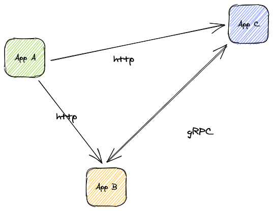
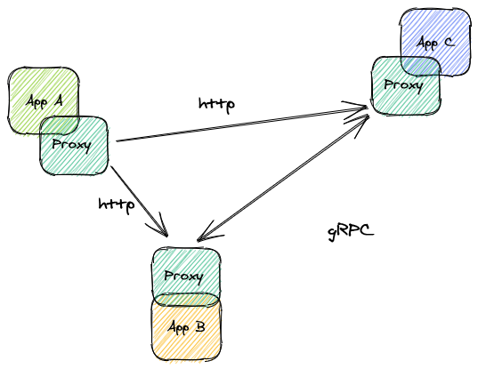
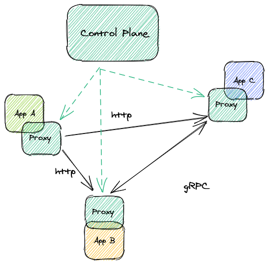

## A 101 with Linkerd

Looking to get started with a service mesh but not sure of where to begin? In this service mesh 101 tutorial, I'll explain what a service mesh is and how to add Linkerd—the original service mesh—to your Kubernetes cluster. You'll learn how to get  Linkerd up and running and visualize your Kubernetes applications.

If you are more of a visual person, check out the video tutorial by Linkerd core maintainer Alex Leong below 👇

## What is a Service Mesh?

A service mesh is a tool for adding observability, security, and reliability features to applications by inserting these features at the platform layer rather than the application layer.

Service meshes consist of two components: the **data plane** consisting of a network of proxies that sit in between your applications, and the **control plane** that tells the proxies what to do and provides an interface for the humans operating the mesh.

### Let’s look at a sample application in Kubernetes

Here's a diagram of a generic application running in Kubernetes. It's made up of three microservices: apps A, B, and C. A talks to B and C is using http traffic, B and C talk to each other over gRPC.

When adding a service mesh, these applications change from communicating directly to doing so through a proxy. Now the proxy intercepts and manages all inter-app communication.

## Now let’s see it as part of a mesh

As you can see in the image above, a proxy is now sitting between each component and intercepting the traffic at either end of the connection.

### What’s up with the proxies?

The proxies make up the data plane of the mesh and are directly responsible for doing all of the work the service mesh does. They are the components that will implement retries, add mTLS, or perform request level load balancing. Some service meshes build on top of general-purpose proxies, but Linkerd uses the [ultra-light "micro-proxy" Linkerd2-proxy](/2020/12/03/why-linkerd-doesnt-use-envoy/). It's highly secure, lightweight, and consumes a lot fewer resources than a general-purpose proxy.

### Where does the control plane fit?

The control plane provides a control point for mesh operators as well as instructions to the data plane. It communicates directly with the proxies as shown below.

In summary, a service mesh is a tool consisting of a data plane and control plane that work together to provide additional value to your organization. But what does a service mesh give you and why should you use one? We’ll answer that next.

## Where Does Linkerd Fit?

Linkerd is a [CNCF](https://www.cncf.io/) service mesh used by many organizations to improve the way their applications perform in Kubernetes. Its benefits generally fall into three categories: security, reliability, and observability.

### Observability

Linkerd makes it easy to see the health of your applications at a glance by quickly surfacing golden metrics by namespace, deployment, and pod. It also simplifies tapping into inter-app communication, enabling you to see live request and response metadata. Between metrics and the ability to intercept messages, Linkerd dramatically simplifies the process of diagnosing application problems. You can read more about [debugging http](/2.10/tasks/books/) and [gRPC traffic](/2.10/tasks/debugging-your-service/) on the [Linkerd docs page](/2.10/overview/).

### Security

Linkerd simplifies security by transparently and automatically enabling mutual TLS between applications. The design philosophy behind Linkerd is that the default configuration of the mesh should be secure and that operators should configure as little as possible to secure their environment—security should always be the default. We also believe that adding security features should be transparent to the applications running in Kubernetes.

### Reliability

Linkerd improves on native Kubernetes constructs to allow mesh operators and platform users to gain performance and reliability benefits for their applications. Applications in the Linkerd mesh benefit from the Linkerd proxy’s ability to make smarter routing decisions so traffic is never routed to downed application instances and is deliberately routed to the [best performing endpoints using exponentially weighted moving average, or EWMA](/2.10/features/load-balancing/). It also allows operators to configure retries and timeouts for their applications.



## Getting Started with Linkerd

Installing and using Linkerd in your Kubernetes cluster is as simple as running: `linkerd install | kubectl apply -f -`

You can follow along with Alex in the video above or use the [Linkerd getting started guide](/2.10/getting-started/) to get yourself up and running.

## Wrapping Up

Thanks so much for taking the time to follow along as we walked through what a service mesh is, how it does what it does, and how Linkerd makes it easier to run highly available and secure applications in Kubernetes. I appreciate your time and I hope the article, and the video, were helpful and informative!
