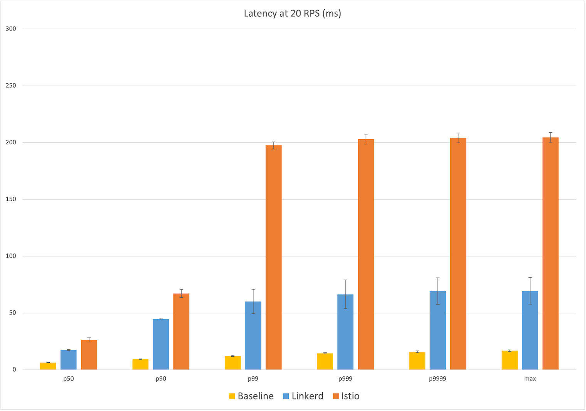
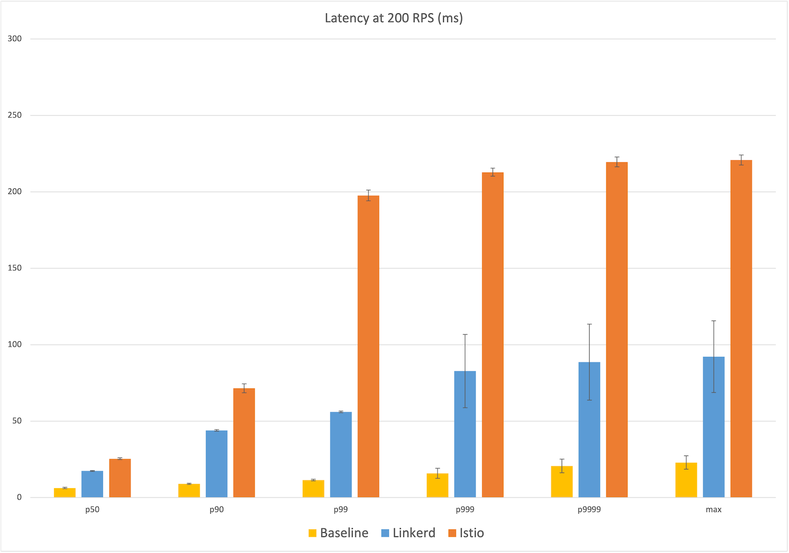
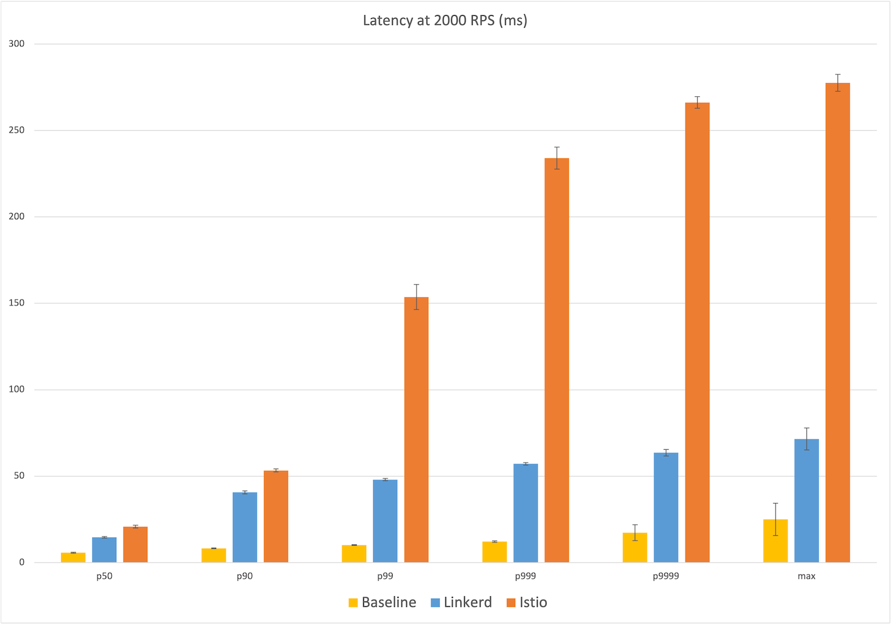
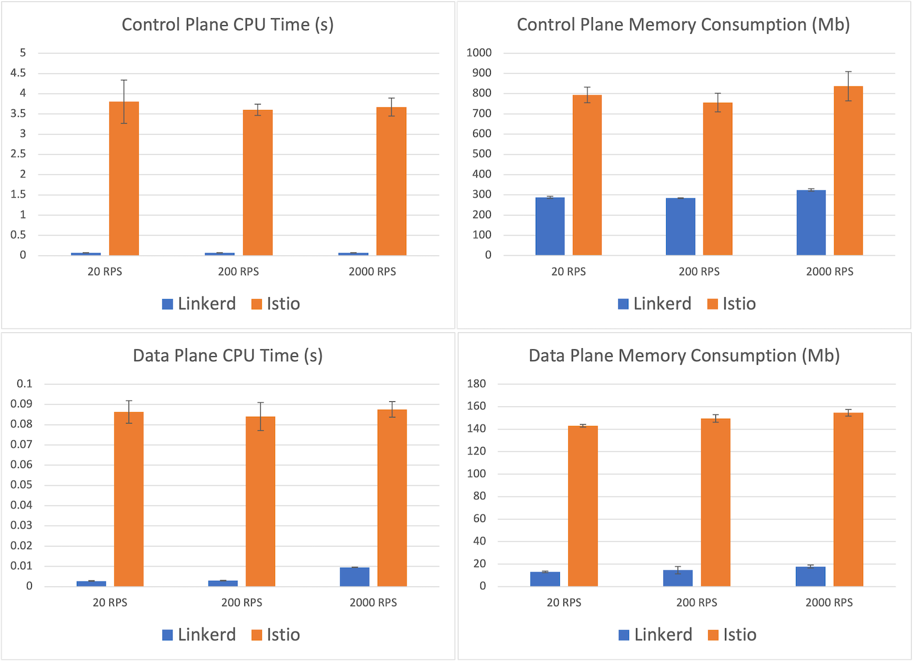

**Update 2021-11-29: we've repeated these experiments with the
[latest versions of Linkerd and Istio](/2021/11/29/linkerd-vs-istio-benchmarks-2021/).**

Two years ago, the fine folks at [Kinvolk](https://kinvolk.io) benchmarked the
performance of Linkerd and Istio and showed that
[Linkerd was dramatically faster and smaller than Istio in all but one area](https://kinvolk.io/blog/2019/05/performance-benchmark-analysis-of-istio-and-linkerd/)
(Linkerd used more data plane CPU). Recently, we repeated those experiments with
the latest versions of both projects. Our results show that **Linkerd not only
remains dramatically faster than Istio, but now also consumes an order of
magnitude less data plane memory and CPU while doing so**. These results were
sustained even at throughput levels over 3x more than what Kinvolk evaluated,
and you can reproduce them yourself.

Read on for more!

## Background

In 2019, Kinvolk released
[public benchmark numbers comparing Linkerd to Istio](/2019/05/18/linkerd-benchmarks/).
This work accomplished two things. First, it produced an
[open source service mesh benchmarking harness](https://github.com/kinvolk/service-mesh-benchmark)
so that anyone could reproduce the results. This harness was notable because it
mimicked "real life" scenarios: it sent a sustained level of traffic through a
simple microservices application, made use of both gRPC and HTTP calls, and
measured the cost of using a service mesh in terms of memory and CPU consumed as
well as latency added. Critically, latency was measured from the client's
perspective, yielding user-facing numbers, as opposed to internal proxy timings.

The second thing Kinvolk produced were the actual benchmark results circa 2019
for both Linkerd and Istio. These numbers showed that Linkerd was dramatically
faster and that Linkerd's resource consumption was also dramatically smaller in
all factors except one—Linkerd's data plane (i.e. its proxies) consumed more CPU
than Istio at the highest level of load.

Two years later and after many releases from both projects, we decided to
revisit these experiments.

## Experiment setup

In these experiments, we applied the Kinvolk benchmark suite to the latest
stable releases of both projects: Linkerd 2.10.2 (with its default installation)
and Istio 1.10.0 (with its "minimal" config). We ran the latest version of the
benchmark harness on a Kubernetes v1.19 cluster using the Lokomotive Kubernetes
distribution. The benchmark ran on bare-metal hardware kindly provided by
[Equinix Metal](https://www.equinix.com/) to CNCF projects.

Our first step was to find a test environment within Equinix Metal that could
deliver consistent results across runs. This was a surprisingly difficult task:
many of the environments we tried produced hugely variable latencies between
runs, including for the base case of no service mesh. (For example, in one
environment we tried, the benchmarks reported maximum latencies of anywhere from
26ms to 159ms at 200 RPS for the no service mesh case!)

We finally arrived at a cluster in the
[Equinix Metal `dfw2` datacenter](https://metal.equinix.com/developers/docs/locations/facilities/#core-sites)
which yielded consistent behavior with low variance between runs. This cluster
comprised 6 worker nodes of the `s3.xlarge.x86` configuration (Intel Xeon 4214
with 24 physical cores @ 2.2GHz and 192GB of RAM) on which the benchmark
application ran, plus one load generator node of the same config, plus one K8s
master node of a c2.medium.x86 config.

Next, we turned to the parameters of the harness. While the original Kinvolk
work evaluated performance at 500 requests per second (RPS) and 600 RPS, we
wanted to try a broader range: we evaluated the meshes at 20 RPS, 200 RPS, and
2,000 RPS. At each of these levels, we ran 6 independent runs of 10 minutes each
of sustained load, for Linkerd, Istio, and the base case of no service mesh. All
benchmark and mesh resources were reinstalled in between runs. For each level,
we discarded the single run with the highest maximum latency, leaving us with 5
runs. (Our
[raw data is available](https://docs.google.com/spreadsheets/d/1x0QXFAvL0nWOIGL5coaaW1xwsju5EmSjsqjw6bwHMlQ/)
for perusal.)

Note that the Kinvolk framework measures the behavior of the service mesh in a
very specific way:

- It measures memory usage at the highest point for both control plane and data
  plane. In other words, the highest memory usage from the control plane (as a
  whole, i.e. with any subcomponents aggregated together) at any point in the
  run is reported as the control plane memory consumption for the run.
- Similarly, the highest memory usage from any single data plane proxy is
  reported as the data plane consumption for the run.
- It measures CPU usage in a similar way, using CPU time as the metric.
- It measures latency from the client's perspective (the load generator), which
  includes time on the cluster's network, time in the application, time in the
  proxies, and so on. Latency is reported as the percentiles of a distribution,
  e.g. p50 (median), p99, p999 (99.9th percent), and so on.

(See [Summary and discussion](#summary-and-discussion) below for more on this.)

Note also that the numbers reported by this benchmark are a function of both the
service mesh _and_ of the harness and its environment. In other words, these are
not absolute scores but relative ones, which can only be evaluated against other
alternatives measured in the same environment and same way.[^1]

## What service mesh features were tested?

While each service mesh provides a large set of features, only a subset of these
were actually in play during these experiments:

- Both service meshes had [mTLS](https://buoyant.io/mtls-guide/) enabled, and
  were encrypting traffic and validating identity between all application pods.
- Both service meshes were tracking metrics, including L7 metrics, though these
  metrics were not consumed in this experiment.
- Both service meshes logged various messages at the INFO level by default. We
  did not configure logging.
- Both service meshes were capable of adding retries and timeouts, and of
  shifting traffic in various ways, but none of these features were explicitly
  used in this experiment.
- No distributed tracing, multi-cluster communication, or other "mesh-y"
  features were enabled.

## Results

The results of our experiments are shown in the graphs below. Each point in
these graphs is the mean of the five runs, with error bars representing one
standard deviation from that mean. The bars themselves represent Linkerd (blue),
Istio (orange) and the baseline of no service mesh (yellow).

### Latency at 20 RPS

Starting at the relatively calm level of 20 RPS, we already see a big difference
in user-facing latency: Linkerd's median latency was 17ms, 11ms over the
baseline of 6ms. Istio's median latency, by contrast, was 26ms, almost twice the
additional latency of Linkerd. At the maximum, Linkerd added 53ms over the
baseline of 17ms of latency, whereas Istio's max latency added 188ms, over three
times the additional latency of Linkerd.

Looking at the percentiles, we see that Istio's latency distribution jumped
dramatically at the 99th percentile to ~200ms, while Linkerd showing a more
gradual increase in the higher percentiles to 70ms. (Remember that these latency
numbers are measured from the client's perspective, i.e. what a user of this
application would actually experience.)

### Latency at 200 RPS

The 200 RPS numbers tell a very similar story and the median latency numbers are
almost identical: Linkerd's median latency of 17ms represents 11ms over the
baseline median of 6ms, while Istio's median latency of 25ms is 19ms over. At
the max, Istio's latency of 221ms is almost 200ms over the baseline of 23ms,
while Linkerd's max latency of 92ms is ~70ms over, 2.5x less than Istio. We see
the same jump in Istio's latency occurring at the 99th percentile to almost
200ms of user-facing latency, with Linkerd leveling out at the 99.9th percentile
to almost 90ms.

### Latency at 2,000 RPS

Finally, at 2,000 RPS—over three times what Kinvolk evaluated—we see the same
pattern again: at the median, Linkerd introduces an additional 9ms of latency
over the baseline of 6ms vs Istio's additional 15ms; at the max, Linkerd
introduces an additional 47ms over the baseline of 25ms, and Istio adding 5x
that with an additional ~253ms. Generally speaking, at each percentile reported,
Istio introduced between 40% to 400% more additional latency than Linkerd.

## Resource consumption

Let's turn now to resource usage. The CPU and memory consumption of each service
mesh are shown in the graphs below. These numbers are fairly consistent across
all throughput levels, so we'll focus on the highest-load scenario of 2,000 RPS.

Starting with the control plane, we see that Istio's control plane usage
averaged 837mb, about 2.5x Linkerd's control plane memory consumption of 324mb.
Linkerd's CPU usage was orders of magnitude smaller—71ms of control plane CPU
time versus Istio's 3.7s.

More important than the control plane, however, is the data plane. After all,
this is the part of the mesh that must scale out with the application. Here we
see another dramatic difference: the maximum memory consumed by a Linkerd proxy
was, on average, 17.8mb, whereas the maximum memory consumed by one of Istio's
Envoy proxies was 154.6mb—a factor of 8. Similarly, Linkerd's maximum proxy CPU
time recorded was 10ms, whereas Istio's was 88ms—almost an order of magnitude
difference.

## Summary and discussion

In these benchmarks, designed to mimic behavior in a real-world scenario, we saw
Linkerd dramatically outperform Istio while maintaining a resource cost that is
many orders of magnitude smaller at the critical data plane level. At the
highest throughput evaluated, we saw Linkerd consume 1/9th the memory and 1/8th
the CPU at the data plane, while delivering 75% of the additional median latency
and less than 1/5th the additional maximum latency of Istio.

Benchmarking is as much art as science. In these experiments, we made a
conscious choice to stick to the Kinvolk benchmark framework as published. In
future work, there are several things we might consider changing. For example:

- Measuring cumulative rather than maximum resource consumption is arguably more
  reflective of true cost.
- Measuring CPU in terms of cores consumed rather than CPU time might be a
  better analog to the way memory is measured.
- Calculating latency percentiles over all data from all runs, rather than
  taking the mean of percentiles over individual runs, would be more
  statistically accurate.

Additionally, our experiments were significantly simpler than Kinvolk's 2019
experiments, which involved 30 minutes of sustained traffic, different clusters,
different datacenters, and other techniques to control for variable hardware or
networking. In our case, we explicitly focused on finding a low-variance
environment first on which to run the tests.

## Why is Linkerd so much faster and lighter?

The large difference in performance and resource cost between Linkerd and Istio
primarily comes down to one thing:
[Linkerd's Rust-based "microproxy", Linkerd2-proxy](/2020/12/03/why-linkerd-doesnt-use-envoy/).
This micro-proxy powers Linkerd's entire data plane, and the benchmark largely
reflects its performance and resource consumption.

[We've written a lot about Linkerd2-proxy](/2020/07/23/under-the-hood-of-linkerds-state-of-the-art-rust-proxy-linkerd2-proxy/)
as well as our
[motivations behind adopting Rust](https://www.infoq.com/articles/linkerd-v2-production-adoption/)
back in the dark ages of 2018. Interestingly enough, the primary reason for
building Linkerd2-proxy was not for performance but for _operational_ reasons:
operating an Envoy-based service mesh like Istio often requires you to become an
expert at operating Envoy, a challenge which we did not relish imposing upon
Linkerd users.[^2]

Happily, the choice to build Linkerd2-proxy also resulted in significant
performance and efficiency gains. By solving the very specific problem of being
a "service mesh sidecar proxy" only, we can be extremely efficient at the data
plane level. And by building Linkerd2-proxy in Rust, we can ride the wave of the
incredible technological investment placed in that ecosystem: libraries like
[Tokio](https://github.com/tokio-rs/tokio),
[Hyper](https://github.com/hyperium/hyper), and
[Tower](https://github.com/tower-rs) are the focal point of some of the world's
best systems thinking and design.

Linkerd2-proxy isn't just incredibly fast, light, and secure, it represents some
of the most cutting edge technology in the entire CNCF landscape.

## Future work

Oddly enough, despite Linkerd's excellent performance in these benchmarks, we
have yet to make a concentrated effort on performance-tuning the proxy. We
expect that spending time on performance will result in additional gains in this
area.

We are also eagerly watching the [SMP project](https://smp-spec.io/) as a
potential source of benchmarking standards. Ideally, these benchmarks would be
run by a neutral third party. Which brings us to:

## How to reproduce these results

If you want to reproduce these experiments on your own, you can follow the
[benchmarking instructions](https://github.com/linkerd/linkerd2/wiki/Linkerd-Benchmark-Setup).

If you try this, please see our [comments above](#experiment-setup) about
experimental methodology. It is critical that you find an environment that can
deliver consistent results, especially for things like max latency that are very
sensitive to network traffic, resource contention, and so on. Also, please
remember that the numbers you produce will be relative, not absolute,
measurements.

And let us know what you find!

## Thanks

A special thank you to the kind folks at Equinix for providing the Kubernetes
environment that made this all possible; to the CNCF, who made it possible for
the Linkerd project to run these experiments; and to Kinvolk, especially Thilo
Fromm, for the excellent benchmark harness.

## Linkerd is for everyone

Linkerd is a community project and is hosted by the
[Cloud Native Computing Foundation](https://cncf.io/). Linkerd is
[committed to open governance.](/2019/10/03/linkerds-commitment-to-open-governance/)
If you have feature requests, questions, or comments, we'd love to have you join
our rapidly-growing community! Linkerd is hosted on
[GitHub](https://github.com/linkerd/), and we have a thriving community on
[Slack](https://slack.linkerd.io/), [Twitter](https://twitter.com/linkerd), and
the [mailing lists](/community/get-involved/). Come and join the fun!

(_Photo by
[Marc Sendra Martorell](https://unsplash.com/@marcsm?utm_source=unsplash&utm_medium=referral&utm_content=creditCopyText")
on
[Unsplash](https://unsplash.com/s/photos/speed?utm_source=unsplash&utm_medium=referral&utm_content=creditCopyText)._)

## Footnotes

[^1]:
    For example, statements like "Linkerd added Xms of latency at the median" in
    this report do not mean that Linkerd will add Xms of median latency to
    _your_ application. Nor do they mean that an individual Linkerd proxy will
    add Xms of latency (in fact, the median latency of an individual Linkerd
    proxy is less than a millisecond for most types of traffic).

[^2]:
    The proxy might be the most interesting part of the service mesh from a
    technology perspective, but it's the _least_ interesting part from the
    users' perspective. Our belief is that the service mesh proxy should be an
    implementation detail, and we strive hard to ensure that the majority of
    Linkerd users have to learn very little about Linkerd2-proxy.
