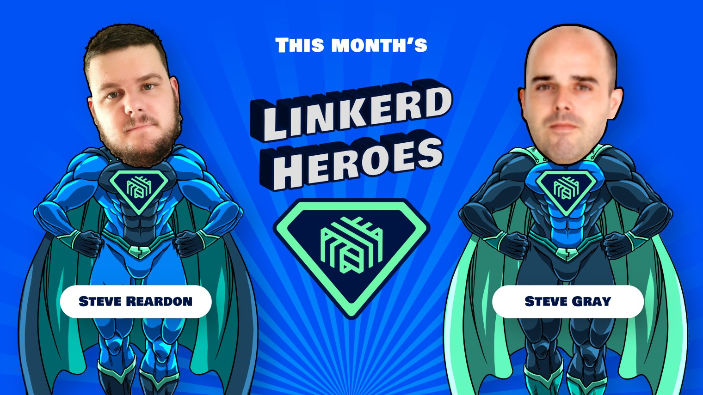

If you attended this month's
[Linkerd Community meeting](https://community.cncf.io/events/details/cncf-linkerd-community-presents-june-linkerd-online-community-meetup/)
, you've already
heard the news: this month's Linkerd Heroes are Steve Gray and Steve
Reardon. Congrats, Steve and Steve!

## What are Linkerd Heroes?

Linkerd Heroes are community members who best represent the spirit
of the Linkerd community. Whether it's helping folks, answering
questions, sharing their successes (and failures!) with the world
at large, or contributing code or docs, Linkerd Heroes are instrumental
in making the Linkerd community the amazing place it is today.

## Congrats, Steve and Steve!

This month's heroes are Steve Gray and Steve Reardon, who wrote about their
Linkerd adoption story at Entain in
[this insightful CNCF blog post](https://www.cncf.io/blog/2021/04/19/when-lebron-scores-latency-matters-realizing-10x-throughput-while-driving-down-costs-and-sleeping-through-the-night/).
Thank you, Steves, for sharing your experience and lessons learned with the
broader community!

## Nominate next month's Linkerd Hero

Linkerd Heroes take many forms. Perhaps someone has answered your or the
community’s pressing questions on Slack. Maybe you've read a blog post or
watched a conference talk that helped spur your decision-making process
or advance your Linkerd implementation. Or perhaps someone contributed
an awesome Linkerd feature or bugfix that has made your life a lot easier.
Who is your Linkerd Hero? [Submit your nomination for next month's hero here!](https://docs.google.com/forms/d/e/1FAIpQLSfNv--UnbbZSzW7J3SbREIMI-HaooyX9im8yLIGB7M_LKT_Fw/viewform?usp=sf_link)

For those who nominated, thank you for participating, and remember to [join
our next community meeting](https://community.cncf.io/events/details/cncf-linkerd-community-presents-july-linkerd-online-community-meetup/)
on Thursday, July 22 at 9 am PT!
