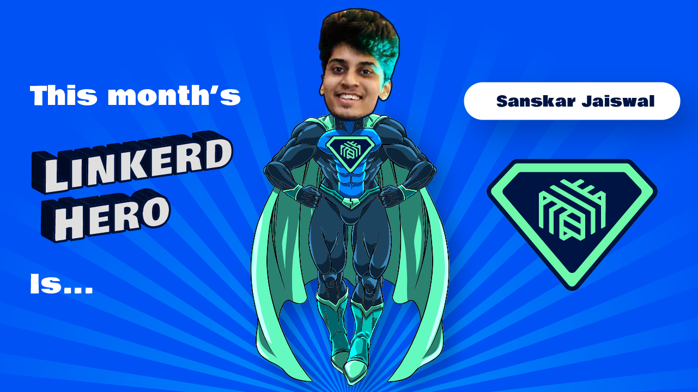

If you attended this month's Linkerd Community meeting, you've already heard
the news: this month's Linkerd Hero is Sanskar Jaiswal. Congrats, Sanskar!

## What are Linkerd Heroes?

Linkerd Heroes are community members who best represent the spirit of the
Linkerd community. Whether it's helping others, answering questions, sharing
their successes (and failures!) with the world at large, or contributing
code or docs, Linkerd Heroes are instrumental in making the Linkerd
community the amazing place it is today.

## Congrats, Sanskar Jaiswal!

This month's hero is [Sanskar Jaiswal](https://github.com/aryan9600).
In a short amount of time, Sanskar has made his presence felt through his
thoughtful code contributions 一 ranging from bug fixes to adding new
health checks in the control plane. Thank you, Sanskar, for your passion,
commitment, and prolific contributions. Your changes are a welcome addition
to the project!

## Nominate next month's Linkerd Hero

Linkerd Heroes take many forms. Perhaps someone has answered your or the
community’s pressing questions on Slack. Maybe you've read a blog post or
watched a conference talk that helped spur your decision-making process or
advance your Linkerd implementation. Or perhaps someone contributed an
awesome Linkerd feature or bug fix that has made your life a lot easier.
Who is your Linkerd Hero?
[Submit your nomination for next month's hero here](https://docs.google.com/forms/d/e/1FAIpQLSfNv--UnbbZSzW7J3SbREIMI-HaooyX9im8yLIGB7M_LKT_Fw/viewform?usp=sf_link)!

For those who nominated someone, thank you for participating, and remember
to join our next community meeting on
[Thursday, August 26, at 9 am PT](https://community.cncf.io/events/details/cncf-linkerd-community-presents-august-linkerd-online-community-meetup/)!
