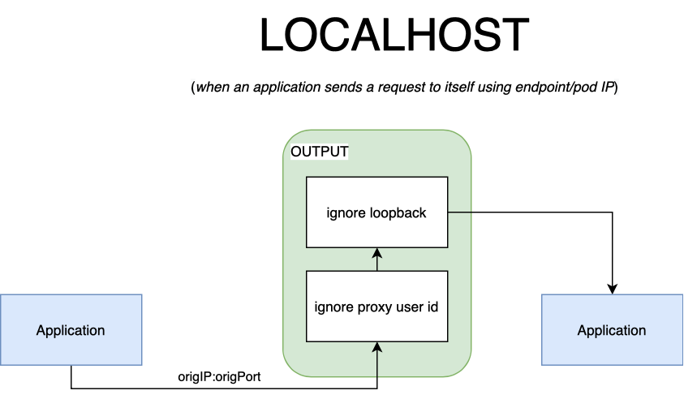
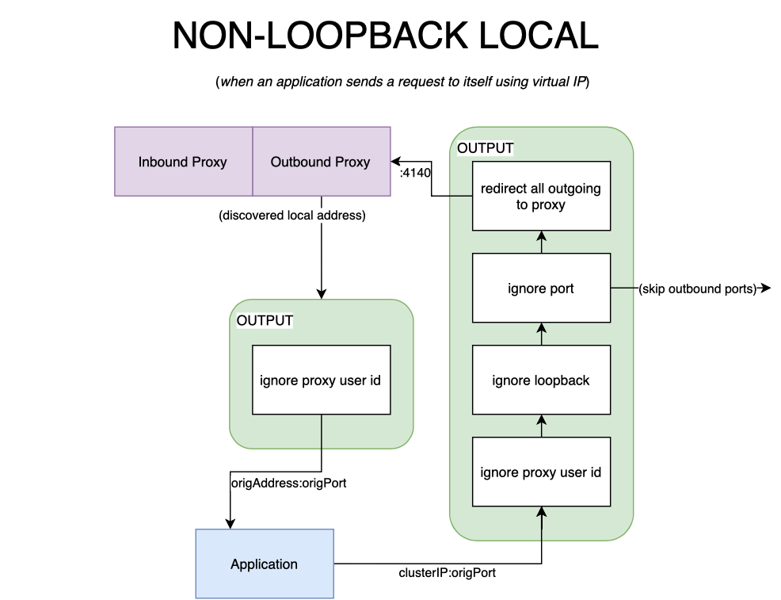

This blog post will look at how Linkerd uses iptables to intercept the TCP
traffic to and from Kubernetes pods and route it through
["sidecar" proxies](https://linkerd.io/service-mesh-glossary/#sidecar-proxy)
without the application knowing. This ability to transparently route traffic
is key to Linkerd's entire feature set, from
[golden metrics](https://linkerd.io/service-mesh-glossary/#golden-metrics)
to [mTLS](https://buoyant.io/mtls-guide/),
from request retries to gRPC load balancing. And, while iptables is
a particularly hairy bit of the networking stack, it is both powerful and
flexible. So read on as we uncover some of the mysteries of iptables,
including what it is, how it works in the Kubernetes world, and how service
meshes like Linkerd use it.

## Introduction

Ahead of our eagerly anticipated 2.11 release for Linkerd, my colleagues and
I had the opportunity to rework how
[Linkerd2-proxy](https://github.com/linkerd/linkerd2-proxy) behaves when
forwarding traffic to an application process in a pod. Inbound traffic was
always forwarded to a port bound on localhost, regardless of the actual
inbound address. This had the unintended consequence of exposing ports not
bound on public interfaces to other pods in the
[cluster](https://linkerd.io/service-mesh-glossary/#cluster).
We changed the proxy to forward traffic to the original address to harden
security and better integrate with the upcoming policy feature. During
testing, we noticed the changes introduced a strange looping behavior—a
request would start being processed by the inbound side of the proxy but,
instead of being forwarded to the application process, it would leave the
proxy and come right back!

Coincidentally, around the same time, I became more and more interested in
CNIs and the dreaded **iptables**. As soon as I noticed this strange looping
behavior, I knew I had to satisfy my curiosity and do a deep dive into the
magical powers of [netfilter](https://www.netfilter.org). And magical it is
because *netfilter*—and more accurately, its packet filtering kernel module,
iptables—facilitates proxying in a Kubernetes cluster. Most service meshes rely
on it to configure traffic forwarding rules, and from that perspective, Linkerd
is not an exception. While this article focuses on the iptables module that we
all know and love to hate, it’s worth pointing out that Linkerd only uses the
*iptables interface*. Without any code changes, the backend can be
[transparently replaced](https://www.mail-archive.com/netdev@vger.kernel.org/msg217095.html)
with a BPF alternative (i.e. *bpfilter*), as long as it’s enabled in the kernel.

Naturally, as many people will tell you, iptables are not fun to debug and look
into, as integral as they are. As such, I took it upon myself to document this
underappreciated core component, the firewall that configures traffic routing to
and from the sidecar proxy. I will not cover iptables or Linux networking
in-depth. That’s better left to some of the existing articles on the topic
(recommended readings listed below).

## Why do we need iptables?

It would be natural to talk about what Linkerd does for you before talking about
what iptables does for Linkerd. A
**[service mesh](https://linkerd.io/service-mesh-glossary/#service-mesh)**
adds *[observability](https://linkerd.io/service-mesh-glossary/#observability),
security*, and *reliability* features to an application, but it does so at a
platform layer. The mesh consists of a *data plane*, represented by a group of
network proxies that sit in between your applications, and a
*[control plane](https://linkerd.io/service-mesh-glossary/#control-plane)* that
provides an
[interface for the humans operating the mesh](https://linkerd.io/2021/04/01/introduction-to-the-service-mesh/#what-is-a-service-mesh).
Linkerd uses its own
[ultralight, Rust-based "micro-proxy"](https://linkerd.io/2020/12/03/why-linkerd-doesnt-use-envoy/)
for the data plane for security and performance reasons—each instance of an
application that participates in the mesh gets its **Linkerd2-proxy** running
beside it. We say that the proxy runs as a “sidecar”—it is just another container
in your application’s pod.

In **fig 1.1** you can see the service mesh architecture. The control plane is
deployed in a cluster and helps the proxy in its decision-making process. Each
pod in the mesh uses a sidecar deployment model; the proxy becomes the traffic
“conduit” to and from your application.

You might have noticed that in the diagram, we have an additional container
in the pod—*linkerd-init*. If you guessed this is where our journey into
iptables begins, then you’re most right.

## Init Containers and pod networking

In the Kubernetes networking model, each pod has its IP address; pods talk to
each other
[using their assigned IP addresses](https://ronaknathani.com/blog/2020/08/how-a-kubernetes-pod-gets-an-ip-address/).
Each pod also runs in its networking namespace; as noted in
“[A Guide to the Kubernetes Networking Model](https://sookocheff.com/post/kubernetes/understanding-kubernetes-networking-model/#container-to-container),"
this provides pods with their own brand new network stack for all processes
within the namespace. They have their routes, network devices,
and **firewall rules**.

These considerations are important to us, especially in the context of proxying
traffic. Ideally, the proxy is *selectively injected into a pod*.
Applications should not be forced to participate in the mesh (it should be
opt-in), and having a network namespace per pod gives us a clearly defined
boundary for our configuration. Next, having separate networking devices and
firewall rules for each pod gives us an easy way to configure routing—after
all, iptables have been historically used to route traffic, and we want to
route all traffic through the proxy. Let’s recap: *we can configure pods to
route traffic through the proxy, and the configuration applies only to the pod
itself*. The only thing we are missing is how to configure this. **Enter the
init container.**

The Kubernetes
[official documentation](https://kubernetes.io/docs/concepts/workloads/pods/init-containers/)
on the topic describes init containers best: *a pod may have multiple containers
running within it*, but it can also have one or more **init containers**, which
are run before the app containers are started. In other words, init containers
are akin to a **Job**: they run once until completion before your main
application starts and, if they fail, the whole pod fails. Linkerd uses init
containers to set up traffic rules before an application starts—you guessed it,
through iptables.

## “Sysadmins hate them! Ten simple rules to live by if you want to proxy traffic”

We are finally getting to the good part. We’ve established why we use init
containers and how it is possible to set up iptables for each pod, but what
about the actual setup? How many lines of code does it take to route traffic
between processes in the kernel? Not that many. We have **ten rules** (ish) to
make this happen. I would feel incredibly guilty if I relied entirely on other
freely available material to get you up to speed on **iptables**, so I will give
you my own understanding in a few sentences.

When a packet arrives fresh off the network interface, the kernel goes through a
decision process in which it decides what to do with it. A packet may be
forwarded to another hop, rejected, or processed locally. A critical authority
figure in this decision-making process is *Netfilter*, the kernel’s packet
filtering subsystem.  Filtering rules are configured through *iptables*, and it
goes like this: a table is composed of multiple chains, each chain has one or
more rules. These rules match a packet. When a packet is matched, an action (or
a *target* in iptables lingo) is taken.

Tables, chains, and rules are traversed for a packet, and order matters. There
are a couple of built-in tables, and each table has a set of default chains. For
Linkerd, we are concerned primarily with the **nat** (network address
translation) table. The nat table allows us to rewrite the packet's source
and/or destination, and that’s exactly what we look for when proxying traffic.
When a packet arrives, we want to rewrite its destination to the proxy instead
of the application process. When a packet leaves, we want it to go through the
proxy instead of simply leaving it on the network interface. The nat table has
two default chains that allow us to configure this behaviour: the *PREROUTING*
chain, which is traversed when a packet arrives from a network interface, and
the *OUTPUT* chain, which is traversed when a local process produces a packet.

Armed with this archaic knowledge, we are ready to look at how packets are
handled **on the inbound side** of the proxy. Communication between proxies is
opportunistically upgraded to HTTP/2 (unless an opaque transport is used) and
opportunistically [mTLS](https://linkerd.io/service-mesh-glossary/#mtls)’d.
This means that the proxy should first handle any packet that comes in our
networking namespace—we otherwise risk sending a payload to the application we
won’t be able to make sense of.

**Fig 2.1** describes the flow of a packet on the inbound side. We first create
a new chain and attach that to the nat table. Since traffic first comes through
the prerouting chain, we attach a rule that sends packets to our newly created
chain. After “jumping” to our chain, a packet goes through two more rules:

- We check whether the destination port should be ignored
([since Linkerd 2.9, certain ports may be skipped](https://linkerd.io/2021/02/23/protocol-detection-and-opaque-ports-in-linkerd/)).
If the port is skipped, the packet makes it directly to the application.
- If the packet does not match any of the destination ports, it’s simply
forwarded to the proxy’s inbound port. Under the hood, iptables will rewrite
the header of our packet and change its IP address to “localhost” and its port
to 4143. The kernel is smart—it saves the original destination of the packet,
which the proxy is able to access through the **SO_ORIGINAL_DST** socket option.
After processing, the proxy will produce a new packet that will be forwarded to
the application process. The packet produced by the proxy will go to the output
chain (confusing, I know). Fortunately, a rule which we will cover in a second,
will allow the packet to skip any further processing and go directly to
its destination.

The outbound counterpart is slightly harder to understand but follows a similar
flow. **Fig 2.2** describes how a packet makes its way out of the network
namespace by traversing the same nat table. Once again, we create a new chain
and add a couple of rules. Previously, we “jumped” from the prerouting chain.
With outbound, we “jump” from the output chain — the first to be traversed by a
packet on its way out:

- Any packet produced by the proxy (with a hardcoded user-id), is automatically
ignored from processing. On the inbound side, this allows us to send a packet to
the application. On the outbound side, it allows our packet to leave on the
network card.
- Any packet sent over the *loopback interface* will be automatically ignored.
If, for example, two containers in the same pod talk directly to each other,
they will not be sent through the proxy (more on this later).
- Like its inbound counterpart, the ignore port rule will skip processing the
packet and send it directly out. This is useful for certain types of traffic
that the proxy should not handle.
- Finally, if we have made it this far in the chain, we know the packet has been
created by the application process and is destined for a server (perhaps),
in which case we want the proxy to intercept it.

## But wait... there's more!

One rule, in particular, may seem out of place. You might be wondering, “why do
we need to ignore loopback traffic”? We have a few exceptions with the outbound
traffic. When an application wants to talk to itself (or another container in
the pod), we want to skip proxying traffic for several reasons. The most obvious
one is: *we can’t do service discovery on ports bound on localhost*. It’s not as
if we have many endpoints to pick from anyway. Packets that circulate over the
loopback interface are also exempt from traversing the prerouting chain.  It’s
not of our choosing, it’s just an optimization the kernel does on its own.

An application may talk to itself via its clusterIP service, however. In this
case, the packet would be processed by the proxy. If the proxy picks the
originating pod as the endpoint the packet will *still be forwarded over the
loopback interface*. The kernel knows the packet's destination is local, so it
intelligently saves this route and associates it with loopback. In such cases,
we’d need to either reroute our packet through the prerouting chain or skip the
proxy altogether, otherwise, the process will receive an encrypted packet. This
is what caused the looping behavior I spoke of earlier in the article. In
keeping with our philosophy of simplicity, in Linkerd, we decided to skip
mTLSing when the packet stays local. As cliché as it sounds, a picture is worth
a thousand words. **Fig 2.3** and **fig 2.4** describe the scenarios outlined
above.

## Wrapping it up

Hopefully, I was able to turn you into a Kubernetes iptables expert. The
powerful iptables handles packet filtering at low levels; service meshes
(including Linkerd) are reliant on it to provide a way of proxying traffic to
and from an application container. I hope to have demystified some of the rules
that we put in place through our *linkerd-init container*. Although not critical
to operate the world’s fastest, lightest service mesh, it's useful to know,
especially since proxying traffic can often appear as if it was magic.

### Reading List

I recommend reading these articles to further explore iptables conceptually and how
container networking works in a nutshell.

- Julia Evans'
[container networking overview](https://jvns.ca/blog/2016/12/22/container-networking/)
- [Networking in Kubernetes](https://sookocheff.com/post/kubernetes/understanding-kubernetes-networking-model/)
- [IP Tables man pages](https://linux.die.net/man/8/iptables)
- [IP Tables tutorial](https://www.frozentux.net/iptables-tutorial/iptables-tutorial.html)
