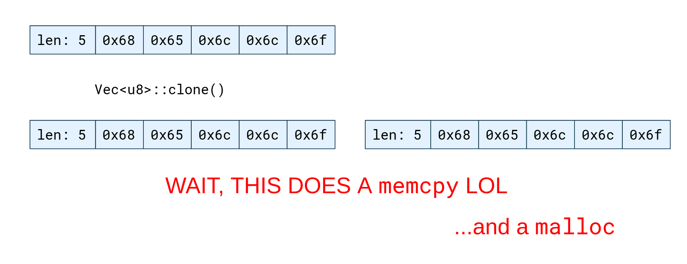
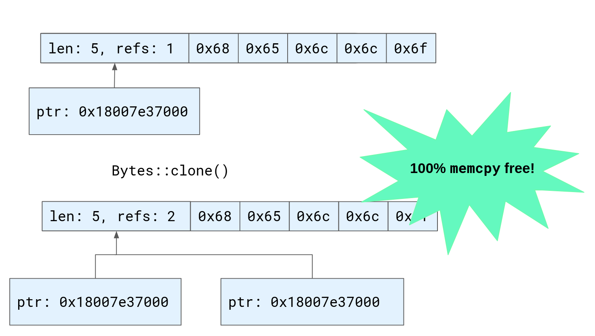
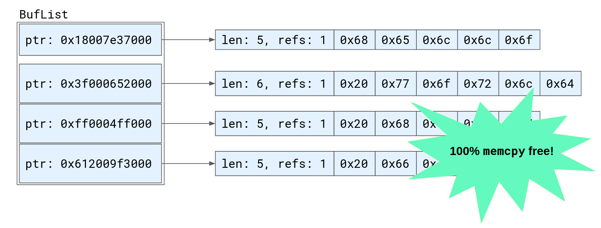

[Linkerd 2.11](https://github.com/linkerd/linkerd2/issues/6130) is here and with
it are some cool new updates. One I am particularly excited about (full
disclosure: I worked on it), is retries for HTTP requests with bodies. Linkerd
has supported HTTP retries
[since version 2.2](/2019/02/22/how-we-designed-retries-in-linkerd-2-2/), but
until now, we would only retry requests without bodies. Retrying requests with
bodies is especially important for anyone using Linkerd with gRPC. Since all
gRPC requests are HTTP/2 `POST` requests with bodies, this feature enables
retries to be configured for gRPC traffic.

Retrying a request with a body may sound simple (just send the body again,
right?), but it’s not that straightforward. In order to send a body again, the
entire body has to be buffered in memory until the original request completes.
This means that proxies will have to use more memory to store those bodies, and
buffering the body increases latency. We would like to be able to retry these
requests while keeping the impact on latency and proxy memory usage as low as
possible.

Additionally, some requests, like
[client-streaming requests in HTTP/2](https://httpwg.org/specs/rfc7540.html#StreamsLayer)
and
[`Transfer-Encoding: chunked` requests](https://developer.mozilla.org/en-US/docs/Web/HTTP/Headers/Transfer-Encoding#directives)
in HTTP/1.1, can have long bodies that are sent in multiple pieces. If the proxy
were to buffer the entire request body before forwarding the request to the
server, it would have to wait for the body to complete — potentially introducing
significant latency. And, in many cases, the server might expect to process
those request bodies chunk-by-chunk. Imagine uploading a multi-gigabyte video
file or a client-streaming gRPC request where the client pushes events to the
server as they occur. Waiting to buffer the entire body before forwarding it
could break the behavior that the server expects. Instead, we want to be able to
forward each chunk as it’s received while also buffering it in the proxy in case
the request needs to be retried.

To reduce the overhead of buffering body data, we also want to minimize copying
data from one buffer to another (i.e. `memcpy` calls). This can be quite
time-consuming when there’s a lot of data and we want to avoid unnecessary
memory allocations (i.e. `malloc` calls).

In addition, we want to make sure we’re correctly handling potential edge cases.
What if the server responds with an error before the body stream ends? We might
have to retry the request before we’ve received the whole body from the client.
Or, what if the client sends a longer body than the request’s
[`Content-Length` header](https://developer.mozilla.org/en-US/docs/Web/HTTP/Headers/Content-Length)?
A standards-compliant client shouldn’t do this, but it might happen due to a bug
or (if the request came from an untrusted client outside the cluster)
[an HTTP request smuggling attack](https://cwe.mitre.org/data/definitions/444.html).
If this occurs, we want to ensure that the proxy doesn’t use potentially
unbounded amounts of memory.

The bottom line is that there are a lot of potential challenges and edge cases
involved in buffering and re-sending request bodies. Fortunately, we can use
some excellent libraries from the Rust ecosystem to help solve them. In
particular, the [`bytes`](https://crates.io/crates/bytes) and
[`http-body`](https://crates.io/crates/http-body) crates (both written by
emeritus Linkerd maintainers), were vital parts of our implementation.

## Buffering

The `bytes` crate provides
[an implementation](https://docs.rs/bytes/1.1.0/bytes/struct.Bytes.html) of
_reference-counted byte buffers_. This is very useful because it allows us to
clone chunks of body data _without_ having to copy all the bytes into a new
array.

The Rust standard library’s growable array type,
[`Vec`](https://doc.rust-lang.org/stable/std/vec/struct.Vec.html), is
represented simply as a pointer to an array in memory, plus a length. This
representation is simple and lightweight. However, it means that if we want to
clone a `Vec` of bytes representing an HTTP body chunk, we have to do this by
allocating a new array and copying all the bytes from the existing array into
it. This is quite time-consuming when there’s a large amount of data.

To solve this problem the bytes crate provides the
[`Bytes`](https://docs.rs/bytes/1.1.0/bytes/struct.Bytes.html#) type, a
reference-counted byte buffer. Where a `Vec` is a pointer to an array and a
length, a `Bytes` is a pointer to an array, a length, and an atomic reference
count. This means that multiple owning references to the byte buffer can exist
at the same time, as it will only be deallocated when all those references go
away. Now, cloning buffers only requires incrementing a reference count and
copying a pointer. That's much faster than copying all the data — 100% `malloc`
and `memcpy` free!

[`Hyper`](https://crates.io/crates/hyper), the Rust HTTP implementation used by
the proxy, can be configured to represent HTTP body data using the `Bytes` type.
This means that we can take a chunk of data received from the client, clone it
by incrementing its reference count, and send one clone to the server, while
retaining the other for a potential retry. But because both clones of the buffer
are just pointers to the _same_ array in memory, we don’t have to copy all of
the bytes.

This solves half of the problem. But, recall that a body might be streaming: we
might receive several chunks of data over time. How do we add new data to our
buffer?

The `bytes` crate’s
[`BytesMut::extend_from_slice`](https://docs.rs/bytes/1.1.0/bytes/struct.BytesMut.html#method.extend_from_slice)
method appends the data from a slice of bytes to a mutable byte buffer. But,
because we are using the shared, reference-counted `Bytes` type, we can’t use
this. Mutating the contents of the byte buffer while it might be referenced
elsewhere could result in a data race, so the shared `Bytes` type does not
provide this API. We could copy the data from the `Bytes` into a new buffer that
we can freely mutate, but this would mean allocating and copying the actual
array of bytes, which defeats the purpose of using reference-counted buffers in
the first place.

Instead, our solution was to implement a new type called
[`BufList`](https://github.com/linkerd/linkerd2-proxy/blob/1cff3aef82c203bf09ccce485506d7a29ca27308/linkerd/http-retry/src/lib.rs#L57-L61).
A `BufList` is a `Vec` of multiple `Bytes` buffers, in the order that they were
received. Now we can append a new chunk of data to the buffered body by simply
cloning the `Bytes` and appending it to the `BufList`’s vector. By doing this,
we can avoid copying the bytes, and (most of the time) avoid allocating as well.
If the `BufList`’s `Vec` array is at capacity it may need to be resized to
append a new chunk, but because it consists only of a pointer to each byte
buffer, rather than all the bytes received as part of the request body, the
array that needs to be allocated and copied is quite small, reducing the
overhead of the allocation significantly.

The `http-body` crate contains Rust traits providing interfaces that can be
implemented types that represent HTTP bodies and HTTP body data chunks.
Implementing these traits allows us to provide our `BufList` type to `hyper` as
body data when forwarding the request. Although the byte buffers are not
contiguous in memory, we can still send them on the network with a single system
call by using
[vectored writes](https://docs.rs/tokio/1.12.0/tokio/io/trait.AsyncWrite.html#method.poll_write_vectored).

## Retrying requests

Now that we have an efficient strategy for buffering body data, how do we
actually retry requests? First, we wrote a new type, called
[`ReplayBody`](https://github.com/linkerd/linkerd2-proxy/blob/1cff3aef82c203bf09ccce485506d7a29ca27308/linkerd/http-retry/src/lib.rs#L13-L42),
that implements `http-body`’s
[`Body` trait](https://docs.rs/http-body/0.4.4/http_body/trait.Body.html). A
`ReplayBody` exists in one of two states: it is either receiving the initial
request body from the client or playing back a buffered body for a retry. When
we are receiving the initial body from the client, we lazily append each chunk
to a `BufList` while forwarding that data to the server. If the request fails
and we have to retry it, we switch to the “replay” state and play back the data
buffered in the `BufList`. After replaying from the buffer, if the original
request body has not completed (i.e. the server returned an error before we
received the end of the body), we can switch back to the initial state, and
continue forwarding from the received body while buffering new data. This means
that from the client’s perspective, everything is fine — the retry is performed
completely transparently, even when the body has not yet completed.

Next, we need to determine _whether_ a given request can be retried. The proxy
already has logic for determining whether a request is retryable based on the
[`ServiceProfile` configuration](/2.11/tasks/configuring-retries/) and retry
budget. Previously, that logic would always determine requests that have bodies
to be non-retryable. All we do is modify this logic to allow retrying requests
with bodies. To avoid potentially unbounded buffering, we set a maximum
`Content-Length` that the proxy will buffer for retries. Requests with
`Content-Length` headers over 64 KB are never considered retryable.

Additionally, as a safeguard against situations where the `Content-Length`
header is incorrect and the body is longer than its advertised length, we added
a check in the `ReplayBody` type that stops buffering if the buffer ever exceeds
the limit. If this occurs, any previously buffered data is discarded and the
request will no longer be retried. This means that the proxy cannot run out of
memory due to a bug in the client, or a malicious request from the outside
world.

## Summary

Retries are one of Linkerd’s most important reliability features. Before Linkerd
2.11, though, only requests without bodies could be retried, limiting the cases
where this feature could be used. In 2.11, however, we added support for
retrying requests with bodies.

Retrying requests with bodies involves some interesting implementation
challenges, especially when we take streaming bodies into consideration.

In this post, we looked at how the Linkerd proxy minimizes the performance
overhead of buffering request bodies by reducing copying and allocation. We also
discussed how the proxy determines which requests can be retried, and some of
the edge cases that had to be taken into consideration.

We hope you’re as excited as we are for this new Linkerd feature. You can try it
out yourself by upgrading to Linkerd 2.11 (if you haven’t already) and
[enabling retries](/2.11/tasks/configuring-retries/) on routes with request
bodies!
