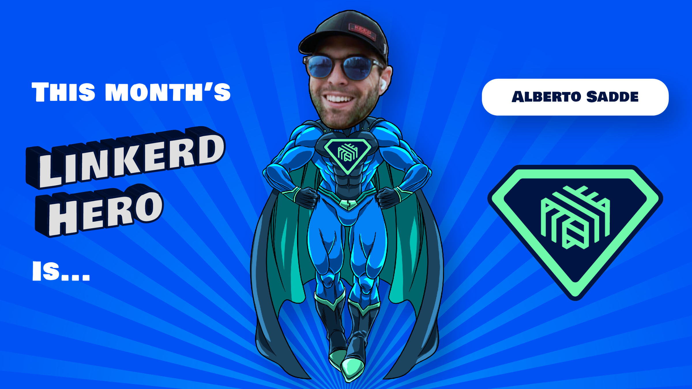

If you attended this month's Linkerd Community meeting, you've already heard
the news: this month's Linkerd Hero is Alberto Sadde. Congrats, Alberto!

## What are Linkerd Heroes?

Linkerd Heroes are community members who best represent the spirit of the
Linkerd community. Whether it's helping others, answering questions, sharing
their successes (and failures!) with the world at large, or contributing code
or docs, Linkerd Heroes are instrumental in making the Linkerd community the
amazing place it is today.

## Congrats, Alberto!

This month's Linkerd Hero is [Alberto Sadde](https://github.com/aesadde).
As a new member of the Linkerd community, Alberto jumped right into the
spirit of the community and helped someone out on Slack when they posted a
question in the linkerd2 channel. By sharing his knowledge and experience
using cert-manager with Linkerd and ArgoCD, Alberto helped others to quickly
work past their issues. And because such selfless behavior is invaluable in
open source communities, he's our October Linkerd Hero! Thank you, Alberto,
for helping others succeed!

## Nominate next month's Linkerd Hero

Linkerd Heroes take many forms. Perhaps someone has answered your or the
community’s pressing questions on Slack. Maybe you've read a blog post or
watched a conference talk that helped spur your decision-making process or
advance your Linkerd implementation. Or perhaps someone contributed an
awesome Linkerd feature or bugfix that has made your life a lot easier.
Who is your Linkerd Hero?
[Submit your nomination for next month's hero here](https://docs.google.com/forms/d/e/1FAIpQLSfNv--UnbbZSzW7J3SbREIMI-HaooyX9im8yLIGB7M_LKT_Fw/viewform?usp=sf_link)!

For those who nominated someone, thank you for participating, and remember
to join our
[next community meeting](https://community.cncf.io/events/details/cncf-linkerd-community-presents-december-linkerd-online-community-meetup/)
on Thursday, December 9th at 9 am PT!
