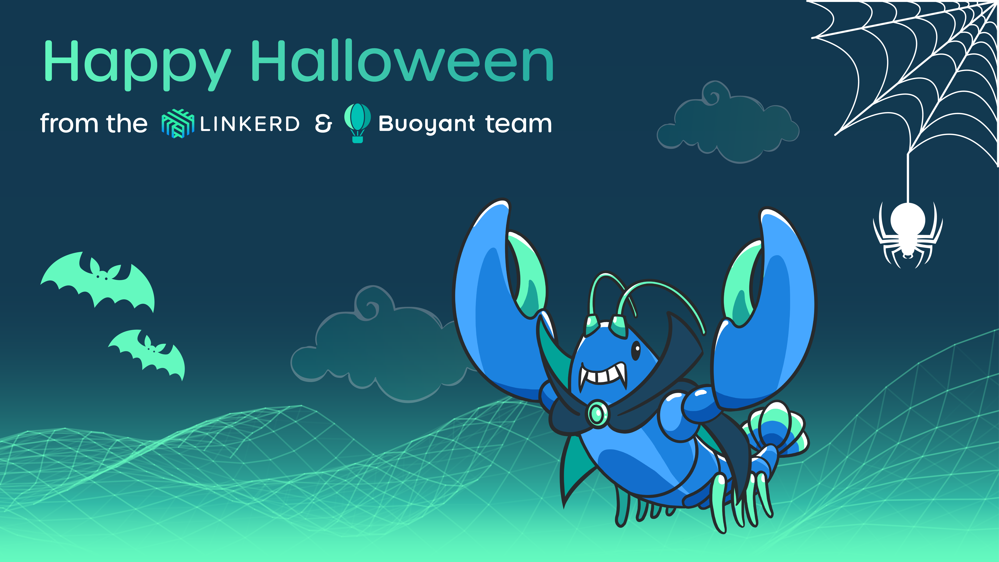

If you missed our last community meeting, don't worry. Below is a recap along
with the recording.

Before we get started, just a quick reminder about our
[Linkerd Community Anchor Program](/community/anchor/). If you have a Linkerd
story you’d like to share, we’d love to help you tell it. Whether you built a
cloud native platform with Linkerd or integrated the service mesh with another
CNCF project, these experiences are incredibly beneficial for the community!

At this point, we generally remind you to participate in our
[2021 Linkerd survey](https://docs.google.com/forms/d/e/1FAIpQLSfofwKQDOrAN9E9Vg1041623A3-8nmEAxlAbvXw-S9r3QnT9g/viewform).
But today, we'd much rather have you participate in the
[CNCF Cloud Native Survey 2021](https://www.surveymonkey.com/r/LZJ9DD7).

Why does your participation matter? Because this survey is the basis of the
yearly CNCF report, read by thousands of your peers. If Linkerd users are
underrepresented, users further down in their service mesh journey may come to
the wrong conclusions. So, if Linkerd has been of any value to you,
[please take this survey now](https://www.surveymonkey.com/r/LZJ9DD7). Thank
you, we really appreciate the support!



## News and updates

The world's first hybrid KubeCon turned out great for Linkerd. Fascinating
talks, a big announcement around Linkerd 2.11, and, best of all, we got to see
real people again. While exhausting, it was awesome and we hope to see a lot
more of you next year in Valencia.

We also launched a brand new workshop series which we kicked off with upgrading
to Linkerd 2.11. Up next is a
[deep dive into Kubernetes mTLS with Linkerd](https://buoyant.io/register/deep-dive-into-kubernetes-mtls)
(Nov 17). Register today and join the #workshops channel on the Linkerd Slack
for updates and follow-up conversations. Upcoming topics include zero trust,
policy, and more.

If you were at KubeCon, you may have already met them; if not, please meet
Linky, the gender-neutral blue lobster — Linkerd's new mascot! A huge Halloween
fan, Linky decided to dress up as a vampire during our community meeting
Halloween edition.

## Roadmap

The 2.11.1 edge release is now live. There are no major feature changes, just a
few bug fixes. To upgrade, please ensure you are running Kubernetes 1.17 or
higher. One change worth mentioning is that Jemalloc will now function as the
memory allocator, reducing memory usage in the proxy.

Looking ahead to 2.12, workload identity will be verified with tokens
specifically created for Linkerd that are time- and audience-bound through
[service account token volume projection](https://kubernetes.io/docs/tasks/configure-pod-container/configure-service-account/#service-account-token-volume-projection).
So, instead of a default token, a specific Linkerd token will be added during
the injection. This will fix issues where service account mounting is explicitly
disabled. Additionally, we are updating the ProxyInit to use TPROXY to preserve
source IP. FIPS compliance is also being worked on.

As to 2.12 headline features, they are all still TBD. We are considering mesh
expansion and client side policy but are also open to suggestions. If you have
any, [please raise an issue on GitHub](https://github.com/linkerd/linkerd2)!

## Community convo with Eli & Omri

Salt Security's platform engineers Eli and Omri, joined the meeting to tell us a
little about their Linkerd journey. Salt is a company focused on providing
[API security](https://salt.security/api-security-trends). Multiple fortune 500
clients rely on their platform to discover security issues around their APIs. It
is absolutely mission-critical that their platform works reliably at scale. The
platform was built as microservices running on Kubernetes from day one. But, as
the company grew and had to work at scale, requirements began to shift. They
needed solutions that would help them grow the team and the stack.

Until recently, they used a custom TCP-based protocol for inter-service
communication, but this created multiple challenges, including monitoring and
the ability to switch languages within services. That's when the team started
looking into gRPC and that triggered lots of other architectural changes.

### Why gRPC

gRPC was appealing for two reasons: First, its backward compatibility for
growing your schema. Based on protocol buffers, gRPC helps ensure their services
can grow without fearing that something will break — this is critical to hitting
their high SLA targets!

Second, well, Salt started with the UNIX stack — the same programming languages
and the same disciplines — but with a growing company, often you realize that
the tool you chose yesterday doesn't fit your needs today. Currently, they have
services in three programming languages, with a fourth language on its way. The
advantage of gRPC is that, since it's based on protocol buffers, you can define
these schemas outside of the application code.

Speaking of programming languages, Charles had to ask if they are using Rust.
Not yet, but Eli and Omri have experimented with it and regularly read articles
on the Linkerd proxy. They primarily code in Go and NodeJS.

Back to gRPC. Kubernetes doesn't load balance gRPC, so they knew they needed
another load balancer. When checking the official Kubernetes documentation, they
saw a link to Linkerd and how it could help. Although there were some other
solutions out there, setting up Linkerd was easy so they went ahead with the
service mesh. While they were only looking for load balancing, they quickly
realized all the other features Linkerd offered and were totally sold.

### Linkerd in dev environments

Salt's dev environment is identical to its prod environment — both run Linkerd.
They soon realized that, with the dashboard and Linkerd's Tap and Top
functionalities, they could quickly identify bugs before going to prod. Today,
Linkerd has become a standard tool of their development process.

Before switching to gRPC, observability was limited. With Linkerd's CLI and
dashboard, the team can now see how requests fail as they make changes. They can
also see where clients are excessively interacting with one another which helps
identify unwanted behavior. Now, before they go to production, they first check
the traffic to see if anything is wrong.

One of their favorite features is Linkerd's Top functionality. It allows the
platform team to understand issues before they turn into problems. It also
allows them to easily identify the service owner and flag issues. In short, Top
helps them zero in on bugs much faster.

### Linkerd feature wishlist

Eli and Omri are big Linkerd fans and really believe in its value. But if there
was one feature they'd like to see, it would be circuit breakers — that's their
next goal! And traffic mirroring would be cool, too.

## KubeCon Recap

There were a few Linkerd talks at KubeCon, but today, we'll focus on end-users
only as those are the best. Fredrik Klingenberg, Linkerd Ambassador, and Senior
Consultant at Aurum AS, shared how he helped replatform Elkjøp, the Nordic
retail giant, to Kubernetes and Linkerd.

In his talk, Fredrik explained why learning about tools like Linkerd helps you
on your Kubernetes journey, shared ideas and arguments for investing in a
service mesh, and how to onboard developers for an organization.

With a 25% market share, Elkjøp's cloud costs are significant. Through that
migration, they were able to reduce these from $450K to $115K. For the full
story, check out Fredrik's CNCF blog
[how a $4 billion retailer built an enterprise-ready Kubernetes platform powered by Linkerd](https://www.cncf.io/blog/2021/02/19/how-a-4-billion-retailer-built-an-enterprise-ready-kubernetes-platform-powered-by-linkerd/).

Steve Gray, also a Linkerd Ambassador and Head of Trading at Entain Australia,
shared how the online sports betting company 10xed throughput with Linkerd. They
migrated an application with 1.7 million lines of PHP code to 347 services
written in Go. They selected Linkerd due to its gRPC load balancing ability,
because no app code or configuration is required, and due to its observability
features. The fact that the cloud/bandwidth cost went down, was a welcome bonus.
You can read more about it in Steve's CNCF blog
[when LeBron scores, latency matters: Realizing 10x throughput while driving down costs and sleeping through the night](https://www.cncf.io/blog/2021/04/19/when-lebron-scores-latency-matters-realizing-10x-throughput-while-driving-down-costs-and-sleeping-through-the-night/).

## October Linkerd Hero

And of course, we announced our October Linkerd Hero, Alberto Sadde. As a new
member of the Linkerd community, Alberto jumped right into the spirit of the
community and helped someone out on Slack when they posted a question in the
linkerd2 channel. By sharing his knowledge and experience using cert-manager
with Linkerd and ArgoCD, Alberto helped others quickly work past their issues.
And because such selfless behavior is invaluable in open source communities,
he’s our October Linkerd Hero! Thank you, Alberto, for helping others succeed!

Who is your Linkerd Hero?
[Submit your nomination today](https://docs.google.com/forms/d/e/1FAIpQLSfNv--UnbbZSzW7J3SbREIMI-HaooyX9im8yLIGB7M_LKT_Fw/viewform)!

That’s it! Hope you can attend our next community meeting on Thursday, December
28 at 9 a.m. PT live.
[Register today](https://community.cncf.io/events/details/cncf-linkerd-community-presents-december-linkerd-online-community-meetup/)!
