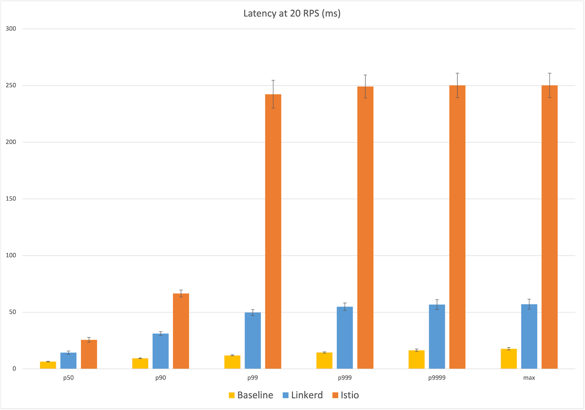
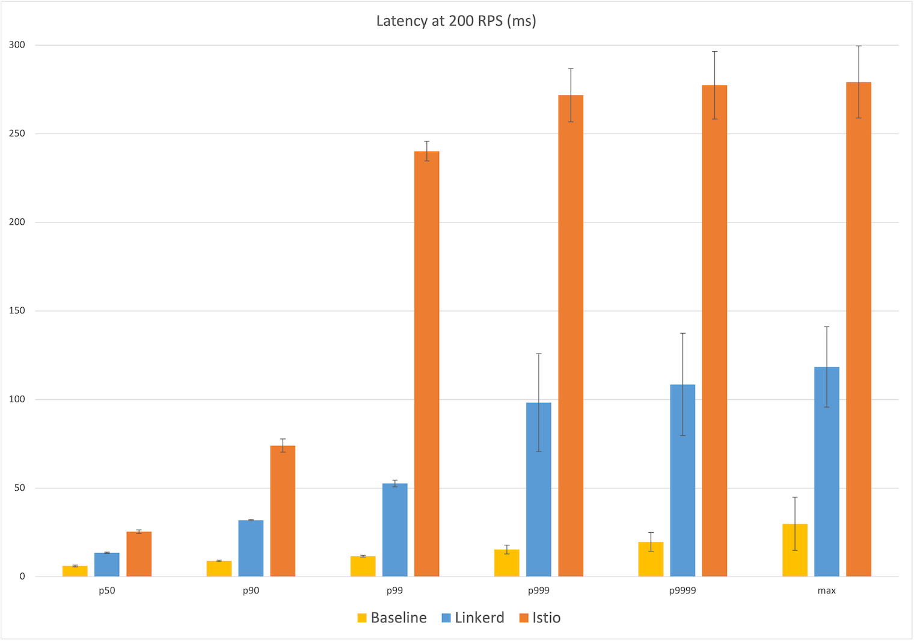
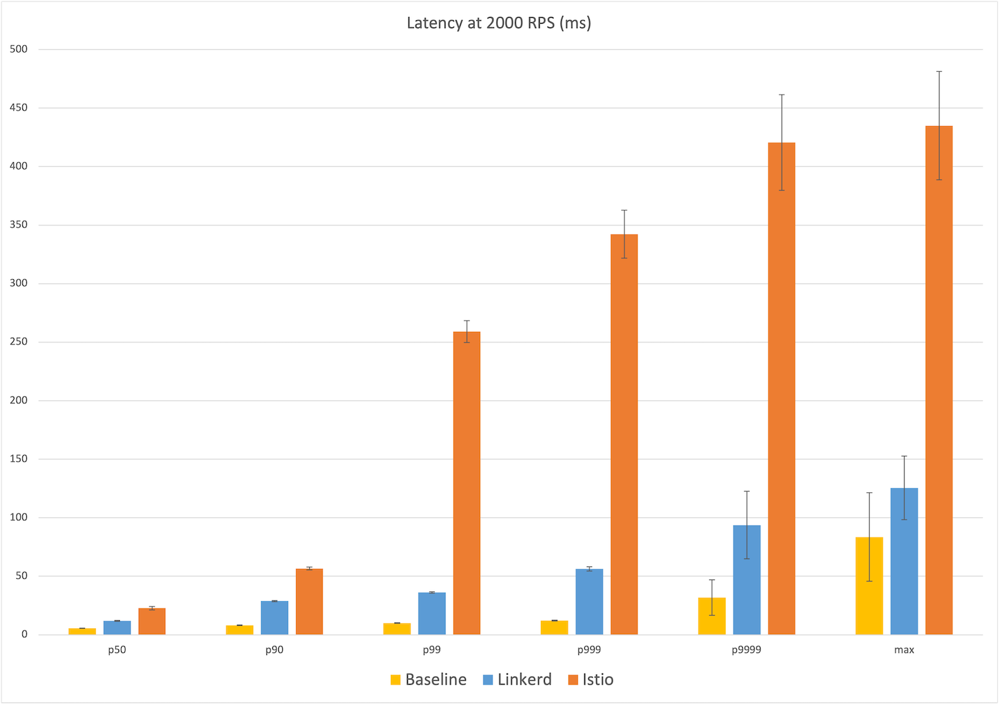
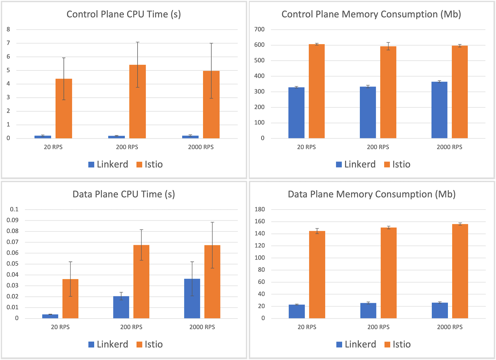

Earlier this year, we published [Linkerd vs Istio
benchmarks](/2021/05/27/linkerd-vs-istio-benchmarks/) comparing the performance
and resource consumption of the two service meshes on a simple microservice
application under various levels of load. Using an open source benchmark
harness, we showed that Linkerd was dramatically faster than Istio while
consuming an order of magnitude less data plane memory and CPU.

With the recent release of [authorization policy in Linkerd
2.11](/2021/09/30/announcing-linkerd-2.11/), we wanted to reevaluate Linkerd's
performance. After all, this was a major new feature for the project with
potential performance implications. How does the latest version of Linkerd stack
up?

To find out, we re-ran the benchmarks with the latest versions of both projects.
Our results show that **even with the addition of policy, Linkerd continues to
be dramatically faster than Istio while consuming just a fraction of the system
resources.** At the highest level of load we tested, Linkerd introduced almost
an order of magnitude less additional tail latency than Istio did.

Read on for more!

## Background

In 2019, Kinvolk released [public benchmark numbers comparing Linkerd to
Istio](/2019/05/18/linkerd-benchmarks/). This effort not only showed that that
Linkerd was dramatically faster and lighter than Istio, it produced an [open
source service mesh benchmarking
harness](https://github.com/kinvolk/service-mesh-benchmark) so that anyone could
reproduce the results. This harness mimicked "real life" scenarios: it sent a
sustained level of traffic through a simple microservices application, made use
of both gRPC and HTTP calls, and measured the cost of using a service mesh in
terms of memory and CPU consumed as well as latency added. Critically, latency
was measured from the client's perspective, yielding user-facing numbers rather
than internal proxy timings.

Earlier this year, we [revisited these comparisons for Linkerd 2.10 and Istio
1.10.0](/2021/05/27/linkerd-vs-istio-benchmarks/), showing that Linkerd remained
dramatically faster than Istio and consumed an order of magnitude less data
plane memory and CPU while doing so.

Since then, both projects have released new versions, most notably [Linkerd
2.11's introduction of authorization
policy](/2021/09/30/announcing-linkerd-2.11/), a major new feature for the
project with a potential performance impact.

## Experimental setup

In these experiments, we applied the same Kinvolk benchmark suite to the latest
stable releases of both projects: Linkerd 2.11.1 (with its default installation)
and Istio 1.12.0 (with its "minimal" config). We ran the benchmark harness on a
Kubernetes v1.21.4 cluster using the [Lokomotive Kubernetes
distribution](https://kinvolk.io/lokomotive-kubernetes/) used by the benchmark
harness, running on bare-metal hardware kindly provided by [Equinix
Metal](https://www.equinix.com/) to CNCF projects.

From our previous work, we knew that the most important first step was finding
an environment that would deliver _consistent_ latency results. Cloud
environments can deliver wildly different performance characteristics from
moment to moment, especially when it comes to network. However, getting this
right is _critical_ to comparative experiments like these: variance in baseline
latency degrades the quality of the results.

Our setup mimicked our earlier experiments: we ran all code in  the [Equinix
Metal `dfw2`
datacenter](https://metal.equinix.com/developers/docs/locations/facilities/#core-sites),
which once again yielded the lowest-variance behavior that we found. Our cluster
comprised 6 worker nodes of the `s3.xlarge.x86` configuration (Intel Xeon 4214
with 24 physical cores @ 2.2GHz and 192GB of RAM) on which the benchmark
application ran, plus one load generator node of the same config, plus one K8s
master node of a c2.medium.x86 config.

As before, we evaluated both service meshes at 20 RPS, 200 RPS, and 2,000 RPS.
At each level, we ran several independent runs of 10 minutes each of sustained
load, for Linkerd, Istio, and the base case of no service mesh. All benchmark
and mesh resources were reinstalled in between runs. For the 20 and 200 RPS
runs, we ran 8 runs and discarded the top 3 by maximum baseline latency.  For
the 2,000 RPS run, due to deadline constraints, we ran 7 runs and manually
discarded the single run with the worst max latency for Istio and Linkerd each.
(Our [raw
data](https://docs.google.com/spreadsheets/d/1dUxCCreoJBenuxbuXMhu9XS2RLVsNAxxd4veHvBIm2c/edit#gid=1648960077)
is available for perusal.)

It is important to note that the Kinvolk framework [measures the behavior of the
service mesh in a very specific
way](#experiment-setup), and we
performed no modifications of this framework. Note also that the numbers
reported by this benchmark are a function of both the service mesh _and_ of the
harness and its environment. In other words, these are not absolute scores but
relative ones, which can only be evaluated against other alternatives measured
in the same environment and same way.[^1]

## What service mesh features were tested?

While each service mesh provides a large set of features, only a subset of
these were actually in play during these experiments:

* Both meshes had [mutual TLS](https://buoyant.io/mtls-guide/)
  enabled, and were encrypting traffic and validating identity between all
  application pods.
* Both meshes were reporting metrics, including L7 metrics, though these
  metrics were not consumed in this experiment.
* Both meshes logged various messages at the INFO level by default. We
  did not configure logging.
* No retries, timeouts, distributed tracing, multi-cluster communication, or
  other features were explicitly enabled.

## Results

The results of our experiments are shown in the graphs below. Each point in
these graphs is the mean of the five runs, with error bars representing one
standard deviation from that mean. The bars themselves represent Linkerd
(blue), Istio (orange) and the baseline of no service mesh (yellow).

### Latency at 20 RPS

Starting at the relatively calm level of 20 RPS, we already see a big
difference in user-facing latency: Linkerd's median latency was 14ms, 8ms over
the baseline of 6ms. Istio's median latency, by contrast, was 26ms, over
twice the additional latency of Linkerd. At the maximum, Linkerd added 39ms
over the baseline of 18ms of latency, whereas Istio's max latency added 232ms,
almost six times the additional latency of Linkerd.

Looking at the percentiles, we see that Istio's latency distribution jumped
dramatically at the 99th percentile to ~240ms, while Linkerd showing a more
gradual increase in the higher percentiles to 57ms.

**Winner**: Linkerd (8ms vs 26ms median; 39ms vs 232ms max)

### Latency at 200 RPS

The 200 RPS numbers tell a very similar story and the median latency numbers are
almost identical: Linkerd's median latency of 14ms represents 8ms over the
baseline median of 6ms, while Istio's median latency of 26ms is 20ms over. At
the max, Istio's latency of 280ms is 250ms over the baseline of 30ms, while
Linkerd's max latency of 119ms is ~90ms over, less than half of Istio's
additional latency. We see the same jump in Istio's latency occurring at the
99th percentile to almost 250ms of user-facing latency, with Linkerd gradually
increasing from the 99.9th percentile on out.

**Winner**: Linkerd (8ms vs 26ms median; 90ms vs 250ms max)

### Latency at 2,000 RPS

Finally, at 2,000 RPS, we see the most dramatic difference between the meshes:
at the median, Linkerd introduces an additional 6ms of latency over the baseline
of 6ms vs Istio's additional 17ms; at the max, Linkerd introduces an additional
42ms over the baseline of 84ms, and Istio adding 8x that with an additional
~350ms. Generally speaking, at each percentile reported, Istio introduced
anywhere between 130% to 850% more additional latency than Linkerd.

**Winner**: Linkerd (6ms vs 17ms median; 42ms vs 350ms max)

## Resource consumption

Turning now to resource usage, the CPU and memory consumption of each service
mesh are shown in the graphs below. These numbers are fairly consistent across
all throughput levels, so we'll focus on the highest-load scenario of 2,000 RPS.

Starting with the control plane, we see that Istio's control plane usage
averaged 597mb, about 50% higher than Linkerd's control plane memory consumption
of 365mb. Linkerd's CPU usage was over an order of magnitude smaller—212ms of
control plane CPU time versus Istio's 5 seconds.

More important than the control plane, however, is the data plane. After all,
this is the part of the mesh that must scale out with the application. Here we
see another dramatic difference: the maximum memory consumed by a Linkerd proxy
was, on average, 26.3mb, whereas the maximum memory consumed by one of Istio's
Envoy proxies was 156.2mb—a factor of 6. Similarly, Linkerd's maximum proxy CPU
time recorded was 36ms, whereas Istio's was 67ms—about 85% more.

**Winner:** Linkerd (26mb vs 156mb memory; 36ms vs 67ms CPU).

## Summary and discussion

In these benchmarks, designed to mimic behavior in a real-world scenario, we
once again saw the latest version of Linkerd dramatically outperform the latest
version of Istio while maintaining a significantly smaller resource cost. At the
highest throughput evaluated, we saw Linkerd consume 1/6th the memory and 55% of
the CPU at the data plane, while delivering 1/3rd the additional median latency
and 1/8th the additional maximum latency of Istio.

It's notable that Linkerd's worst-case latency at 200 RPS was worse than at
2,000 RPS. This may be due to network interference during the course of the
experiment. In the future, we may want to alter the criteria for outlier
detection; for now, in the interests of transparency, we are reporting these
results as is.

Comparing these results to those of the earlier experiments almost 6 months ago,
a few highlights stand out:

* Linkerd's median latency has actually _improved_ since 2.10.1, even with the
  addition of policy. Linkerd's additional median latency was consistently 3ms
  lower at each traffic level evaluated. (Max latency increased in some runs and
  decreased in others).

* Istio's data plane CPU usage improved 67ms down from 88ms at 2,000 RPS;
  however, Istio's max latency appears to have gotten significantly worse,
  increasing by 44ms, 59ms, and 97ms at 20, 200, and 2,000 RPS respectively.

* Linkerd's data plane is heavier than in 2.10, reporting max CPU usage
  of 36ms (previously 11ms) and max memory usage to 26mb (previously 18mb). The
  memory footprint, in particular, changed substantially between Linkerd 2.11.0
  and 2.11.1, likely due to the [move to the jemalloc allocator in the
  proxy](https://github.com/linkerd/linkerd2/blob/main/CHANGES.md#edge-21111).
  In fact, repeating these benchmarks with 2.11.0 (one point release earlier)
  shows an average data plane memory footprint of 17mb, a difference of 9mb![^2]
  One hypothesis is that the jemalloc allocator, which was chosen to reduce memory consumption at very high
  connection counts and allow the proxy to release memory more easily during
  spiky load; it may be the case that this comes at a tradeoff with the max
  memory consumption as measured by these benchmarks. We're continuing to
  investigate this change.

## Why is Linkerd so much faster and lighter?

As before, the large difference in performance and resource cost between
Linkerd and Istio primarily comes down to one thing: [Linkerd's Rust-based
"micro-proxy",
Linkerd2-proxy](/2020/12/03/why-linkerd-doesnt-use-envoy/).
This micro-proxy powers Linkerd's entire data plane, and the benchmark largely
reflects its performance and resource consumption.

[We've written a lot about
Linkerd2-proxy](/2020/07/23/under-the-hood-of-linkerds-state-of-the-art-rust-proxy-linkerd2-proxy/)
as well as our [motivations behind adopting
Rust](https://www.infoq.com/articles/linkerd-v2-production-adoption/) back in
the dark ages of 2018. Interestingly enough, the primary reason for building
Linkerd2-proxy was not for performance but for _operational_ reasons: operating
an Envoy-based service mesh like Istio often requires you to become an expert
at operating Envoy, a challenge which we did not relish imposing upon Linkerd
users.[^3]

Happily, the choice to build Linkerd2-proxy also resulted in significant
performance and efficiency gains. By solving the very specific problem of being
a "service mesh sidecar proxy" only, we can be extremely efficient at the data
plane level. And by building Linkerd2-proxy in Rust, we can ride the wave of
the incredible technological investment placed in that ecosystem: libraries
like [Tokio](https://github.com/tokio-rs/tokio),
[Hyper](https://github.com/hyperium/hyper), and
[Tower](https://github.com/tower-rs) are the focal point of some of the world's
best systems thinking and design.

Linkerd2-proxy isn't just incredibly fast, light, and secure, it represents
some of the most cutting edge technology in the entire CNCF landscape.

## How to reproduce these results

If you want to reproduce these experiments on your own, follow the
[benchmarking
instructions](https://github.com/linkerd/linkerd2/wiki/Linkerd-Benchmark-Setup).

If you try this, please see our [comments above](#experimental-setup) about
experimental methodology. It is critical that you find an environment that can
deliver consistent results, especially for things like max latency that are
very sensitive to network traffic, resource contention, and so on.  Also,
please remember that the numbers you produce will be relative, not absolute,
measurements.

And let us know what you find!

## Thanks

A special thank you to the kind folks at Equinix for providing the Kubernetes
environment that made this all possible; to the CNCF, who made it possible for
the Linkerd project to run these experiments; and to Kinvolk, especially Thilo
Fromm, for the excellent benchmark harness.

## Linkerd is for everyone

Linkerd is a [graduated project](/2021/07/28/announcing-cncf-graduation/) of the
[Cloud Native Computing Foundation](https://cncf.io/). Linkerd is [committed to
open
governance.](/2019/10/03/linkerds-commitment-to-open-governance/)
If you have feature requests, questions, or comments, we'd love to have you join
our rapidly-growing community! Linkerd is hosted on
[GitHub](https://github.com/linkerd/), and we have a thriving community on
[Slack](https://slack.linkerd.io/), [Twitter](https://twitter.com/linkerd), and
the [mailing lists](/community/get-involved/). Come and join the fun!

(*Photo by [Emerson Peters](https://unsplash.com/@spemble?utm_source=unsplash&utm_medium=referral&utm_content=creditCopyText) [Unsplash](https://unsplash.com/s/photos/dog-in-a-car?utm_source=unsplash&utm_medium=referral&utm_content=creditCopyText).*)

## Footnotes

[^1]:
     For example, statements like "Linkerd added Xms of latency at the median"
     in this report do not mean that Linkerd will add Xms of median latency to
     _your_ application. Nor do they mean that an individual Linkerd proxy will
     add Xms of latency (in fact, the median latency of an individual Linkerd
     proxy is less than a millisecond for most types of traffic).

[^2]:
    It was extremely tempting to report these numbers! But, "latest version"
    means latest version, and in this case that means Linkerd 2.11.1.

[^3]:
     The proxy might be the most interesting part of the service mesh from a
     technology perspective, but it's the _least_ interesting part from the
     users' perspective. Our belief is that the service mesh proxy should be an
     implementation detail, and we strive hard to ensure that—blog posts
     aside—the majority of Linkerd users have to learn very little about
     Linkerd2-proxy.
