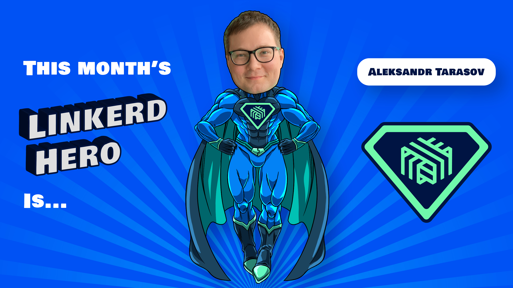

If you attended this month's Linkerd Community meeting, you've already heard the
news: this month's Linkerd Hero is Aleksandr Tarasov. Congrats, Aleksandr!

## What are Linkerd Heroes?

Linkerd Heroes are community members who best represent the spirit of the
Linkerd community. Whether it's helping others, answering questions, sharing
their successes (and failures!) with the world at large, or contributing code or
docs, Linkerd Heroes are instrumental in making the Linkerd community the
amazing place it is today.

## Congrats, Aleksandr!

This month's hero is [Aleksandr Tarasov](https://github.com/aatarasoff).
Aleksandr is Director of Engineering at ANNA Money and recently wrote three
great Linkerd blog posts. In his first blog, he shares his team's
decision-making process when
[selecting Linkerd as their service mesh](https://aatarasoff.medium.com/the-journey-to-service-mesh-part-2-how-we-met-linkerd-cd32a6e9fa63).
His next blog covers
[three ways to use Linkerd with Kubernetes jobs](https://itnext.io/three-ways-to-use-linkerd-with-kubernetes-jobs-c12ccc6d4c7c).
And his latest blog is
[a practical guide to Linkerd authorization policies](https://itnext.io/a-practical-guide-for-linkerd-authorization-policies-6cfdb50392e9).
These are all great reads, keep them coming Aleksandr! Sharing your experience
with the community is one of the most valuable ways to contribute to Linkerd!
Thank you, Aleksandr, for sharing your journey so others can learn from it!

## Nominate next month's Linkerd Hero

Linkerd Heroes take many forms. Perhaps someone has answered your or the
community’s pressing questions on Slack. Maybe you've read a blog post or
watched a conference talk that helped spur your decision-making process or
advance your Linkerd implementation. Or perhaps someone contributed an awesome
Linkerd feature or bugfix that has made your life a lot easier. Who is _your_
Linkerd Hero?
[Submit your nomination for next month's hero here](https://docs.google.com/forms/d/e/1FAIpQLSfNv--UnbbZSzW7J3SbREIMI-HaooyX9im8yLIGB7M_LKT_Fw/viewform?usp=sf_link)!

For those who nominated someone, thank you for participating, and remember to
join our
[next community meeting on Thursday](https://community.cncf.io/events/details/cncf-linkerd-community-presents-january-linkerd-online-community-meetup/),
January 22 at 9 am PT!
