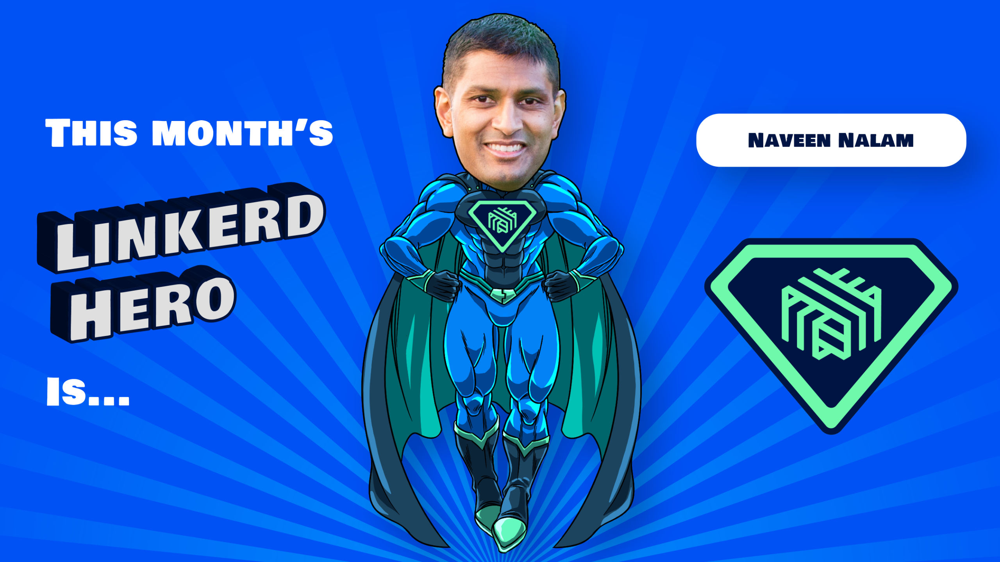

We are excited to announce that this month's Linkerd Hero is
[Naveen Nalam](https://www.linkedin.com/in/nnalam/).
Congrats, Naveen!

## What are Linkerd Heroes?

Linkerd Heroes are community members who best represent the spirit of the
Linkerd community. Whether it's helping others, answering questions, sharing
their successes (and failures!) with the world at large, or contributing code or
docs, Linkerd Heroes are instrumental in making the Linkerd community the
amazing place it is today.

## Congrats, Naveen

This month's hero is Naveen Nalam. Naveen contributed an important fix to the
upcoming Helm chart changes. In 2.12, charts will follow best practices more
closely and be a little smarter. Naveen caught an issue in a newly-introduced
post-install hook. Thank you, Naveen, this will ensure these upcoming changes
are ready for production under every possible scenario!

## Nominate next month's Linkerd Hero

Linkerd Heroes take many forms. Perhaps someone has answered your or the
community’s pressing questions on Slack. Maybe you've read a blog post or
watched a conference talk that helped spur your decision-making process or
advance your Linkerd implementation. Or perhaps someone contributed an awesome
Linkerd feature or bugfix that has made your life a lot easier. Who is your
Linkerd Hero?
[Submit your nomination for next month's hero here](https://docs.google.com/forms/d/e/1FAIpQLSfNv--UnbbZSzW7J3SbREIMI-HaooyX9im8yLIGB7M_LKT_Fw/viewform?usp=sf_link)!
For those who nominated someone, thank you for participating!
