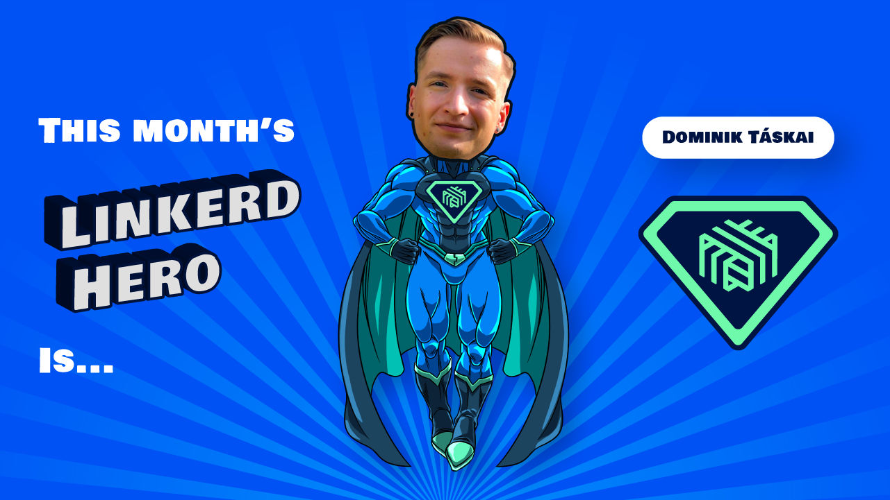

We are excited to announce this month's Linkerd Hero: Dominik Táskai. Congrats,
Dominik!

## What are Linkerd Heroes?

Linkerd Heroes are community members who best represent the spirit of the
Linkerd community. Whether it's helping others, answering questions, sharing
their successes (and failures!) with the world at large, or contributing code
or docs, Linkerd Heroes are instrumental in making the Linkerd community the
amazing place it is today.

## Congrats, Dominik!

This month's hero is [Dominik Táskai](https://www.linkedin.com/in/dtaskai/).
Over the past months, Dominik has been actively answering questions and
helping community members on the Linkerd Slack. Whether his peers had
questions about open telemetry, linkerd-destination pods, or how Linkerd
releases work, Dominik was always happy to help. Thank you, Dominik,
for sharing your knowledge with
the community and helping your peers during their Linkerd journey!

## Nominate next month's Linkerd Hero

Linkerd Heroes take many forms. Perhaps someone has answered your or the
community’s pressing questions on Slack. Maybe you've read a blog post or
watched a conference talk that helped spur your decision-making process or
advance your Linkerd implementation. Or perhaps someone contributed an
awesome Linkerd feature or bugfix that has made your life much easier.
Who is *your* Linkerd Hero?
[Submit your nomination for next month's hero here!](https://docs.google.com/forms/d/e/1FAIpQLSfNv--UnbbZSzW7J3SbREIMI-HaooyX9im8yLIGB7M_LKT_Fw/viewform?usp=sf_link)
