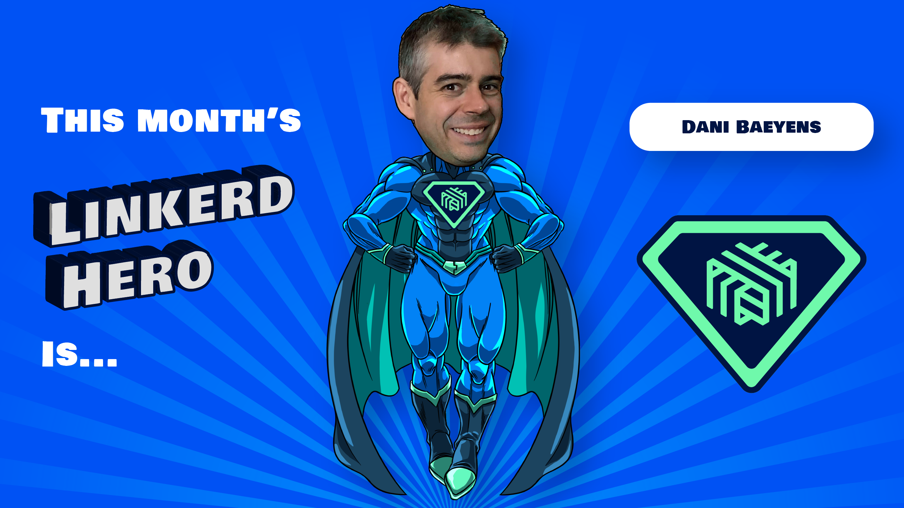

We are excited to announce this month's Linkerd Hero: Dani Baeyens. Congrats, Dani!

## What are Linkerd Heroes?

Linkerd Heroes are community members who best represent the spirit of the Linkerd
community. Whether it's helping others, answering questions, sharing their successes
(and failures!) with the world at large, or contributing code or docs, Linkerd Heroes
are instrumental in making the Linkerd community the amazing place it is today.

## Congrats, Dani Baeyens!

This month's hero is [Dani Baeyens](http://www.linkedin.com/in/danibaeyens),
who contributed changes to fully support RSA signatures on Linkerd's trust anchors.
The trust anchor is the root of authentication in Linkerd, and allowing RSA
signatures makes it even easier to integrate Linkerd into an existing workflow.
Thanks, Dani, for helping us make Linkerd 2.12 more awesome!

## Nominate next month's Linkerd Hero

Linkerd Heroes take many forms. Perhaps someone has answered your or the community’s
pressing questions on Slack. Maybe you've read a blog post or watched a conference
talk that helped spur your decision-making process or advance your Linkerd
implementation. Or perhaps someone contributed an awesome Linkerd feature or bugfix
that has made your life a lot easier. Who is your Linkerd Hero?
[Submit your nomination for next month's hero here](https://docs.google.com/forms/d/e/1FAIpQLSfNv--UnbbZSzW7J3SbREIMI-HaooyX9im8yLIGB7M_LKT_Fw/viewform?usp=sf_link)!
