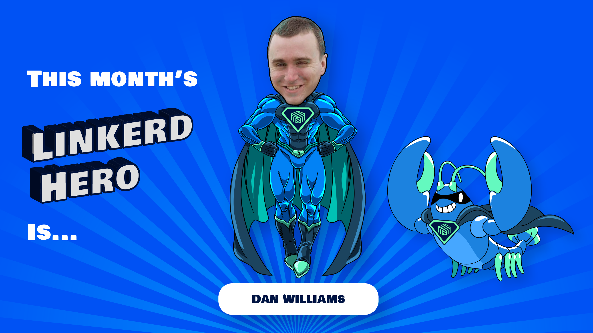

We are excited to announce this month's Linkerd Hero: Dan Williams.
Congrats, Dan!

## What are Linkerd Heroes?

Linkerd Heroes are community members who best represent the spirit
of the Linkerd community. Whether it's helping others, answering
questions, sharing their successes (and failures!) with the world
at large, or contributing code or docs, Linkerd Heroes are
instrumental in making the Linkerd community the amazing place it is
today.

## Congrats, Dan!

This month's hero is
[Dan Williams](https://www.linkedin.com/in/dan-williams-5501a8105/).
Dan is always ready to jump in and help the community out on Slack.
You might also know him as a contributor to the
[Loveholidays Tech blog](https://tech.loveholidays.com/).
We've heard a Linkerd blog post might be coming soon, so stay tuned!
Thank you, Dan, for helping your peers — one of the most underrated
yet critical ways of contributing to open source!

## Nominate next month's Linkerd Hero

Linkerd Heroes take many forms. Perhaps someone has answered your
or the community’s pressing questions on Slack. Maybe you've read
a blog post or watched a conference talk that helped spur your
decision-making process or advance your Linkerd implementation.
Or perhaps someone contributed an awesome Linkerd feature or bugfix
that has made your life a lot easier. Who is your Linkerd Hero?
[Submit your nomination](https://docs.google.com/forms/d/e/1FAIpQLSfNv--UnbbZSzW7J3SbREIMI-HaooyX9im8yLIGB7M_LKT_Fw/viewform?usp=sf_link)
for next month's hero here!
