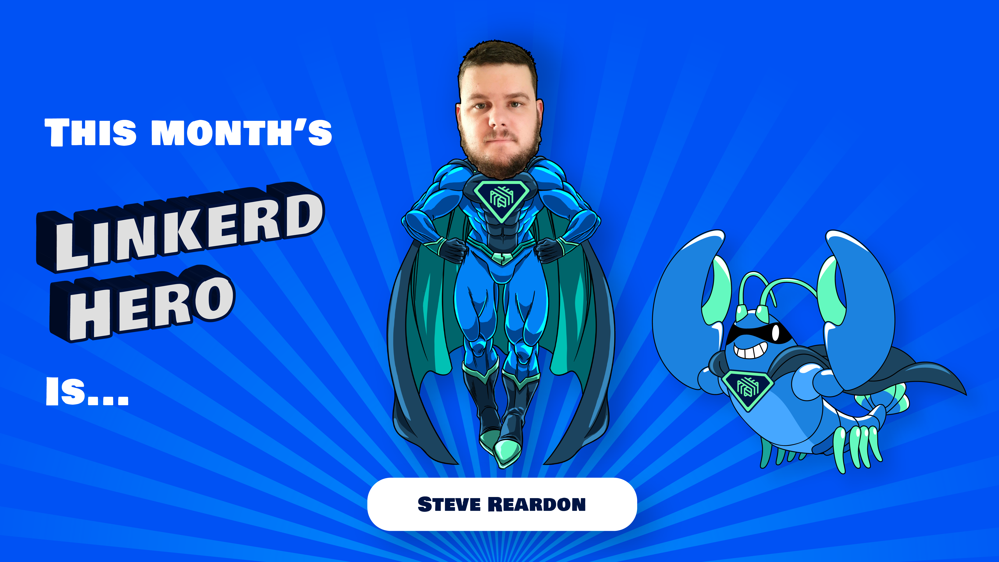

We are excited to announce this month's Linkerd Hero: Steve Reardon, a two-time
winner! Congrats, Steve!

## What are Linkerd Heroes?

Linkerd Heroes are community members who best represent the spirit of
the Linkerd community. Whether it's helping others, answering
questions, sharing their successes (and failures!) with the world
at large, or contributing code or docs, Linkerd Heroes are instrumental
in making the Linkerd community the amazing place it is today.

## Congrats, Steve!

This month's hero is [Steve Reardon](https://github.com/Monkman08).
This is Steve's second nomination! The first time was in June 2021,
when he was nominated along with Steve Gray for their awesome
[CNCF blog post on Entain's Linkerd journey.](https://www.cncf.io/blog/2021/04/19/when-lebron-scores-latency-matters-realizing-10x-throughput-while-driving-down-costs-and-sleeping-through-the-night/)

This time, Steve is nominated for helping his peers on Slack time
and again. And because helping community members is one of the most
valuable contributions, Steve was nominated again! Thank you, Steve,
for taking the time to carefully answer user's questions on Slack,
and helping them on their journey!

## Nominate next month's Linkerd Hero

Linkerd Heroes take many forms. Perhaps someone has answered your
or the community’s pressing questions on Slack. Maybe you've read a
blog post or watched a conference talk that helped spur your
decision-making process or advance your Linkerd implementation.
Or perhaps someone contributed an awesome Linkerd feature or bugfix
that has made your life a lot easier. Who is your Linkerd Hero?
[Submit your nomination for next month's hero here!](https://docs.google.com/forms/d/e/1FAIpQLSfNv--UnbbZSzW7J3SbREIMI-HaooyX9im8yLIGB7M_LKT_Fw/viewform?usp=sf_link)

For those who nominated someone, thank you for participating!
