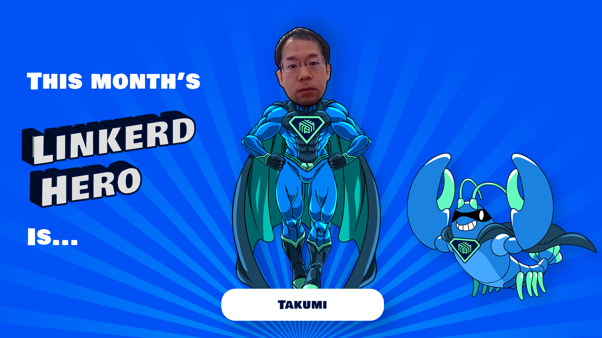

We are excited to announce this month's Linkerd Hero: Takumi Sue. Congrats,
Takumi!

## What are Linkerd Heroes?

Linkerd Heroes are community members who best represent the spirit of the
Linkerd community. Whether it's helping others, answering questions, sharing
their successes (and failures!) with the world at large, or contributing code or
docs, Linkerd Heroes are instrumental in making the Linkerd community the
amazing place it is today.

## Congrats, Takumi Sue!

This month's hero is [Takumi Sue](https://github.com/mikutas). Over the past
three years, Takumi has regularly contributed fixes to Linkerd’s code base. From
CLI fixes to Helm template and control plane changes, Takumi has positively
impacted the project. Thank you for being such a prolific contributor and
dedicating your time to making Linkerd an even more awesome project!

## Nominate next month's Linkerd Hero

Linkerd Heroes take many forms. Perhaps someone has answered your or the
community's pressing questions on Slack. Maybe you've read a blog post or
watched a conference talk that helped spur your decision-making process or
advance your Linkerd implementation. Or perhaps someone contributed an awesome
Linkerd feature or bugfix that has made your life a lot easier. Who is your
Linkerd Hero? Submit your nomination for
[next month's hero here!](https://docs.google.com/forms/d/e/1FAIpQLSfNv--UnbbZSzW7J3SbREIMI-HaooyX9im8yLIGB7M_LKT_Fw/viewform?usp=sf_link)

For those who nominated someone, thank you for participating!
