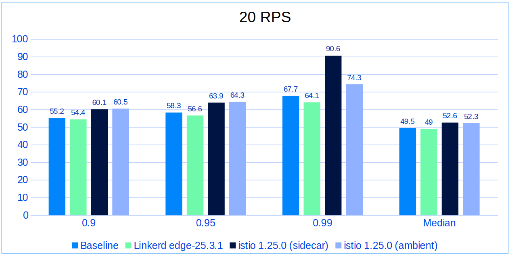
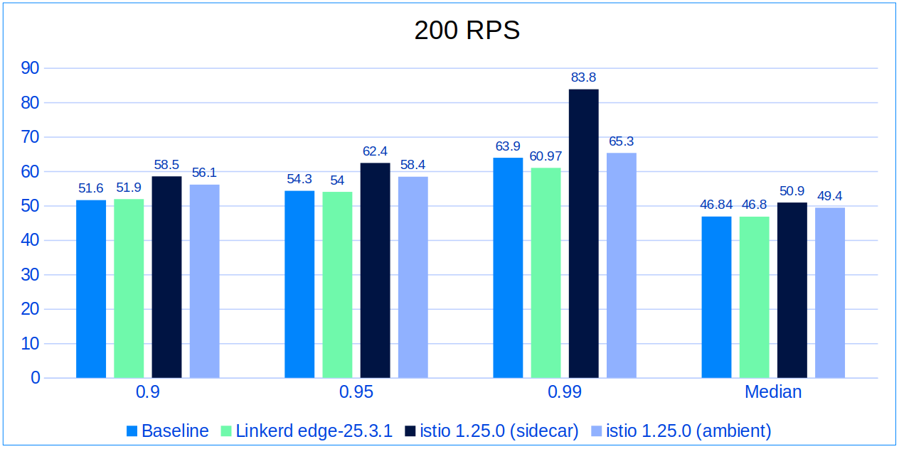
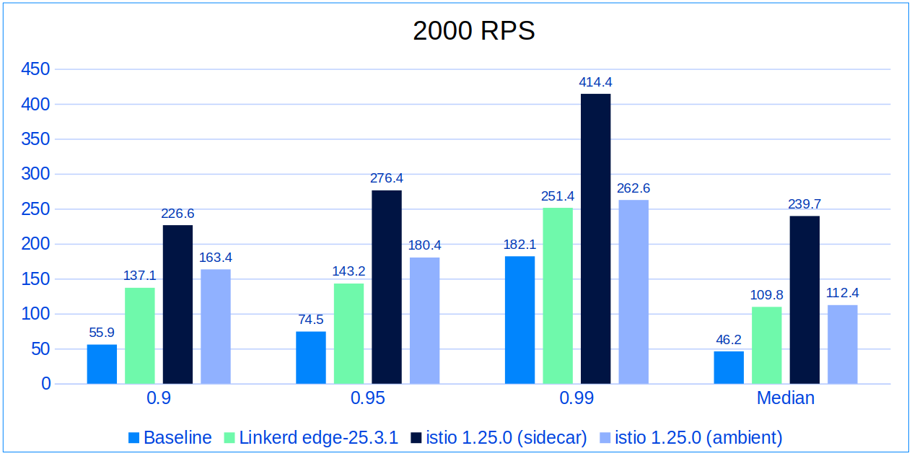

It's been a while since the last Linkerd vs. Istio benchmarks were published
([2021, to be exact](/2021/11/29/linkerd-vs-istio-benchmarks-2021/)). Since a
lot has happened since then, it is time to revisit the service mesh landscape.
And that's what I did in
[my recent Linkerd Day talk](https://www.youtube.com/watch?v=9GHcADMeAuM) at
KubeCon London, and since there is a lot of confusion regarding this topic, I
decided to write a blog post as well. If you are evaluating the service meshes
right now, I hope this is helpful.

## Service Meshes Since 2021

In these short four years, sidecarless service meshes have emerged. While they
are a good option for some use cases, sidecars are here to stay. Zero trust
security is more important than ever and has been one of the major topics of the
past year. We can now mesh our non-Kubernetes workloads running on VMs and even
bare metal (shoutout to Linkerd’s
[mesh expansion](/2/tasks/adding-non-kubernetes-workloads/) feature). The
service mesh market has a 41.3% compound annual growth rate[^1], which continues
to drive innovation and development in the service mesh domain. Most
importantly, service mesh adoption is now at an all-time high, with 70% of the
companies that participated in the CNCF survey reporting that they are running a
service mesh[^2].

## Benchmark Test Harness

Our test harness consisted of a GKE cluster in the nearest geographical region,
running 3 nodes of **e2-standard-8**. The wrk2 tool was used to run the tests,
targeting the endpoints of the
[emojivoto](https://github.com/BuoyantIO/emojivoto) application, which has both
gRPC and HTTP endpoints. The cluster and the deployments were reinstalled
between each test run, and only mTLS was enabled, except for Istio Ambient,
where the waypoint proxy was configured for L7 processing, to achieve parity
between Linkerd and Ambient.

Tests were executed at 20, 200, and 2000 RPS with 100 connections. Each test was
run five times, after which the two worst runs were discarded based on the
maximum latency.

I would like to highlight that the traffic was North-South, as reflected in the
test results, where the latencies are marginally higher than the 2021 benchmark.
These results are relative and depend on the service meshes, the application,
and the test environment. The raw test results are, of course, available
[here](https://docs.google.com/spreadsheets/d/1z1g_rBDm8Hyhx8IlzGYjzt1Umoc5Jm4DLjhxM0TXaXY/).

## 20 RPS: No surprises

At 20 RPS, there is nothing unusual, as all service meshes perform close to the
baseline. Linkerd even showed better performance in some cases, while Istio has
a notable increase at the 99th percentile.

## 200 RPS: The sidecar kicks in

At 200 RPS sidecar-enabled Istio is starting to leave the others behind, but not
in a good way, showing 22.83ms higher latency than Linkerd, 19.9ms higher than
baseline, and 18.5ms higher than Ambient at 99th percentile. Linkerd continues
to deliver the best performance among the three, with a slight lead over
Ambient.

## 2000 RPS: The production-grade load test

The 2000 RPS scenario is an effective way to highlight the strengths of a
service mesh, as it can easily represent a production-grade load for a
microservice in action. In our case, Linkerd continues to excel, as it is 163ms
faster than sidecar-enabled Istio at the 99th percentile, and maintains a
consistent 11.2ms lead over Istio Ambient.

## Conclusion

These benchmark results show a competitive service mesh landscape with various
options, and that's great news for users! While the performance gap has narrowed
since 2021, differences still exist, especially under higher loads, and when it
comes to production use cases, that matters.

Linkerd consistently showed better performance, especially at 200 and 2000 RPS,
even outperforming Ambient in some cases. While Ambient showed strong performance,
Linkerd maintained a lead.  
As shown in the results above, the performance gap has narrowed compared to
2021, making additional features—such as
[Multi-cluster Federated Services](/2/tasks/federated-services/),
[FIPS compliance](https://www.buoyant.io/linkerd-enterprise), and the upcoming
Windows support in Linkerd’s case—increasingly important for gaining an
advantage over other service meshes.

Today is a great time to start your service mesh journey, and Linkerd offers a
strong choice for those prioritizing performance and advanced features.

[^1]:
    https://www.businessresearchinsights.com/market-reports/service-mesh-market-100139

[^2]:
    https://www.cncf.io/blog/2022/05/17/service-meshes-are-on-the-rise-but-greater-understanding-and-experience-are-required/
