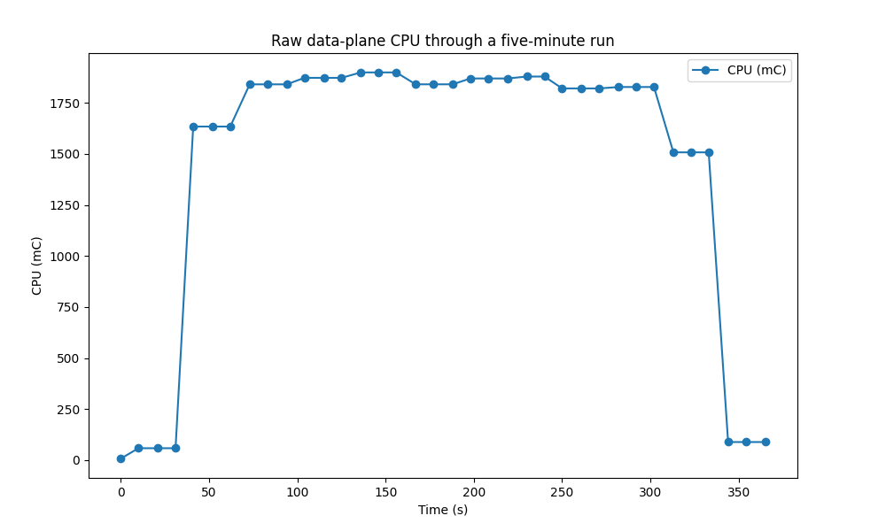
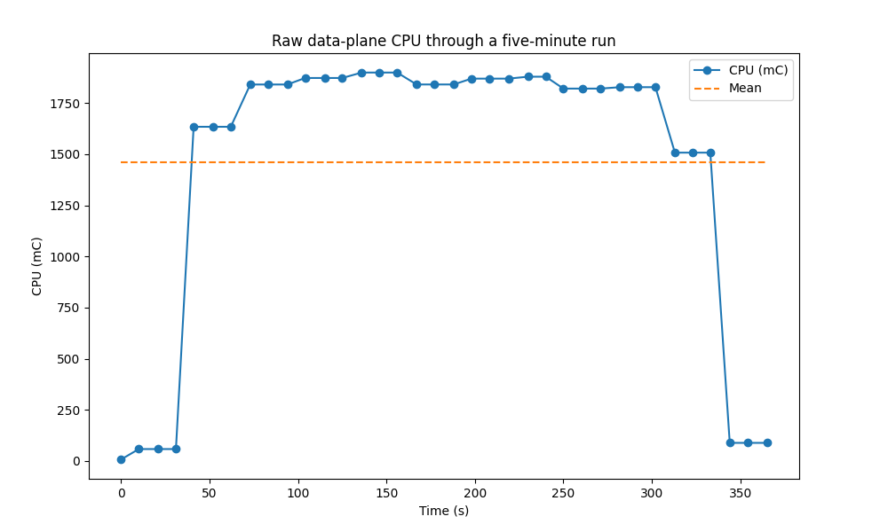
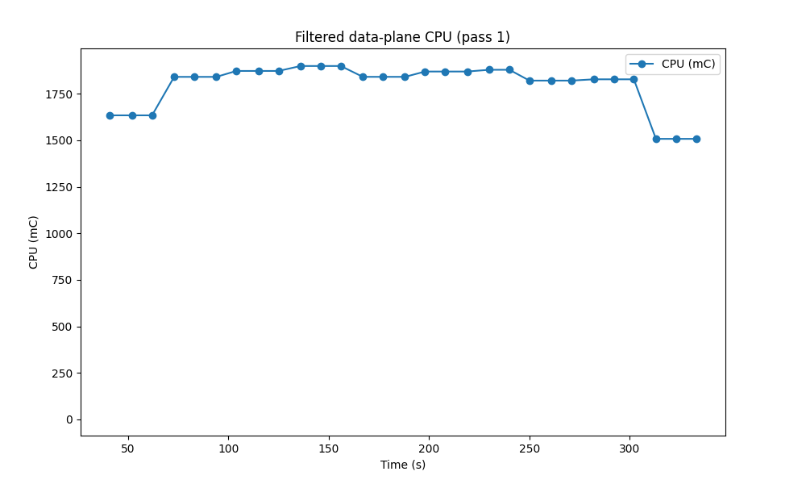
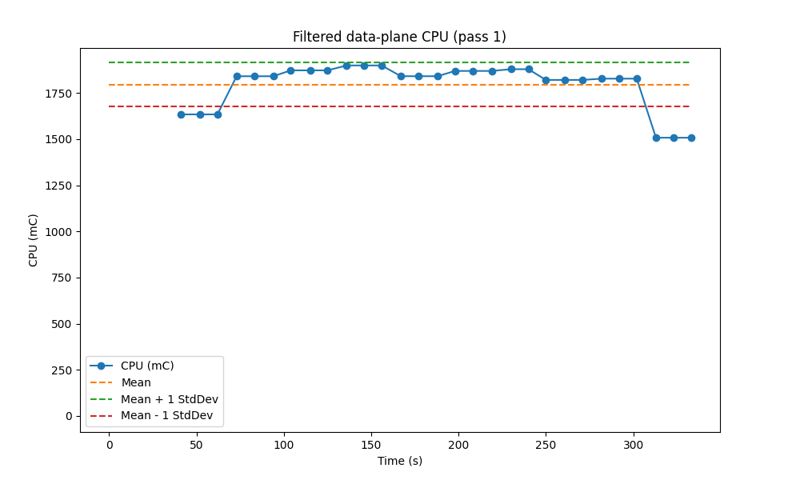
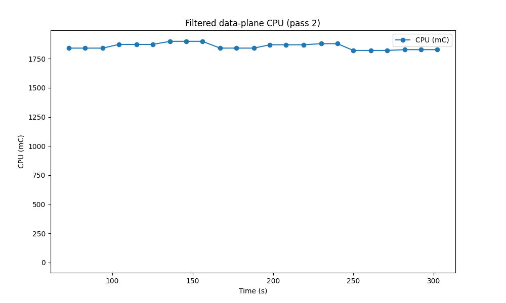
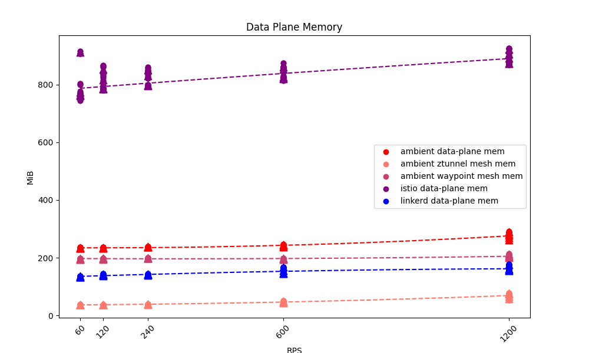
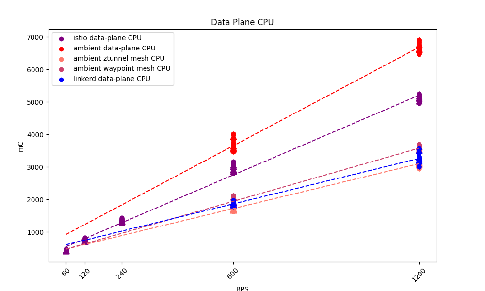
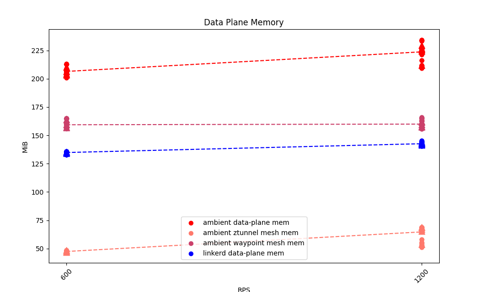
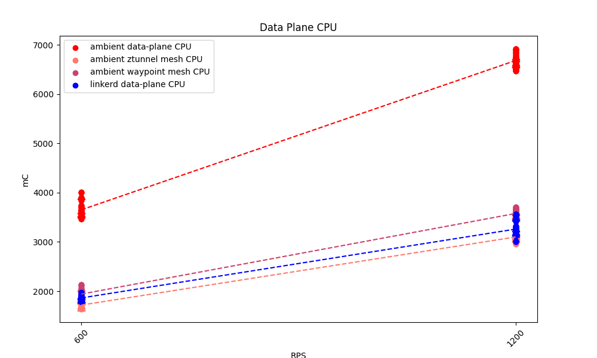

# The Story Behind the Great Sidecar Debate

Many, many pixels have been burned on the topic of sidecars of late.

If you've been paying any attention at all to the cloud-native ecosystem,
you've doubtless run across discussions about the merits - or lack thereof -
of sidecars. In a lot of ways, this is kind of silly: sidecars are a fairly
low-level implementation pattern, and it would probably make sense to see them
considered an implementation detail rather than the latest hot marketing
topic. In other ways, though, we live in an imperfect world and we often do
have to pull back the curtains to take a look at the technology underneath the
tools we use: understanding the tradeoffs made by our tool choices is often
critical to getting the most out of those tools, and architectural decisions
are _always_ about tradeoffs.

For various reasons, I ended up being the one to take on the job of pulling
back the curtain on both Linkerd's choice to use the sidecar pattern and Istio
Ambient's choice to avoid it, and see what the ramifications of those choices
really were. I did this in the obvious way: I ran both meshes under load and
measured things about them. It was simultaneously frustrating and fascinating,
often in surprising ways.

## The Disclaimers

Benchmarking two systems like this is as much an art as it is a science:

- the way the benchmark tests are designed will itself affect the outcomes you
  measure in the benchmarks;
- the way the tests are actually run can introduce bias;
- there are a million different invisible underlying variables that can affect
  your results; and
- no matter what you do, there will be people convinced that you're trying to
  make their favorite system look bad!

So while this post will talk about analysis and results, **the main goal here
is transparency**: what tests I ran and why, how I set them up, how I measured
the results, etc. You may well disagree with my methodology or conclusion,
which is fine and we can discuss it, but it's much better for us to go into
that discussion with good information.

## Reproducing My Results

If you want to run this test for yourself - and I encourage you to do so! -
you'll find all the source code and some of my data at [the Great Sidecar
Debate] repository on GitHub. Check out its [README] for more detailed
instructions on how to run everything, and check out the [linkerd], [istio],
and [ambient] scripts to find out _exactly_ how I installed Linkerd, Istio
Legacy, and Istio Ambient, respectively.

[the Great Sidecar Debate]: https://github.com/BuoyantIO/great-sidecar-debate
[README]: https://github.com/BuoyantIO/great-sidecar-debate/blob/main/README.md
[linkerd]: https://github.com/BuoyantIO/great-sidecar-debate/blob/main/tools/linkerd.sh
[istio]: https://github.com/BuoyantIO/great-sidecar-debate/blob/main/tools/istio.sh
[ambient]: https://github.com/BuoyantIO/great-sidecar-debate/blob/main/tools/ambient.sh

## The Test

At a high level, the test I went with is really simple: I ran the [Faces demo
app] and used a load generator to hit its `face` workload (which is the top of
its call graph). I then used the Kubernetes metrics API to measure CPU and
memory usage for all the pods in the cluster.

[Faces demo app]: https://github.com/BuoyantIO/faces-demo

Even this simple test setup involved several decisions.

1. **I chose to focus on resource consumption rather than latency**.

   Getting good results for resource consumption from a cluster running on
   (probably virtualized) nodes from a cloud provider is relatively
   straightforward, but getting really solid results for latency in that same
   kind of environment is a bit of a different story, so I focused on resource
   consumption. Obviously, latency is important! and I'd like to return to it
   later. For the moment, though, others have already done some work in this
   area, and frankly my experience is that the modern meshes are all fast
   enough that latency problems tend not to be the mesh.

   The load generators I used do report latency, and my tooling will graph it,
   but it wasn't my focus and I didn't spend a lot of time making sure that
   the latency graphing is correct.

2. **I chose to focus on the data plane rather than the control plane**.

   The data plane is the part of the mesh that's in the critical path all the
   time, and the part that has to scale with application usage. This doesn't
   mean that the control plane is irrelevant, just that the data plane is more
   likely to be an earlier bottleneck.

3. **I chose to use the Kubernetes metrics API to measure resource
   consumption.**

   I wanted to be testing the meshes themselves, so I wanted to minimize the
   moving parts that weren't the meshes. Using the Kubernetes metrics
   machinery meant that I didn't have to run additional monitoring software
   like a Prometheus instance.

   It also means that I was making Kubernetes API calls every 10 seconds or so
   throughout the test, but I decided that that shouldn't be a significant
   load.

4. **I chose to run the load generator in the cluster, with data collection
   and analysis on my local machine.**

   Putting the load generator in the cluster let me avoid running an ingress
   controller, and meant that I didn't have to rely on the network outside the
   cluster for much. Pulling all the data back to my laptop and running the
   analysis there made it very easy to save data, and made it easy to analyze
   one run while another was in progress.

5. **I chose to run multiple nodes and multiple replicas of the test workloads.**

   I wanted to test production-like installations, which for Linkerd means
   using HA mode, which requires at least three nodes so that it can run three
   replicas of all control-plane components. To compare apples to apples, I
   arranged for all three meshes to run three replicas of their control-plane
   components.

   I also chose to run the test workloads with three replicas each, since
   there's not much point in running a non-HA application on an HA cluster!
   This has the side effect of making Linkerd and Istio Legacy run three times
   as many sidecars as they otherwise would, which actually gives Istio
   Ambient something of an unfair advantage. I decided to run with it, though,
   since I didn't particularly want to be easy on Linkerd in this test.

6. **I chose to always configure Istio Ambient to use waypoints, and to run three replicas of the waypoint.**

   In addition to testing similar configurations, I wanted to test similar
   functionality. Linkerd and Istio Legacy both always include important Layer
   7 functionality, but Istio Ambient _without_ waypoints can't do _anything_
   at Layer 7, so I decided to always run Istio Ambient with waypoints. (I
   didn't actually configure any Layer 7 functionality in the tests I ran,
   though. This is another area I'd like to return to.)

   I chose to run three replicas of the waypoint for the same reason I ran
   three replicas of the control plane: the waypoint is a single point of
   failure otherwise.

7. **I chose to run the tests on GKE.**

   I needed a cloud provider to make it feasible for others to reproduce my
   results, and I unfortunately couldn't get Istio Ambient to run on a [Civo]
   cluster. It was easier for me, personally, to run on GKE than on Azure or
   Amazon, so I went with GKE. It would be lovely to figure out how to run
   Istio Ambient on Civo, though.

[Civo]: https://civo.com/

## The Analysis

I collected CPU and memory usage data for all the pods in the cluster every 10
seconds, then computed averages for the mesh data plane and fit a quadratic
curve to the averages.

This was harder than it sounds, because the Kubernetes metrics API is fairly
low-resolution, and because I didn't want to tear down the cluster and
reinstall every time: installing everything is pretty quick, but GKE is
awfully slow to spin up clusters! This means that a given usage metric tends
to look like this:

You can see that the usage starts very low and ends very low. What's going on
here is that the metrics API lags the real world:

- On the left, the load generator has started, but the metrics API hasn't yet
  sampled the usage under higher load.
- On the right, the load generator has stopped, but the metrics API hasn't yet
  sampled the usage under the absence of load.

Including all of these data would make the analysis much less useful. We
really want the steady-state usage across the top of the graph; to get it, we
filter in two passes.

First, we can see that the average of the first graph is pulled far down by
the samples at the start and finish of the run:

So for the first pass, we just drop any samples below the mean:

(There's a safeguard in the code to make sure that, if we somehow missed the
outliers at the ends, we don't just drop all the data.) For pass two, we look
at the standard deviation of remaining samples:

and we drop samples more than one standard deviation from the mean:

This gives us a much cleaner set of data to work with. Obviously this
filtering is _highly_ opinionated! My reasoning here is that the ramp-up and
ramp-down periods are likely to mess things up more than anything else, and
that in the steady state, we should expect the data on resource usage to be
fairly stable.

## The Results

As always, the test scenarios I chose to run matter, and as always they're not
exhaustive.

When I ran the basic benchmarks I described against Linkerd, Istio Legacy, and
Istio Ambient, I was not at all surprised to find that Istio Legacy used more
memory _by far_ than either Linkerd or Istio Ambient:

I was _extremely_ surprised to find that Istio Ambient used more CPU than
Istio Legacy:

(If you work on Istio, I would _love_ to hear thoughts about this -- I'm
honestly wondering if I somehow misconfigured Istio Legacy here.)

Zooming in on Linkerd and Istio Ambient, we can see that Linkerd still used
less resource for its data plane than Istio Ambient:

It was interesting to me that the ztunnel's memory usage was very low, but its
CPU usage almost matched Linkerd's.

## Other Tests

I also ran a few other simple tests from the operational point of view. This
is probably the most biased section of this post, so let me talk about that
head-on: from the point that I first looked at Istio Ambient, I've worried
that if anything went wrong with the ztunnel or waypoint, the set of pods that
would be affected would be larger and less deterministic than the set of pods
affected if something went wrong with a Linkerd proxy. For me, that's an
operational issue that the architecture of the mesh can affect: if the blast
radius of a failing data-plane component is small, it's likely to be easier to
figure out what's up and fix it than if the blast radius is large.

So yes, there are _absolutely_ ways to make Linkerd's proxies fail, and in
fact the things I'm about to describe will make a Linkerd proxy very unhappy
if you do them to it! However, when you do that, you'll be affecting exactly
one pod: that's the difference I want to highlight here.

First I verified my impression that if a ztunnel or waypoint runs out of
memory or dies, an effectively-random set of pods will be unable to
communicate with each other. I feel like this would be very strange to debug
when it happens, but I have to say that I was very impressed with how quickly
Istio Ambient can restart either of these components when they die! (I did
this both by using `kubectl delete` and by cranking memory limits down
artificially.)

I also verified that if the ztunnel or waypoint hits a CPU limit, then an
effectively-random set of pods will either see communications slow down or
fail entirely. Here, of course, Kubernetes won't restart the slow component;
that's not how CPU limits work. (I did this by artificially applying CPU
limits.)

Finally, I verified that I could starve the Faces demo by running a ton of
traffic from something else through the system (specifically, I ran `iperf3`
in the cluster with CPU limits lowered on the Istio Ambient data plane).

Again: Linkerd proxies won't like these things either. I'd also be remiss if I
didn't point out that Istio Ambient's normal requests and limits are high
enough that you're more likely to hit trouble running Istio Ambient on small
nodes than you are to hit the limits.

## Conclusion

Looking at the difference between Istio Legacy and Istio Ambient, it's much
more clear to me why the Istio crowd is excited about Ambient: the numbers on
memory usage, in particular, are honestly shocking even if you know what to
expect.

On the other hand, when you look at Linkerd and Istio Ambient, what I see is
higher resource usage _and_ more complexity for Istio Ambient, so I have a
hard time recommending it over Linkerd. There are definitely interesting
things about the Ambient architecture, and it was fascinating to dig into it a
bit... but overall, I still feel that the tradeoffs that Linkerd has made are
easier for me to get behind.

Of course, you may have other thoughts! if so, you can reach me as `@flynn` on
the [Linkerd Slack](https://slack.linkerd.io) or by email at
[`flynn@buoyant.io`](mailto:flynn@buoyant.io).

## Linkerd is for everyone

Linkerd is a graduated project of the
[Cloud Native Computing Foundation](https://cncf.io/). Linkerd is
[committed to open governance.](/2019/10/03/linkerds-commitment-to-open-governance/)
If you have feature requests, questions, or comments, we'd love to have you join
our rapidly-growing community! Linkerd is hosted on
[GitHub](https://github.com/linkerd/), and we have a thriving community on
[Slack](https://slack.linkerd.io/), [Twitter](https://twitter.com/linkerd), and
in [mailing lists](/community/get-involved/). Come and join the fun!

---

_My thanks to John Howard for answering bizarre questions about Istio Ambient and to Rob Scott for answering bizarre questions about GKE._

