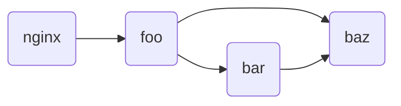
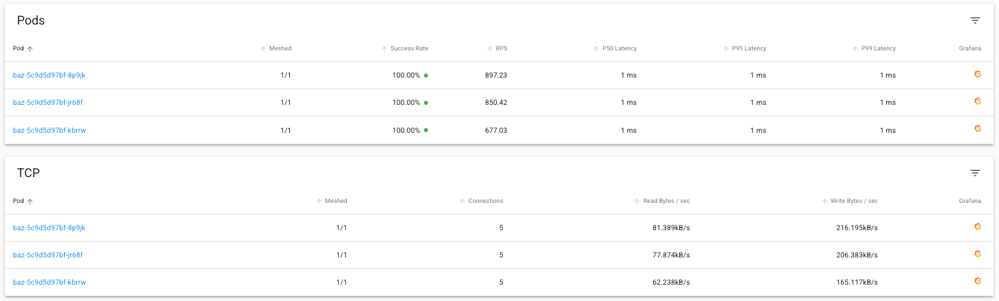
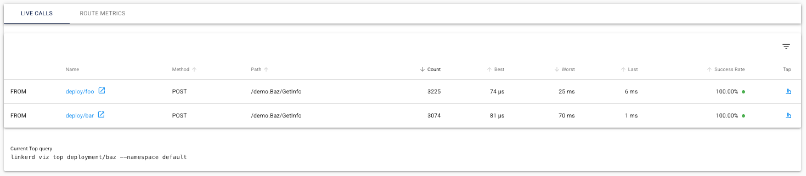
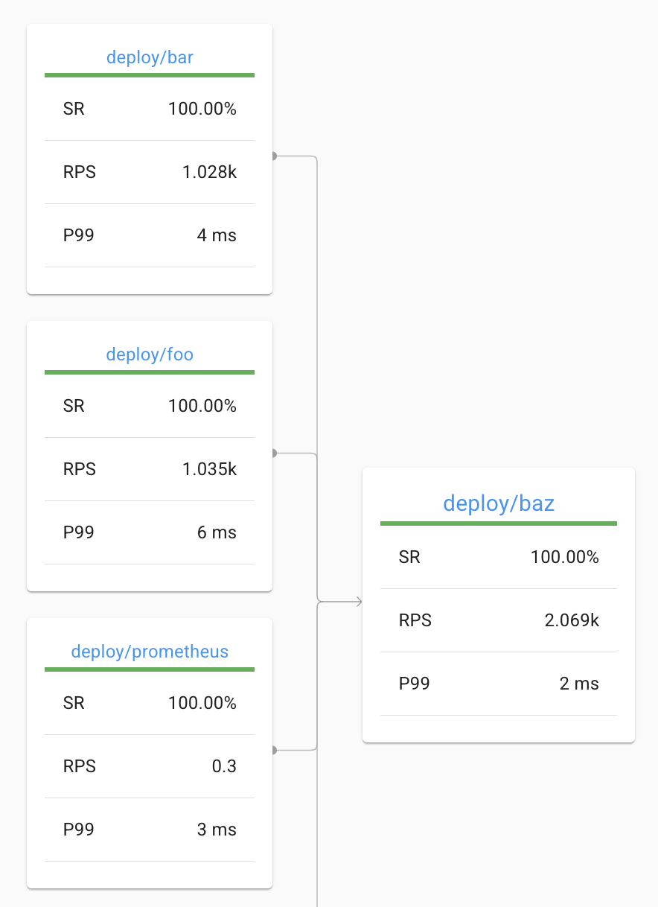

_This is part two of a series by Linkerd Ambassador Chris Campbell exploring how
to bridge the gap between development and production by using Linkerd, Tilt, and
Ingress-Nginx to create a robust environment in which you can develop using your
real production infrastructure._

---

In [Part 1](/2024/12/02/tilt-linkerd-nginx-part-1/) of this series, we built a
simple microservices demo with Linkerd on a local Kubernetes cluster using Tilt.
Our demo consists of three services (foo, bar, and baz) that communicate via
HTTP REST. In this second part, we'll extend our demo to support gRPC
communication and explore some of Linkerd's helpful features for managing gRPC
services.

## The gRPC Advantage in Microservices

gRPC, a graduated CNCF project like Linkerd, offers a powerful communication
foundation for modern microservices architectures. By combining HTTP/2's
efficiency with Protocol Buffers' strong typing and code generation, gRPC
delivers superior performance, type safety, and cross-language compatibility
compared to traditional REST APIs. These benefits make it particularly valuable
in complex, polyglot microservices environments where frequent inter-service
communication occurs.

However, running gRPC on Kubernetes introduces challenges—particularly around
load balancing, observability, and security. This is where Linkerd shines,
providing transparent solutions to these challenges without requiring
application changes. The combination of gRPC and Linkerd creates a powerful
synergy: gRPC's performance and developer experience with Linkerd's operational
capabilities, allowing teams to focus on building features rather than solving
infrastructure problems.

## Architecture Overview

Before diving into the gRPC implementation, let's review our application's
architecture:

1. **foo** - An entry point service that makes parallel requests to bar and baz
2. **bar** - A middle-tier service that processes requests and calls baz
3. **baz** - A backend service that returns request information

These services are all written in Go and deployed to a local Kubernetes cluster.
We're using Tilt for a fast inner development loop, which allows us to see our
changes in real-time as we modify the code.

Our architecture currently looks like this:





When running locally, our setup includes a `synthetic` service that generates
continuous traffic to the `foo` service, simulating real-world application load.



## The gRPC Implementation

Since the initial blog post, we've enhanced our application to support both HTTP
REST and gRPC communication. Key components of our implementation include:

### 1. Protocol Buffer Definitions

We created a shared Protobuf schema that defines our service interfaces:

```protobuf
// services.proto
syntax = "proto3";

package demo;
option go_package = "./proto";

service Foo {
  rpc GetInfo (InfoRequest) returns (InfoResponse);
}

service Bar {
  rpc GetInfo (InfoRequest) returns (InfoResponse);
}

service Baz {
  rpc GetInfo (InfoRequest) returns (InfoResponse);
}

message InfoRequest {
  string client = 1;
  map<string, string> headers = 2;
}

message InfoResponse {
  string message = 1;
  string hostname = 2;
  map<string, string> headers = 3;
  int32 status = 4;
}
```

### 2. Dual Protocol Support

Each service now supports both HTTP REST and gRPC:

- Each service runs an HTTP server on port 8080
- Each service runs a gRPC server on port 9090
- A `USE_GRPC` environment variable controls which protocol is used for
  service-to-service communication
- Kubernetes configuration has been updated to support the dual protocol of our
  services

### 3. Tilt Configuration

We've enhanced our Tilt setup to make switching between protocols and service
mesh options easy:

```sh
# Run with HTTP REST (default)
tilt up

# Run with gRPC (no Linkerd)
tilt up -- --use_grpc

# Run with HTTP REST and Linkerd
tilt up -- --use_linkerd

# Run with gRPC and Linkerd
tilt up -- --use_grpc --use_linkerd
```

These configuration flags allow us to test our application in different modes,
which is especially useful for comparing performance and behavior across
different configurations.

## Leveraging Linkerd with gRPC

One of the best ways to appreciate Linkerd's value is to observe what happens
when running gRPC without it. Try running the application with just gRPC enabled
(`tilt up -- --use_grpc`) and you'll notice something interesting: the `foo`
service only communicates with a single instance of the `baz` service, even
though multiple instances are available.

This happens because gRPC connections persist and don't load balance across
service instances by default. If you're curious about the technical details,
check out this excellent article:
[gRPC Load Balancing on Kubernetes without Tears](/2018/11/14/grpc-load-balancing-on-kubernetes-without-tears/).

To solve this issue and get proper load balancing with gRPC, we simply need to
enable Linkerd:

```sh
tilt up -- --use_grpc --use_linkerd
```

### A Virtual Tour

With both gRPC and Linkerd enabled, let's explore what we gain from this
combination.

The dashboard view below highlights two key advantages. First, Linkerd
automatically provides detailed request and TCP metrics without requiring any
custom instrumentation in our application code. Second, we can see proper load
balancing across all baz pods in action. This load balancing is particularly
important in development environments with only a few service instances, where
having traffic pinned to a single instance (as would happen without Linkerd) can
mask potential issues.



Below, we can see live calls flowing through our service mesh. This visibility
is particularly valuable as we transition protocols - notice how Linkerd clearly
shows calls to the gRPC endpoint `/demo.Baz/GetInfo`. With our application
supporting both protocols, this visual confirmation helps us verify that we're
correctly using gRPC for service communication.



While the dashboard provides intuitive visualizations, the Linkerd CLI offers
the same data in a terminal-friendly format for quick diagnostics:

```bash
$ linkerd viz top deployment/baz
Source                Destination           Method      Path                Count    Best   Worst    Last  Success Rate
foo-64798767b7-x8xvf  baz-659dbf6895-v7gdm  POST        /demo.Baz/GetInfo    1187    81µs     9ms   124µs       100.00%
bar-577c4bf849-cpdxl  baz-659dbf6895-9twg9  POST        /demo.Baz/GetInfo    1103    86µs     6ms   140µs       100.00%
foo-64798767b7-x8xvf  baz-659dbf6895-7chgx  POST        /demo.Baz/GetInfo    1084    79µs     9ms   355µs       100.00%
bar-577c4bf849-cpdxl  baz-659dbf6895-7chgx  POST        /demo.Baz/GetInfo    1061    93µs     7ms   293µs       100.00%
foo-64798767b7-x8xvf  baz-659dbf6895-9twg9  POST        /demo.Baz/GetInfo    1042    81µs     5ms   565µs       100.00%
bar-577c4bf849-cpdxl  baz-659dbf6895-v7gdm  POST        /demo.Baz/GetInfo     958    75µs     8ms   203µs       100.00%
```

### Implementing gRPC Authorization

Let's now implement an authorization policy for our new gRPC routes on the `baz`
service. This policy provides fine-grained control over which services can
access our endpoints. First, we need to create a new server and route
definition. The server will represent the gRPC endpoint we've opened on the baz
service. As with our HTTP route, we'll implement a default deny policy to ensure
our services require explicit authorization.

```yaml
---
apiVersion: policy.linkerd.io/v1beta1
kind: Server
metadata:
  name: baz-grpc
  namespace: default
spec:
  podSelector:
    matchLabels:
      app: baz
  port: grpc # grpc port defined from our service
  proxyProtocol: gRPC
  accessPolicy: deny # deny all traffic by default
```

After applying this configuration, communication between our components
immediately breaks with the following error:

```bash
rpc error: code = PermissionDenied desc = client 192.168.194.77:57364: server: 192.168.194.70:4143: unauthorized request on route
```

This is expected and confirms our policy is working. The error occurs for two
reasons: we've set our default `accessPolicy` to `deny`, and we haven't yet
provided the proper traffic labeling for Linkerd to identify and authorize
legitimate requests.

To resolve this issue, we need to authorize our services to connect to the new
server. We'll follow the same pattern we used for HTTP authorization: the `foo`
service will receive server-level authorization, while the `bar` service will
get route-level authorization. Let's start with implementing authorization for
`foo`.

#### Foo

To enable server-level authorization for `foo > baz` communication, we first
need to identify the gRPC routes on the baz service. This requires creating both
inbound and outbound route definitions. For a detailed explanation of the
differences between these route types, see the
[official documentation](/2/reference/grpcroute/).

##### Outbound

```yaml
---
apiVersion: gateway.networking.k8s.io/v1alpha2
kind: GRPCRoute
metadata:
  name: baz-grpc-outbound
  namespace: default
spec:
  parentRefs:
    - name: baz-grpc
      kind: Server
      group: policy.linkerd.io
  rules:
    - backendRefs:
        - name: baz
          port: 9090
```

##### Inbound

```yaml
---
apiVersion: gateway.networking.k8s.io/v1alpha2
kind: GRPCRoute
metadata:
  name: baz-grpc-inbound
  namespace: default
spec:
  parentRefs:
    - name: baz-grpc
      kind: Server
      group: policy.linkerd.io
  rules:
    - backendRefs:
        - name: baz
          port: 9090
```

Next we can authorize the foo service to access our baz gRPC server.

```yaml
---
apiVersion: policy.linkerd.io/v1alpha1
kind: MeshTLSAuthentication
metadata:
  name: foo-baz-authn
  namespace: default
spec:
  identities:
    - "foo.default.serviceaccount.identity.linkerd.cluster.local"
---
apiVersion: policy.linkerd.io/v1alpha1
kind: AuthorizationPolicy
metadata:
  name: baz-grpc-authn
  namespace: default
spec:
  targetRef:
    group: policy.linkerd.io
    kind: Server
    name: baz-grpc
  requiredAuthenticationRefs:
    - name: foo-baz-authn
      kind: MeshTLSAuthentication
      group: policy.linkerd.io
```



The MeshTLSAuthentication can be shared between gRPC and HTTP routes.



With these definitions in place, we've established a secure, authorized
connection from `foo` to `baz`. If you check your application now, you'll see
that communication from `foo` is working again, while `bar` requests are still
being blocked.

#### Bar

Since we've already configured the routes for our service, implementing
route-level authorization for `bar` is straightforward.

```yaml
---
apiVersion: policy.linkerd.io/v1alpha1
kind: MeshTLSAuthentication
metadata:
  name: baz-bar-authn
  namespace: default
spec:
  identities:
    - "bar.default.serviceaccount.identity.linkerd.cluster.local"
---
apiVersion: policy.linkerd.io/v1alpha1
kind: AuthorizationPolicy
metadata:
  name: baz-grpc-route-authn
  namespace: default
spec:
  targetRef:
    group: gateway.networking.k8s.io
    kind: GRPCRoute
    name: baz-grpc-inbound
  requiredAuthenticationRefs:
    - name: baz-bar-authn
      kind: MeshTLSAuthentication
      group: policy.linkerd.io
```

That completes our authorization setup! We've efficiently reused our inbound
route configuration to allow the `bar` service to access our `baz` endpoints
without granting it unrestricted access to the server.

With both authorization policies in place, our services are now communicating
securely via gRPC, with proper access controls:



## Conclusions

In this tutorial, we've successfully added gRPC support to our demo application
while leveraging Linkerd to make the process smoother. We've seen first-hand how
Linkerd addresses key challenges with gRPC in Kubernetes environments -
particularly load balancing, which would otherwise require custom proxy
configurations or client-side changes. We've also implemented fine-grained
authorization policies to secure our services, showing how a service mesh can
enhance both functionality and security without complex code changes.

The combination of gRPC and Linkerd creates a solid foundation for modern
microservices. You get all the benefits of gRPC's performance and type safety,
while Linkerd handles the operational challenges that would otherwise require
significant engineering effort. Whether you're building new applications or
evolving existing ones, this pairing helps ensure your services are fast,
secure, and observable throughout their lifecycle.
