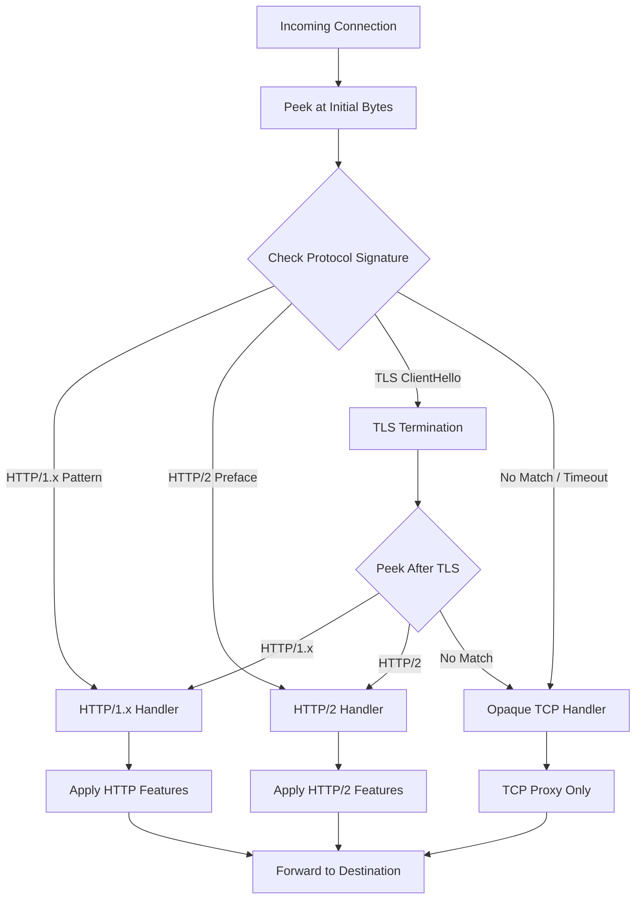

_This blog post was originally published on the [OneUptime blog](https://oneuptime.com/blog/post/2026-01-30-linkerd-protocol-detection/view). The cover photo is derived from an [image by OpenClipart-Vectors](https://pixabay.com/vectors/detective-clues-police-work-find-151275/)._

Linkerd is a lightweight service mesh that provides observability, reliability, and security for Kubernetes applications. One of its powerful features is automatic protocol detection, which allows Linkerd to identify the protocol being used by incoming connections without requiring explicit configuration.

This automatic detection enables Linkerd to apply protocol-specific features like HTTP metrics, retries, and load balancing strategies without manual annotation of every service.

## How Protocol Detection Works

When a connection arrives at a Linkerd proxy, it needs to determine what protocol the connection is using. Linkerd accomplishes this by peeking at the first few bytes of the connection and matching them against known protocol signatures.

### The Detection Flow



### Protocol Signatures

Linkerd looks for specific byte patterns to identify protocols:

| Protocol | Detection Method |
|----------|------------------|
| HTTP/1.x | Starts with HTTP method (GET, POST, PUT, DELETE, etc.) |
| HTTP/2 | Starts with connection preface `PRI * HTTP/2.0\r\n\r\nSM\r\n\r\n` |
| gRPC | HTTP/2 with `content-type: application/grpc` header |
| TLS | Starts with TLS ClientHello byte sequence |
| TCP | Fallback when no pattern matches |

## Configuring Protocol Detection

### Default Timeout Configuration

Linkerd waits for a configurable amount of time to receive enough bytes for protocol detection. If the timeout expires before detection completes, the connection is treated as opaque TCP.

```yaml
# linkerd-config ConfigMap
apiVersion: v1
kind: ConfigMap
metadata:
  name: linkerd-config
  namespace: linkerd
data:
  # Protocol detection timeout in milliseconds
  # Default is 10 seconds (10000ms)
  protocolDetectTimeout: "10000ms"
```

### Setting Detection Timeout via Helm

When installing Linkerd with Helm, you can configure the detection timeout:

```bash
# Install Linkerd with custom protocol detection timeout
helm install linkerd-control-plane linkerd/linkerd-control-plane \
  --namespace linkerd \
  --set proxy.protocolDetectTimeout=10s
```

### Per-Pod Configuration

You can override the detection timeout for specific pods using annotations:

```yaml
# deployment.yaml
apiVersion: apps/v1
kind: Deployment
metadata:
  name: my-service
spec:
  template:
    metadata:
      annotations:
        # Override protocol detection timeout for this pod
        config.linkerd.io/protocol-detect-timeout: "5s"
    spec:
      containers:
      - name: my-service
        image: my-service:latest
        ports:
        - containerPort: 8080
```

## Marking Ports as Opaque

For services that use protocols that cannot be detected (like MySQL, Redis, or custom binary protocols), you should mark the ports as opaque to skip protocol detection entirely.

### Using Annotations

```yaml
# service.yaml
apiVersion: v1
kind: Service
metadata:
  name: mysql-service
  annotations:
    # Skip protocol detection for port 3306
    config.linkerd.io/opaque-ports: "3306"
spec:
  selector:
    app: mysql
  ports:
  - port: 3306
    targetPort: 3306
```

### Multiple Opaque Ports

```yaml
# deployment.yaml
apiVersion: apps/v1
kind: Deployment
metadata:
  name: database-cluster
spec:
  template:
    metadata:
      annotations:
        # Multiple ports can be specified as comma-separated values
        config.linkerd.io/opaque-ports: "3306,6379,27017"
    spec:
      containers:
      - name: mysql
        image: mysql:8.0
        ports:
        - containerPort: 3306
      - name: redis
        image: redis:7.0
        ports:
        - containerPort: 6379
      - name: mongo
        image: mongo:6.0
        ports:
        - containerPort: 27017
```

## Server-First Protocols

Some protocols require the server to send data before the client (server-first protocols). These protocols cannot be detected because Linkerd waits for client data that never arrives.

Common server-first protocols include:
- MySQL
- SMTP
- FTP
- SSH

### Configuring Server-First Ports

```yaml
# service.yaml
apiVersion: v1
kind: Service
metadata:
  name: smtp-service
  annotations:
    # Mark SMTP port as opaque (server-first protocol)
    config.linkerd.io/opaque-ports: "25,587"
spec:
  selector:
    app: smtp-server
  ports:
  - name: smtp
    port: 25
    targetPort: 25
  - name: submission
    port: 587
    targetPort: 587
```

## Protocol Detection in Practice

### Example: HTTP Service with Automatic Detection

```yaml
# http-service.yaml
apiVersion: apps/v1
kind: Deployment
metadata:
  name: api-server
  namespace: default
spec:
  replicas: 3
  selector:
    matchLabels:
      app: api-server
  template:
    metadata:
      labels:
        app: api-server
      # No special annotations needed for HTTP
      # Linkerd will automatically detect HTTP traffic
    spec:
      containers:
      - name: api-server
        image: api-server:v1.0.0
        ports:
        - containerPort: 8080
          name: http
        # Health check endpoint helps verify HTTP detection
        livenessProbe:
          httpGet:
            path: /health
            port: 8080
          initialDelaySeconds: 10
          periodSeconds: 5
---
apiVersion: v1
kind: Service
metadata:
  name: api-server
  namespace: default
spec:
  selector:
    app: api-server
  ports:
  - name: http
    port: 80
    targetPort: 8080
```

### Example: gRPC Service Configuration

```yaml
# grpc-service.yaml
apiVersion: apps/v1
kind: Deployment
metadata:
  name: grpc-backend
  namespace: default
spec:
  replicas: 2
  selector:
    matchLabels:
      app: grpc-backend
  template:
    metadata:
      labels:
        app: grpc-backend
      # gRPC runs over HTTP/2, which Linkerd detects automatically
    spec:
      containers:
      - name: grpc-backend
        image: grpc-backend:v1.0.0
        ports:
        - containerPort: 50051
          name: grpc
        # gRPC health checking
        readinessProbe:
          grpc:
            port: 50051
          initialDelaySeconds: 5
          periodSeconds: 10
---
apiVersion: v1
kind: Service
metadata:
  name: grpc-backend
  namespace: default
spec:
  selector:
    app: grpc-backend
  ports:
  - name: grpc
    port: 50051
    targetPort: 50051
```

### Example: Mixed Protocol Service

```yaml
# mixed-protocol-service.yaml
apiVersion: apps/v1
kind: Deployment
metadata:
  name: data-service
  namespace: default
spec:
  replicas: 2
  selector:
    matchLabels:
      app: data-service
  template:
    metadata:
      labels:
        app: data-service
      annotations:
        # Mark the Redis port as opaque
        # HTTP port 8080 will be auto-detected
        config.linkerd.io/opaque-ports: "6379"
    spec:
      containers:
      - name: data-service
        image: data-service:v1.0.0
        ports:
        # HTTP API - will be auto-detected
        - containerPort: 8080
          name: http
        # Redis sidecar - marked as opaque
        - containerPort: 6379
          name: redis
```

## Troubleshooting Protocol Detection

### Checking Protocol Detection Status

Use the Linkerd CLI to inspect protocol detection:

```bash
# Check the proxy logs for protocol detection information
kubectl logs -n default deploy/api-server -c linkerd-proxy | grep -i "protocol"

# View detailed proxy metrics including protocol information
linkerd viz stat deploy/api-server

# Check if connections are being detected correctly
linkerd viz tap deploy/api-server --to deploy/backend-service
```

### Common Issues and Solutions

#### Issue 1: Connections Timing Out During Detection

Symptoms: Slow initial connection, requests fail intermittently.

```bash
# Check the current detection timeout
kubectl get configmap linkerd-config -n linkerd -o yaml | grep protocolDetect

# Solution: Increase the timeout or mark the port as opaque
kubectl annotate deployment my-service \
  config.linkerd.io/protocol-detect-timeout=15s
```

#### Issue 2: HTTP Traffic Treated as TCP

Symptoms: No HTTP metrics, load balancing not working as expected.

```bash
# Verify the protocol being detected
linkerd viz tap deploy/my-service -o wide

# Check if the service is sending valid HTTP
# The first bytes must be a valid HTTP method
curl -v http://my-service.default.svc.cluster.local/health
```

```yaml
# Solution: Ensure the service responds with valid HTTP
# If using a custom protocol over HTTP, ensure headers are correct
apiVersion: v1
kind: Service
metadata:
  name: my-service
  annotations:
    # Force HTTP/2 detection if needed
    config.linkerd.io/proxy-protocol: "HTTP/2"
spec:
  ports:
  - port: 80
    targetPort: 8080
```

#### Issue 3: Server-First Protocol Hanging

Symptoms: Connections hang indefinitely, no data transferred.

```bash
# Identify the hanging connections
kubectl exec -it deploy/my-service -c linkerd-proxy -- \
  /bin/sh -c "netstat -an | grep ESTABLISHED"

# Solution: Mark the port as opaque
kubectl annotate service mysql-service \
  config.linkerd.io/opaque-ports="3306"
```

### Protocol Detection Debugging Script

```bash
#!/bin/bash
# debug-protocol-detection.sh
# Script to debug Linkerd protocol detection issues

NAMESPACE=${1:-default}
DEPLOYMENT=${2:-my-service}

echo "=== Checking Protocol Detection for $DEPLOYMENT in $NAMESPACE ==="

# Get current annotations
echo -e "\n--- Current Annotations ---"
kubectl get deployment $DEPLOYMENT -n $NAMESPACE -o jsonpath='{.spec.template.metadata.annotations}' | jq .

# Check proxy logs for protocol info
echo -e "\n--- Proxy Logs (Protocol Related) ---"
kubectl logs -n $NAMESPACE deploy/$DEPLOYMENT -c linkerd-proxy --tail=50 | grep -i "protocol\|detect\|opaque"

# Get traffic stats
echo -e "\n--- Traffic Statistics ---"
linkerd viz stat deploy/$DEPLOYMENT -n $NAMESPACE

# Check for timeout issues
echo -e "\n--- Checking for Timeout Events ---"
kubectl logs -n $NAMESPACE deploy/$DEPLOYMENT -c linkerd-proxy --tail=100 | grep -i "timeout"

# Live traffic tap (runs for 10 seconds)
echo -e "\n--- Live Traffic Tap (10 seconds) ---"
timeout 10 linkerd viz tap deploy/$DEPLOYMENT -n $NAMESPACE -o wide || true

echo -e "\n=== Debug Complete ==="
```

### Verifying Protocol Detection with Metrics

```bash
# Query Prometheus for protocol-specific metrics
kubectl port-forward -n linkerd-viz svc/prometheus 9090:9090 &

# Check HTTP request metrics (only shows if HTTP was detected)
curl -s 'http://localhost:9090/api/v1/query?query=request_total' | jq '.data.result[] | select(.metric.deployment=="api-server")'

# Check TCP connection metrics
curl -s 'http://localhost:9090/api/v1/query?query=tcp_open_total' | jq '.data.result[] | select(.metric.deployment=="api-server")'
```

## Best Practices

### 1. Use Named Ports

Named ports help Linkerd and operators understand the expected protocol:

```yaml
# Good: Named ports
ports:
- name: http
  port: 80
  targetPort: 8080
- name: grpc
  port: 50051
  targetPort: 50051
- name: mysql
  port: 3306
  targetPort: 3306

# Avoid: Unnamed ports
ports:
- port: 80
  targetPort: 8080
```

### 2. Pre-Configure Known Opaque Ports

Add opaque port annotations proactively for known non-HTTP services:

```yaml
# Configure at the namespace level for consistency
apiVersion: v1
kind: Namespace
metadata:
  name: databases
  annotations:
    config.linkerd.io/opaque-ports: "3306,5432,6379,27017,9042"
```

### 3. Monitor Detection Latency

Keep an eye on protocol detection adding latency to your services:

```bash
# Check p99 latency for protocol detection
linkerd viz stat deploy --all-namespaces -o wide | awk '{print $1, $2, $7}'
```

### 4. Document Protocol Requirements

Maintain documentation of which services require special protocol configuration:

```yaml
# Add labels for documentation purposes
apiVersion: v1
kind: Service
metadata:
  name: legacy-service
  labels:
    protocol-type: server-first
    requires-opaque: "true"
  annotations:
    config.linkerd.io/opaque-ports: "1234"
    description: "Legacy binary protocol, server sends greeting first"
spec:
  ports:
  - port: 1234
    targetPort: 1234
```

## Conclusion

Linkerd's automatic protocol detection simplifies service mesh adoption by eliminating the need for manual protocol configuration in most cases. Understanding how detection works, when to configure opaque ports, and how to troubleshoot issues ensures smooth operation of your service mesh.

Key takeaways:
- HTTP, HTTP/2, and gRPC are automatically detected
- Server-first protocols and binary protocols should be marked as opaque
- Use the detection timeout configuration for slow-starting services
- Monitor protocol detection with Linkerd's built-in tools
- Document any special protocol requirements for your services

By following these practices, you can leverage Linkerd's protocol detection to get rich observability and traffic management features with minimal configuration overhead.
