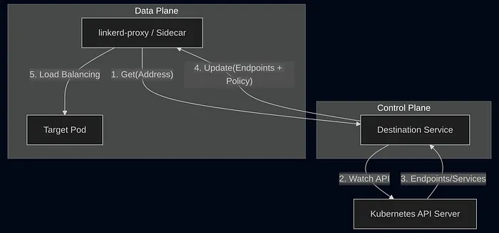
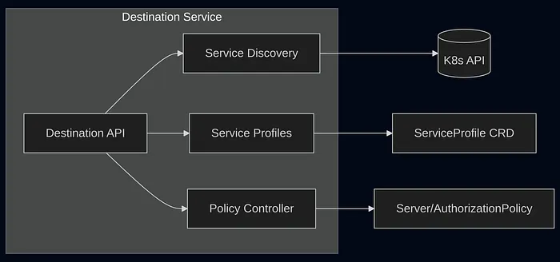
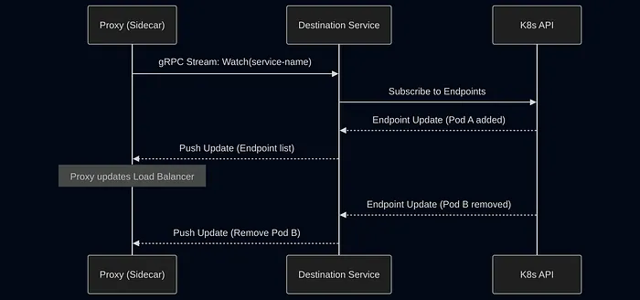

_This blog post was originally published on
[Bezaleel Silva’s Medium blog](https://medium.com/@bezarsnba/deep-dive-the-linkerd-destination-service-en-19f6efd1b308)._

Recently, in our daily operations, we took a deep dive into the inner workings
of **linkerd-destination**, one of the most critical components of the Linkerd
control plane.

The motivation was simple: as our cluster grew and traffic increased, the
question shifted from “Does Linkerd work?” to “**How exactly does it react when
everything changes at once?**”. Frequent deployments, production scaling,
security policies being applied — and at the center of all this, the
_destination_ service.

Throughout this analysis, I connected code reviews, observed behavior in
production, and documentation references. To organize this process, I used the
**Zettelkasten method**, stitching together atomic ideas until a clear vision of
the intelligence behind the mesh was formed. This article is the result of that
synthesis. Shall we dive in?

## Where the Magic Happens: The Role of linkerd-destination

Modern microservices architecture requires a dedicated infrastructure layer to
manage communication: the **Service Mesh**. Linkerd, a pioneer in this space,
stands out for its operational simplicity and high performance.

To understand how Linkerd works in practice, it is essential to dissect its
**Control Plane**, specifically the **linkerd-destination** component. It acts
as the central routing and policy authority for the entire mesh. It is
responsible for translating the dynamic state of Kubernetes into actionable
decisions propagated, in real-time, to thousands of proxies. Its three core
functions are:

- **Service Discovery:** Translates logical DNS names into sets of actual
  endpoints, enriching each address with metadata (_mTLS identity,
  locality/zone, and protocol_).
- **Policy Distribution:** Informs proxies which connections are authorized,
  based on modern resources like the Gateway API and policy CRDs (_Server,
  AuthorizationPolicy_).
- **Service Profiles (L7 Configuration):** Provides advanced Layer 7 rules, such
  as regex-based routes, retry budgets, and timeouts.

To visualize how this orchestration occurs between components, the diagram below
illustrates the communication flow between the control plane and the proxies in
the data plane:

It is crucial to note the impact of a **Degraded State**: should the
_destination_ service fail, proxies will continue to operate using their last
known configuration (_caching_). However, the cluster loses its ability to react
to new deployments or immediate security policy changes, as the update channel
illustrated above would be interrupted.

## Internal Architecture: Separation of Concerns

To understand the behavior of **linkerd-destination** at scale, we must look
inside the pod itself. Far from being a monolithic controller, Linkerd maintains
a clear separation of concerns distributed across multiple cooperating
containers.

The following diagram details how the Destination API is internally divided to
simultaneously process discovery, profiles, and authorization policies:

1. **Destination Container: The Heart (Go)** Implemented in Go, it functions as
   an event-driven controller. It utilizes the _Informer/Reflector_ pattern from
   the `client-go` library, avoiding expensive polling against the Kubernetes
   API.
1. **SP-Validator Container: The Guardian Acts** as a **Validating Admission
   Webhook**, blocking syntax errors in _Service Profiles_ before they reach
   etcd.
1. **Policy Container: The Judge** Evaluates security policies
   (_MeshTLSAuthentication_) in a decoupled manner.
1. **The Proxy in the Proxy** The _destination_ pod itself has an injected
   _linkerd-proxy_. This ensures that control plane traffic is secured by mTLS
   and fully observable.

## Performance Engineering: Events and Translation

The _destination_ service does not periodically query the API; it reacts to
**Watches**. When a Pod comes online, an event is triggered and processed by the
**EndpointTranslator**.

This “brain” enriches raw Kubernetes data by cross-referencing IPs to extract
identities and identifying availability zones to optimize routing. Furthermore,
the use of **EndpointSlices** allows the system to process only “deltas”
(partial changes), which is vital for the health of the system in large-scale
clusters.

### Destination API and gRPC Streaming

The interface between the proxy and the _destination_ is a continuous flow. When
calling `destination.Get()`, the server keeps the stream open and sends:

- **Initial Batch:** The full state at the moment of connection.
- **Incremental Updates:** Only the deltas (_add / remove_).
- **NoEndpoints:** A critical message that triggers the proxy to execute **fail
  fast** if no healthy instances are available.

The sequence diagram below summarizes this lifecycle, demonstrating the
efficiency of push-based communication:

## Observability: What to monitor?

During our deep dive, we identified specific signals that act as the “EKG” of
the control plane:

- **`services_informer_lag_seconds`:** The delay between a change in K8s and
  Linkerd’s perception of it.
- **`endpoint_updates_queue_overflow`:** If greater than 0, it indicates the
  system is dropping updates due to saturation.
- **`grpc_server_handled_total`:** Check for an increase in error codes
  (anything other than `OK`).
- **`proxy_inject_admission_responses_total`:** Reveals the success rate of
  sidecar injections across the cluster.
- **`control_response_total`:** Provides the real-time success rate of control
  plane responses.
- **`identity_cert_expiration_timestamp_seconds`:** The security countdown.
  Ignoring this metric means accepting the risk of total downtime due to expired
  mTLS certificates.

_Note: You can obtain additional metrics using the command:
`$ linkerd diagnostics controller-metrics`_

## Conclusion

The **linkerd-destination** service is the junction point between the dynamism
of Kubernetes and the predictability of a service mesh. Understanding its
event-driven architecture and the role of the **EndpointTranslator** is
essential for operating Linkerd with confidence in high-scale environments.

If you operate Linkerd in production or have ever needed to investigate control
plane behavior under load, understanding the _destination_ component completely
changes the way you debug and scale the mesh.
