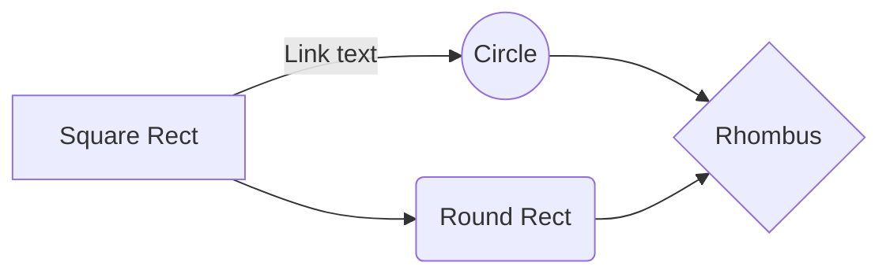

<!-- markdownlint-disable -->
<!-- prettier-ignore-start -->

<div class="container-lg">

## Headings

---

# Heading 1

## Heading 2

### Heading 3

#### Heading 4

##### Heading 5

###### Heading 6

## Emphasis

_Emphasis_, aka _italics_, with asterisks or underscores.

**Strong emphasis** aka **bold**, with two asterisks or underscores.

**_Combined emphasis_** with asterisks and underscores.

~~Strikethrough~~ with two tildes.

## Images

---


## Lists

---

### Ordered:

1. First ordered list item
2. Another item
3. Actual numbers don't matter, just that it's a number
   1. 1st
   1. 2nd
   1. 3rd

### Unordered:

- This is a list item
  - This is a nested list item
    - This is a nested list item
  - This is another list item
- This is another list item

## Links

---

[This is a link](https://www.example.com).

[This link](https://www.example.com "Link Title") has a title attribute.

## Tables

---

| Column 1 | Column 2 | Column 3 |
| :------- | :------: | -------: |
| Cell 1   |  Cell 2  |   Cell 3 |
| Cell 4   |  Cell 5  |   Cell 6 |

## Blockquotes

---

> Perfection is achieved, not when there is nothing more to add, but when there
> is nothing left to take away.

You can reference a footnote like this.

> If you don't have time to do it right, when will you have time to do it over?
> [^1]

## Code

---

`Inline code` has back-ticks around it.

```
{
  "firstName": "John",
  "lastName": "Smith",
  "age": 25
}
```

```javascript
var s = "JavaScript syntax highlighting";
alert(s);
```

## Horizontal Rules

---

Horizontal rule uses three or more hyphens (`---`), asterisks (`***`), or
underscores (`___`).

## Mermaid



## Footnotes

[^1]: https://www.brainyquote.com/quotes/john_wooden_384653

</div>

<!-- prettier-ignore-end -->
